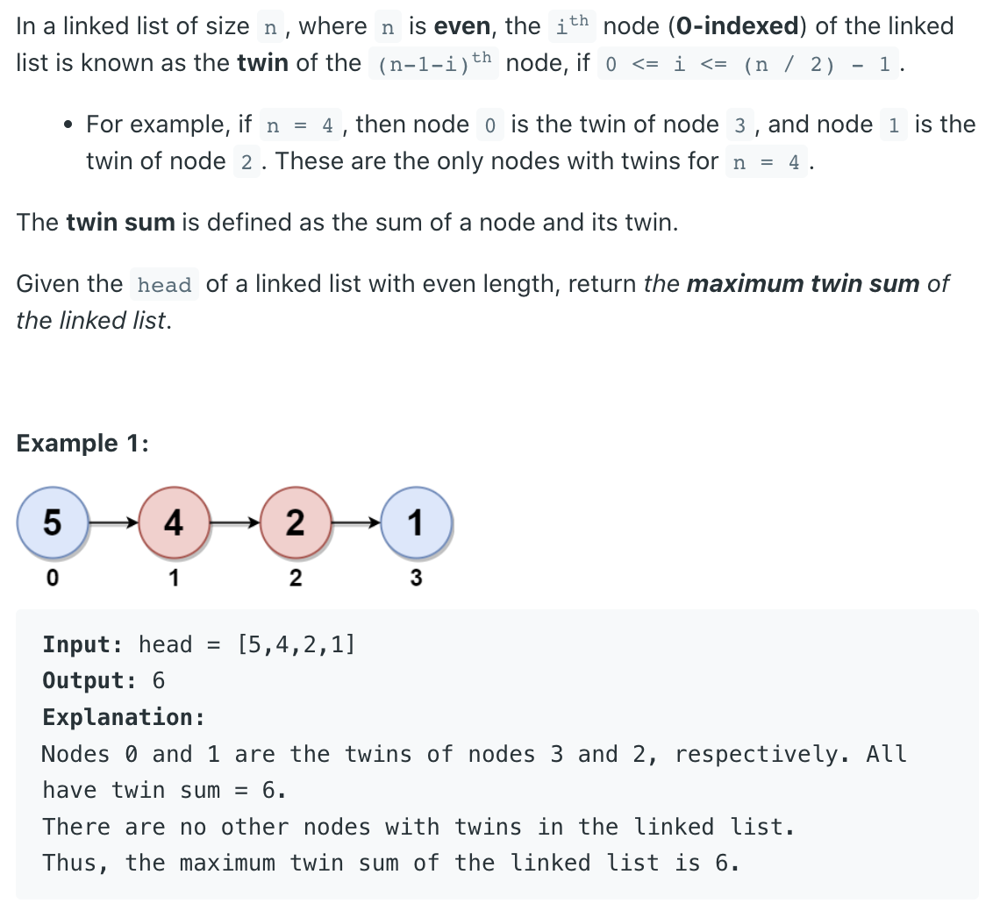
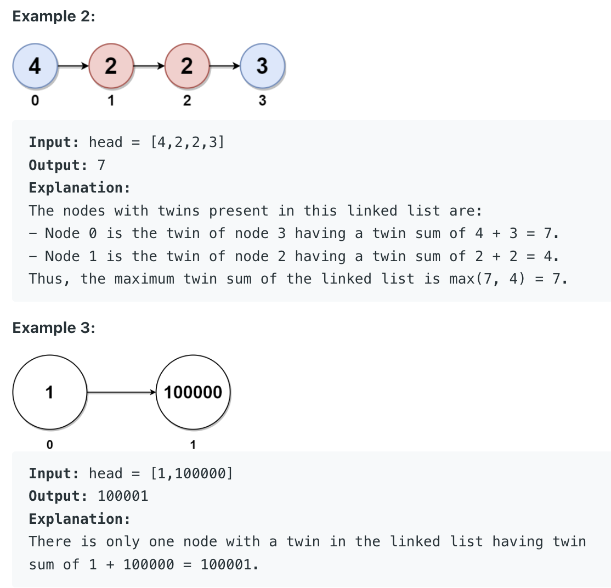

## 2130. Maximum Twin Sum of a Linked List





- The title says that a linked list contains n Nodes, n It must be an even number, 
  The first i Nodes （ The head of the linked list is the first 0 Nodes ） And   The 
  first (n/2) +i Two nodes are called twin nodes , The sum of two twin nodes is 
  called twin sum . Ask to find the largest twins and .

- In fact, it is to put one with n individual（n For the even ） The linked list is 
  divided into two parts from the middle , That is, two sub linked lists with equal 
  number of nodes , So all twin nodes are , The first sub linked list corresponds to 
  the second linked list from end to end to form a pair of twin nodes , From these 
  matching twin nodes, find the largest pair .

- 1） Divide the middle of the linked list into two sub linked lists with the same 
  length , The quickest way is Linked list Linked List The most commonly used fast 
  and slow pointer method in the series . Use two pointers to point to the chain 
  header , The slow pointer moves one step at a time and the fast pointer moves two 
  steps at a time , When the quick pointer comes to the end of the linked list , The 
  slow pointer divides the whole linked list into two parts just halfway through , 
  The node referred to by the slow pointer is the beginning node of the second part .

- 2） Find the sum of all twin nodes , Find the maximum . The first step has divided 
  the linked list into two parts , According to the definition of twin nodes , The 
  twin node is ： The last node of the first part is the same as the first node of 
  the second part , The first node of the first part and the last node 
  of the second part . Obviously, there can be a stack to implement , Put the nodes 
  of the first part into the stack from beginning to end , Then take out the twin 
  nodes one by one matching with the nodes in the second part from beginning to end .


```java
class Solution {
    public int pairSum(ListNode head) {
        int maxVal = 0;
        ListNode slow = head;
        ListNode fast = head;
        // Get middle of linked list
        while (fast != null && fast.next != null) {
            slow = slow.next;
            fast = fast.next.next;
        }
        
        ListNode prev = null;
        ListNode next = null;
        ListNode cur = slow;
        // Reverse second part of linked list
        while (cur != null) {
            next = cur.next;
            cur.next = prev;
            prev = cur;
            cur = next;
        }
        // Get max sum of pairs
        while (head != null && prev != null) {
            int sum = head.val + prev.val;
            maxVal = Math.max(maxVal, sum);
            head = head.next;
            prev = prev.next;
        }
        return maxVal;
    }
}
```
