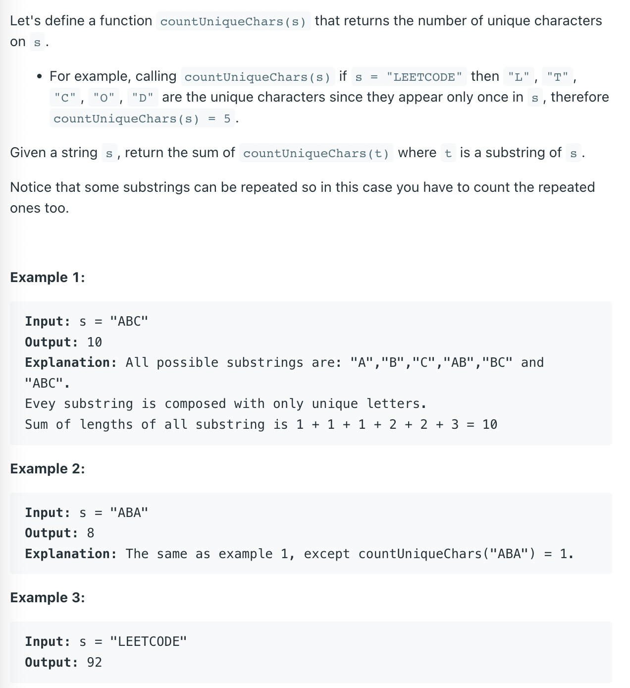

## 828 Count Unique Characters of All Substrings of a Given String



```ruby
input: "ABA"
=> A, B, A, AB, BA, ABA
countUniqueChar("ABA") = 1, because only "B" is unique.

  X A (X A X X A X
  X A  X (A X X A X
  X A  X  A) X X A X
  X A  X  A X) X A X
  X A  X  A X  X) A X

for 2nd A, 2 * 3 = 6 substrings

  A -> index[1, 3, 6]
  X -> index[0, 2, 4, 5, 7]
```

---

```java
class Solution {
    public int uniqueLetterString(String s) {
        if (s == null || s.length() == 0) {
            return 0;
        }
        
        Map <Character, List<Integer>> map = new HashMap<>();
        for (int i = 0; i < s.length(); i++) {
            map.computeIfAbsent(s.charAt(i), 
                                key -> new ArrayList<>()).add(i);
        }
        
        int sum = 0;
        for (List<Integer> indexes : map.values()) {
            for (int i = 0; i < indexes.size(); i++) {
                
                // 0 1 2 3 4 5 6
                // X X A X A X X
                
            // if position is the leftMost
            // 注意：假如 A 有很多个，就需要 DP, 
            // 不能用 indexes.get(i) - indexes.get(0) !!!
                int left = i == 0 ? indexes.get(i) + 1 
                    : indexes.get(i) - indexes.get(i - 1);
                
            // if position is the rightMost     
                int right = i == indexes.size() - 1 ? s.length() - indexes.get(i) 
                    : indexes.get(i + 1) - indexes.get(i);
                
                sum += left * right;
            }
        }
        return sum;
    }
}
```
