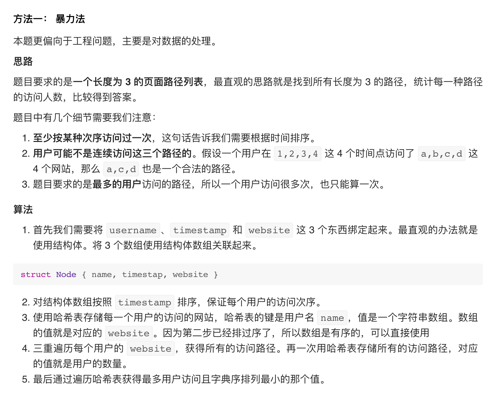

## 1152. Analyze User Website Visit Pattern

- [题目](https://leetcode.com/problems/analyze-user-website-visit-pattern/)


---


```java
/*
    map<user_name, List<websites>>
    map<3-sequence, Set<user_name>>
    O(N * M^3)
*/

class Pair {
    int time;
    String web;
    public Pair(int time, String web) {
        this.time = time;
        this.web = web;
    }
}
class Solution {
    public List<String> mostVisitedPattern(String[] username, int[] timestamp, String[] website) {
        Map<String, List<Pair>> map = new HashMap<>();
        int n = username.length;
        // collect the website info for every user, key: username, value: (timestamp, website)
        for (int i = 0; i < n; i++) {
            map.putIfAbsent(username[i], new ArrayList<>());
            map.get(username[i]).add(new Pair(timestamp[i], website[i]));
        }
        // count map to record every 3 combination occuring time for the different user.
        Map<String, Integer> count = new HashMap<>();
        String res = "";
        for (String key : map.keySet()) {
            Set<String> set = new HashSet<>();
            // this set is to avoid visit the same 3-seq in one user
            List<Pair> list = map.get(key);
            Collections.sort(list, (a, b)->(a.time - b.time)); // sort by time
            // brutal force O(N ^ 3)
            for (int i = 0; i < list.size(); i++) {
                for (int j = i + 1; j < list.size(); j++) {
                    for (int k = j + 1; k < list.size(); k++) {
                        String str = list.get(i).web + " " + list.get(j).web + " " + list.get(k).web;
                        if (!set.contains(str)) {
                            count.put(str, count.getOrDefault(str, 0) + 1);
                            set.add(str);
                        }
                        if (res.equals("") || count.get(res) < count.get(str) || (count.get(res) == count.get(str) && res.compareTo(str) > 0)) {
                            // make sure the right lexi order
                            res = str;
                        }
                    }
                }
            }
        }
        // grab the right answer
        String[] r = res.split(" ");
        List<String> result = new ArrayList<>();
        for (String str : r) {
            result.add(str);
        }
        return result;
    }
}
```

---
---

```ruby
Understand it with 2 examples:
1) Input:
username = ["joe"," joe", "joe", "james","james","james","james","mary", "mary","mary"],
timestamp = [1, 2, 3, 4, 5, 6, 7, 8, 9, 10],
website = ["home","about","career","home", "cart", "maps", "home", "home","about","career"]


Output: ["home","about","career"]

Explanation:
The 3-sequence ("home", "about", "career") was visited by 2 users: joe and mary
james visited 4 websites: "home", "cart",  "maps", "home"
there are 4 possible 3-sequences as:
The 3-sequence ("home", "cart", "maps") 
The 3-sequence ("home", "cart", "home")  
The 3-sequence ("home", "maps", "home") 
The 3-sequence ("cart", "maps", "home")  
each one is visited by one user, james only.


2) Input:
  ["u1","u1","u1","u2","u2","u2"]
  [ 1,   2,   3,   4,   5,   6]
  ["a", "b", "a", "a", "b", "c"]
  Output:  ["a"," b", "a"]
  
  Explanation:
     ["a"," b", "a"] was visited by 1 user: u1
     ["a", "b", "c"] was visited by 1 user: u2

   The lexicographically smallest is  ["a"," b", "a"]
```

- To solve this problem is to find a three-page sequence that has the most number of users who
  have gone through this. 

---

```java
class Solution {
    public List<String> mostVisitedPattern(String[] username, int[] timestamp, String[] website) {
        // collect the website info for every user, key: username, value: (timestamp, website)
        Map<String, TreeMap<Integer, String>> map = new HashMap<>();
        for (int i = 0; i < timestamp.length; i++) {
            if (!map.containsKey(username[i])) {
                map.put(username[i], new TreeMap<>());
            }
            TreeMap<Integer, String> timeMap = map.get(username[i]);
            timeMap.put(timestamp[i], website[i]);
            map.put(username[i], timeMap);
        }
        
        Map<String, Integer> sequenceMap = new HashMap<>();
        for (String user : map.keySet()) {
            TreeMap<Integer, String> timeMap = map.get(user);
            if (timeMap.size() < 3) {
                continue;
            } else {
                List<Integer> times = new ArrayList<>();
                for (int key : timeMap.keySet()) {
                    times.add(key);
                }
                List<String> allSeqs = formAllSeqs(times, timeMap);
                Set<String> visited = new HashSet();
                for (String seq : allSeqs) {
                    if (visited.add(seq)) {
                        sequenceMap.put(seq, sequenceMap.getOrDefault(seq, 0) + 1);
                    }
                }
            }
        }
        int count = 0;
        String res = "";
        for (String key : sequenceMap.keySet()) {
            if (sequenceMap.get(key) > count) {
                count = sequenceMap.get(key);
                res = key;
            } else if (sequenceMap.get(key) == count) {
                if (key.compareTo(res) < 0) {
                    res = key;
                }
            }
        }
        List<String> threeSeq = new ArrayList<>();
        for (String s : res.split("->")) {
            threeSeq.add(s);
        }
        return threeSeq;
    }
    
    private List<String> formAllSeqs(List<Integer> times, TreeMap<Integer, String> timeMap) {
        List<String> result = new ArrayList<>();
        for (int i = 0; i < times.size(); i++) {
            for (int j = i + 1; j < times.size(); j++) {
                for (int k = j + 1; k < times.size(); k++) {
                    result.add(timeMap.get(times.get(i)) + "->" + timeMap.get(times.get(j)) + 
                    "->" + timeMap.get(times.get(k)));
                }
            }
        }
        return result;
    }
}
```