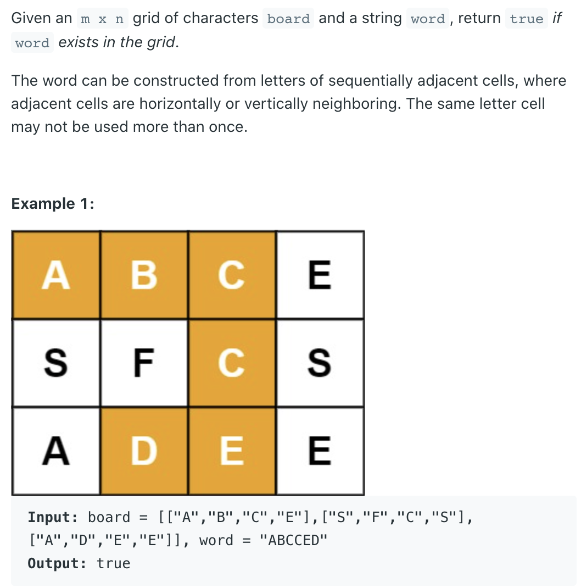
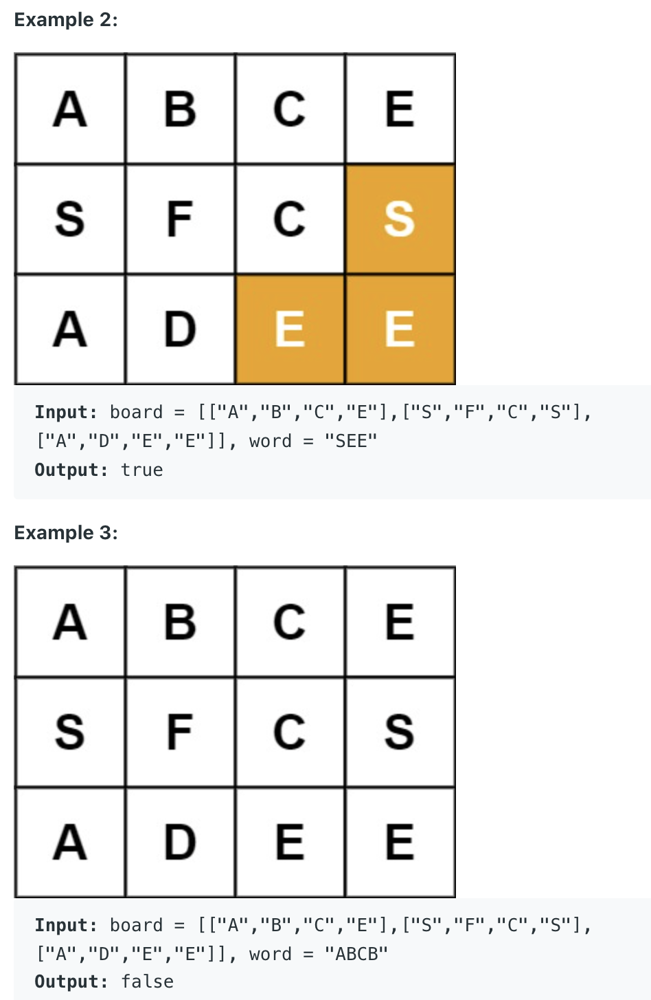
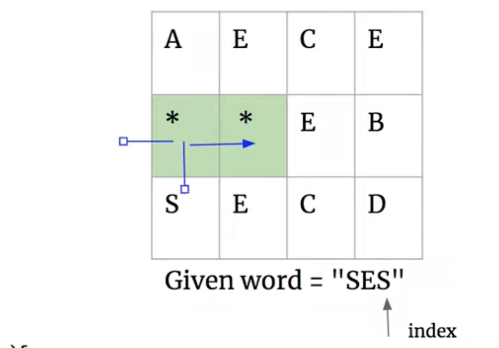

## 79. Word Search





---

- Note: **The same letter cell may not be used more than once.**
  - 因此在这里需要给visited 的element, 做上标记



```java
class Solution {
    private static boolean[][] visited;
    public boolean exist(char[][] board, String word) {
        if (board == null || board.length == 0 
                          || board[0].length == 0) {
            return false;
        } 
        if (word == null || word.length() == 0) {
            return true;
        }
        int m = board.length, n = board[0].length;
        visited = new boolean[m][n];
        for (int i = 0; i < m; i ++ ) {
            for (int j = 0; j < n; j++) {
                if (dfs(board, word, i, j, 0)) {
                    return true;
                }
            }
        }
        return false;
    }
    
    private boolean dfs(char[][] board, String word, 
                       int i, int j, int index) {
        if (index == word.length()) {
            return true;
        }
        if (i < 0 || i >= board.length ||
            j < 0 || j >= board[0].length ||
            board[i][j] != word.charAt(index) ||
            visited[i][j]) {
            return false;
        }
        visited[i][j] = true;
        boolean found = 
            dfs(board, word, i + 1, j, index + 1) ||
            dfs(board, word, i, j + 1, index + 1) ||
            dfs(board, word, i - 1, j, index + 1) ||
            dfs(board, word, i, j - 1, index + 1);
        visited[i][j] = false;
        
        return found;
    }
}
```