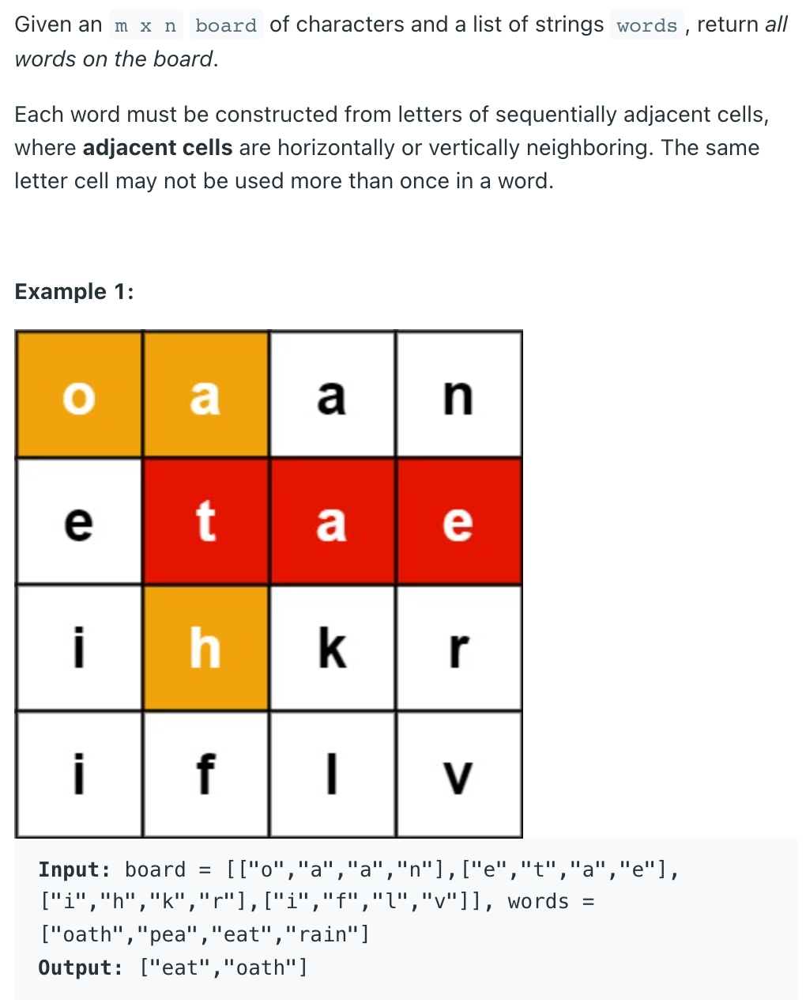

## 212. Word Search II [Hard]




---

- Intuitively, start from every cell and try to build a word in the dictionary. 
  `Backtracking (dfs)` is the powerful way to exhaust every possible ways. 
  Apparently, we need to do `pruning` when current character is not in any word.

- `Trie` is the natural choice. Notice that:
  - 1. `TrieNode` is all we need. search and `startsWith` are useless.
  - 2. No need to store character at TrieNode. `c.next[i] != null` is enough.
  - 3. Never use `c1 + c2 + c3`. Use `StringBuilder`.
  - 4. No need to use `O(n^2)` extra space `visited[m][n]`.
  - 5. No need to use `StringBuilder`. Storing `word` itself at leaf node is enough.
  - 6. No need to use `HashSet` to de-duplicate. Use "one time search" trie.

```java
class Solution {
    class TrieNode {
        TrieNode[] children = new TrieNode[26];
        String word;
    }    
    public List<String> findWords(char[][] board, String[] words) {
        List<String> res = new ArrayList<>();
        TrieNode root = buildTrie(words);
        for (int i = 0; i < board.length; i++) {
            for (int j = 0; j < board[0].length; j++) {
                dfs (board, i, j, root, res);
            }
        }
        return res;
    }

    public void dfs(char[][] board,int i,int j,TrieNode root,List<String> res){
        if (i < 0 || j < 0 || i >= board.length || j >= board[0].length || 
            board[i][j] == '#' || root.children[board[i][j] - 'a'] == null) {
            return;
        }
        root = root.children[board[i][j] - 'a'];
        if (root.word != null) { // found one
            res.add(root.word);
            root.word = null;  // de-duplicate
        }

        char c = board[i][j];
        board[i][j] = '#';
        dfs(board, i - 1, j, root, res);  
        dfs(board, i + 1, j, root, res);        
        dfs(board, i, j - 1, root, res);   
        dfs(board, i, j + 1, root, res); 
        board[i][j] = c;
    }

    public TrieNode buildTrie(String[] words) {
        TrieNode root = new TrieNode();
        for (String w : words) {
            TrieNode cur = root;
            for (char c : w.toCharArray()) {
                 if (cur.children[c - 'a'] == null) {
                     cur.children[c - 'a'] = new TrieNode();                     
                 }
                 cur = cur.children[c - 'a'];
            }
            cur.word = w;
        }
        return root;
    }
}
```