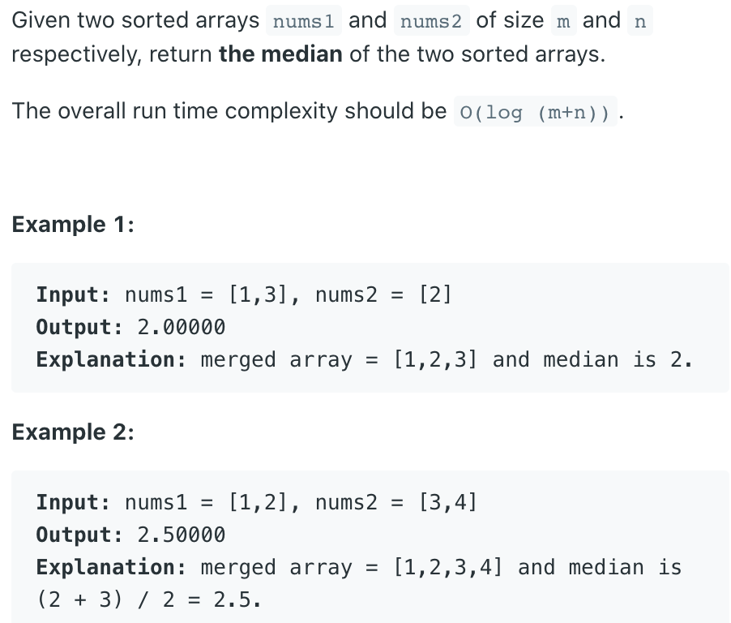
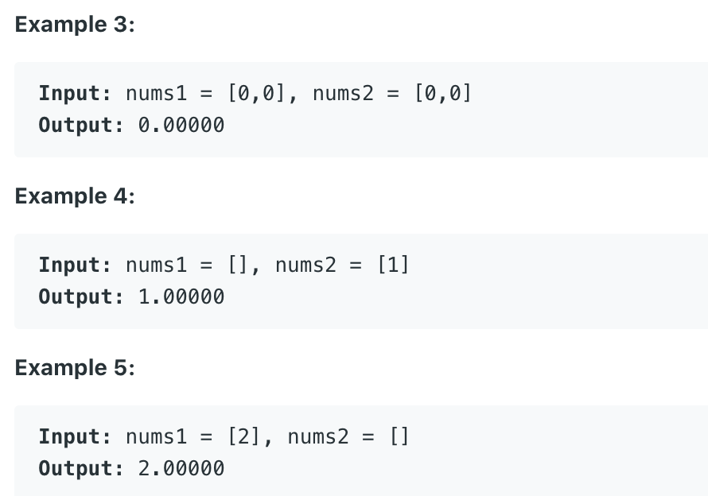

## 4. Median of Two Sorted Arrays



```ruby
# ex1: even length

   A [ 1 | 3 | 5 | 7 ]
   B [ 2 | 4 ]
merge[ 1 | 2 | 3 | 4 | 5 | 7 ]

if (n % 2 == 0)
    return (merge[(n - 1) / 2] + merge[n /2]) / 2.0;

    merge[(n - 1) / 2] 
=   merge[(6 - 1) / 2] = merge[2] = 3

    merge[n / 2] 
=   merge[6 / 2] = merge[3] = 4

return (3 + 4) / 2.0 = 3.5


# ex2: odd length

   A [ 1 | 3 | 5 ]
   B [ 2 | 4 ]
merge[ 1 | 2 | 3 | 4 | 5 ]

if (n % 2 != 0)
    return merge[n /2];

    merge[n / 2] 
=   merge[5 / 2] = 3

return 3
```

- T = O(m + n)
- Space = O(m + n)

```java


class Solution {
    public double findMedianSortedArrays(int[] nums1, int[] nums2) {
      int[] mergedArray = merge(nums1, nums2);
      int n = mergedArray.length;
      if (n % 2 == 0) {
        return (mergedArray[(n - 1) / 2] + mergedArray[n / 2]) / 2.0;
      } else {
        return mergedArray[n / 2];
      }
    }
    
    private int[] merge(int[] nums1, int[] nums2) {
        int m = nums1.length;
        int n = nums2.length;
        int[] merged = new int[m + n];
        int i = 0;
        int j = 0;
        int idx = 0;
        while (i < m && j < n) {
            if (nums1[i] <= nums2[j]) {
                merged[idx++] = nums1[i++];
            } else {
                merged[idx++] = nums2[j++];
            }
        }
        
        while (i < m) {
            merged[idx++] = nums1[i++];
        }
        while (j < n) {
            merged[idx++] = nums2[j++];
        }        
        return merged;
    }
}
```