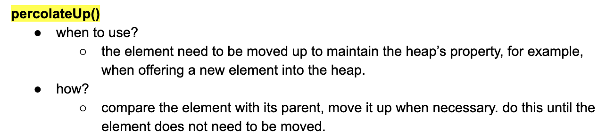
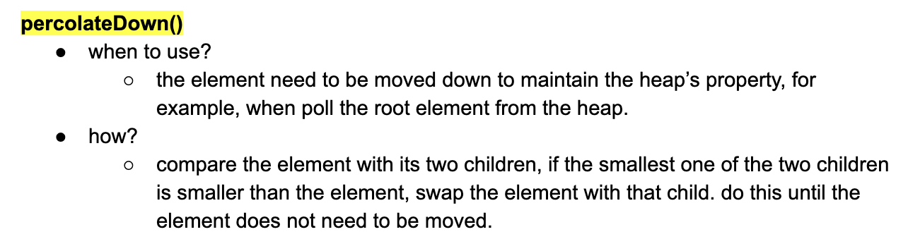
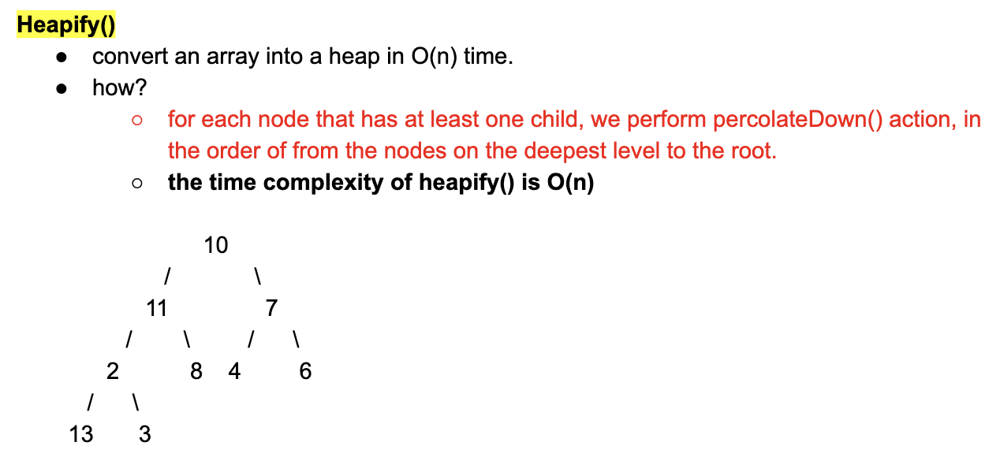
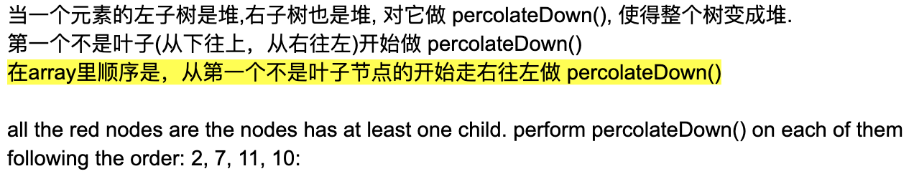
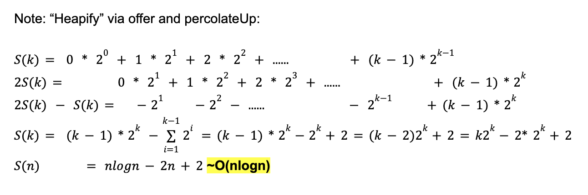

## Implementation of Heap

- Heap is a `Complete binary Tree`

- index of `parent = i`, what is the index of the two child nodes?
  - **left** child of index `i = 2 * i + 1`;
  - **right** child of index `i = 2 * i + 2`;
  - **parent** of index `i = (i - 1) / 2`
- the root of the tree is at `index 0`
---
- 1. 先维护 `complete tree`
- 2. 维护 堆序性
---

### Offer()


```ruby
Min Heap:
                1
            /       \ 
           3         10
         /   \       /  \
        5      4    13   19
      /  \    /
    11    8   6 
  
   [1, 3, 10, 5, 4, 13, 19, 11, 8, 6] 
    0  1   2  3  4   5   6   7  8  9


offer(2):

                1
            /       \ 
           3         10
         /   \       /  \
        5      4    13   19
      /  \    /  \
    11    8   6   [2]


                1
            /       \ 
           3         10
         /   \       /  \
        5     [2]   13   19
      /  \    /  \
    11    8   6   4


                1
            /       \ 
          [2]        10
         /   \       /  \
        5      3    13   19
      /  \    /  \
    11    8   6   4
```


- 如果不记得这个单词，就叫它 `swap up`

---

### poll()

```ruby
Min Heap:
                1
            /       \ 
           3         10
         /   \       /  \
        5      4    13   19
      /  \    /
    11    8   6 
  
   [1, 3, 10, 5, 4, 13, 19, 11, 8, 6] 
    0  1   2  3  4   5   6   7  8  9


poll():  ## 这里肯定是 poll -> 1

                1
            /       \ 
           3         10
         /   \       /  \
        5      4    13   19
      /  \    /
    11    8   6 


               [6]
            /       \ 
           3         10
         /   \       /  \
        5      4    13   19
      /  \    
    11    8 


                3
            /       \ 
          [6]         10
         /   \       /  \
        5      4    13   19
      /  \    
    11    8 


                3
            /       \ 
           4         10
         /   \       /  \
        5    [6]    13   19
      /  \    
    11    8 
```



- 在上面的过程度复杂度最高的是 `swap` => 最多swap `logN` 次

---

### Heapify()




```ruby
                10
            /       \ 
           11          7
         /   \       /  \
        2      8    4    6
      /  \    
    13    3   
    

After percolateDown() on 2

                10
            /       \ 
           11          7
         /   \       /  \
      [2]      8    4    6
      /  \    
    13    3  


After percolateDown() on 7

                10
            /       \ 
           11          4
         /   \       /  \
        2      8   [7]   6
      /  \    
    13    3  


After percolateDown() on 11

                10
            /       \ 
           2          4
         /   \       /  \
       [11]    8    7    6
      /  \    
    13    3  


                10
            /       \ 
           2          4
         /   \       /  \
        3     8     7    6
      /  \    
    13   [11]  


After percolateDown() on 10

                2
            /       \ 
           10          4
         /   \       /  \
        3     8     7    6
      /  \    
    13    11 
    

                2
            /       \ 
           3          4
         /   \       /  \
        10     8    7    6
      /  \    
    13    11 
```


---
- 注意如果用 `offer()` and `percolate Up`, 时间复杂度是 `n * logn`
  - `log1 + log2 + log3 + ... + logn = log(n!) => n log(n)`

---

### Implementation
