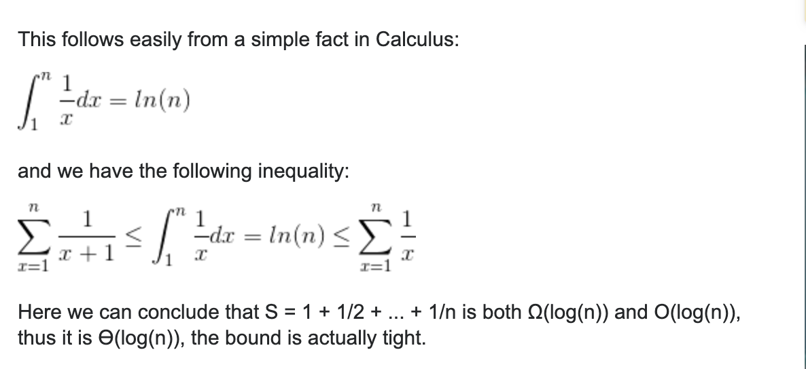
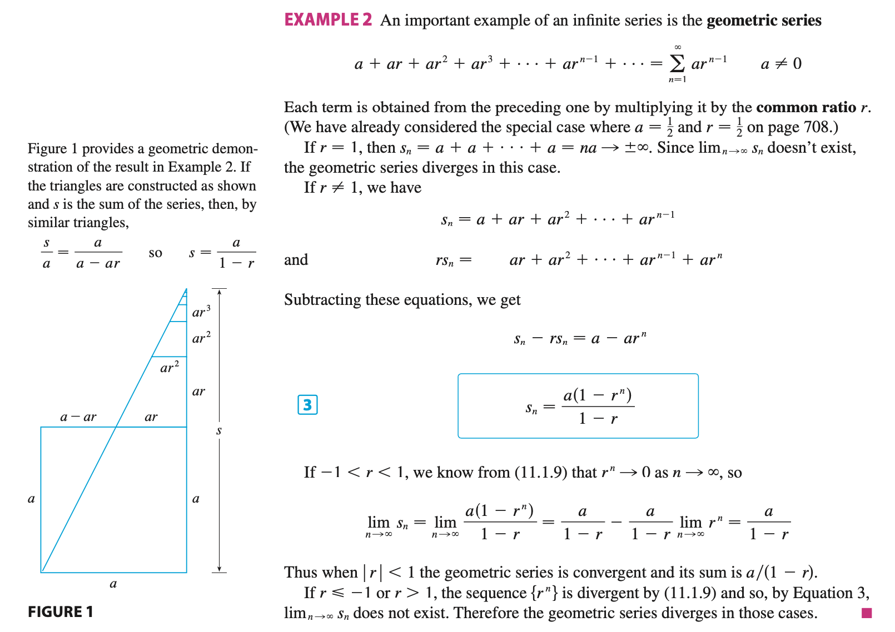

## Series Big-O | arithmetic, Geometric sequence

#### Prove that:

```ruby
1 + 1/2 + 1/3 + ... + 1/n is O(log n)
```




#### Geometric Series:




```ruby
n + n/2 + n/3 + ... + n/n

=> n(1 + 1/2 + 1/3 + ... + 1/n) => O(n logn)
```


#### Power Series:


### 关于 Big O (time complexity, space complexity)

```ruby
时间复杂度和空间复杂度都是函数，定量去描述该算法的运行时间和临时占用的储存空间。
举个最简单的例子吧，你有一个array，现在需要找到数组中的最小值，那么时间上你要遍历在这个array中的
每一个数字。当你遍历到某个数字的时候（array[n]），去和之前你遇到的min比较（min vs. array[n]）
然后更新（min = array[n] or min），这一系列具体操作可以理解用了O(3)时间。
那么你对于n个index都进行了这一系列操作，总时间是O（3*n） = O（n），在time complexity的计算中，
n前面的系数和后面次数比他小的数字都要忽略。
然后空间上，因为你只引进了min这一个variable，所以占用了O（1）空间。
```


## arithmetic sequence

- `(n-1) + (n-2) + (n-3) + ... + 2 + 1 = n (n - 1)/2 => O(n^2);`