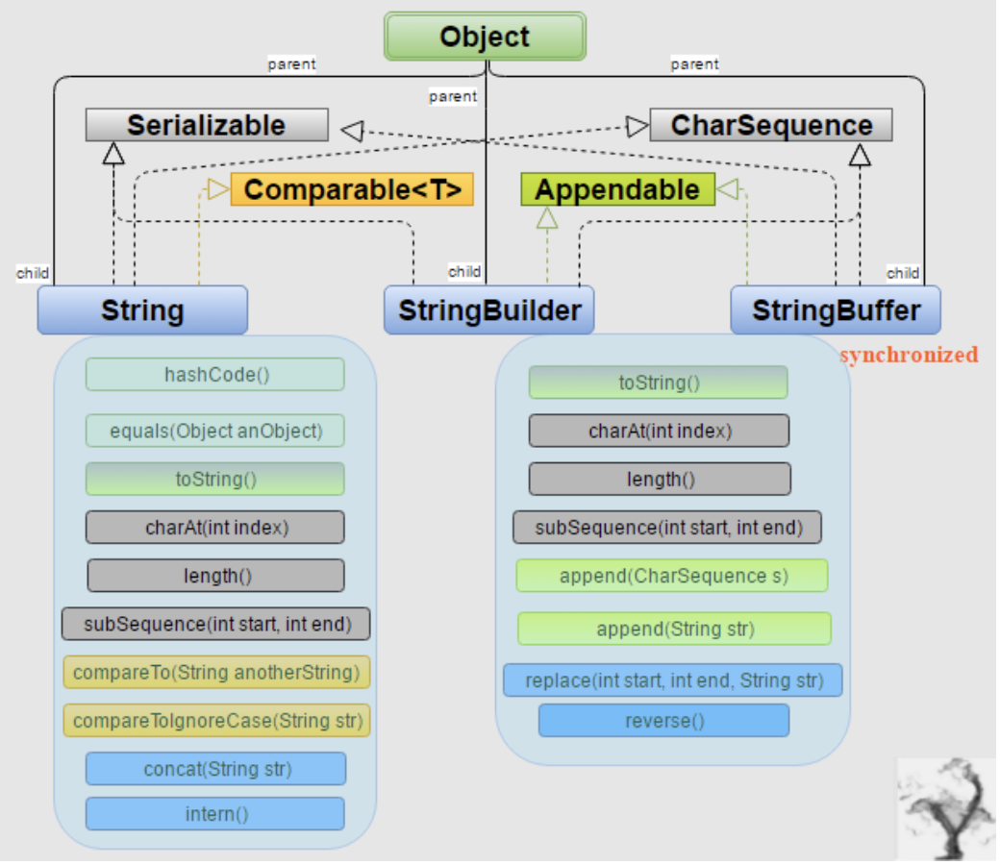

# String | StringBuffer | StringBuilder

### Mutability Difference:

- `String` is immutable, if you try to alter their values, another object gets created, 
   whereas(然而，鉴于) `StringBuilder` and `StringBuilder` are mutable so they can change their
   values.

### Thread-Safety Difference

- The difference between `StringBuffer` and `StringBuilder` is that `StringBuffer` is 
  thread-safe. So when the application needs to be run only in a single thread then it is better to use `StringBuilder`. `StringBuilder` is more efficient than `StringBuffer`.

### Situations

- If your stirng is not going to change use a `String` class because a `String` object is
  immutable.
- If your stirng can change(example: lots of logic and operatins in the construction of the
  stirng) and will only be accessed from a single thread, using a `StringBuilder` is good enough
- If your stirng can change, and will be accessed from multiple threads, use a `StringBuffer` 
  because `StringBuffer` is synchronous so you have thread-safety.


- [reference to stackflow](https://stackoverflow.com/questions/2971315/string-stringbuffer-and-stringbuilder)
---



```java
----------------------------------------------------------------------------------
                  String                    StringBuffer         StringBuilder
----------------------------------------------------------------------------------                 
Storage Area | Constant String Pool         Heap                   Heap 
Modifiable   |  No (immutable)              Yes( mutable )         Yes( mutable )
Thread Safe  |      Yes                     Yes                     No
 Performance |     Fast                 Very slow                  Fast
----------------------------------------------------------------------------------
```

---


### Example:

```java
public class immutable {
    // Concatenates to String
    public static void concat1(String s1) {
        s1 = s1 + "forgeeks";
        System.out.println(s1);
    }

    // Concatenates to StringBuilder
    public static void concat2(StringBuilder s2) {
        s2.append("forgeeks");
    }

    // Concatenates to StringBuffer
    public static void concat3(StringBuffer s3) {
        s3.append("forgeeks");
    }

    public static void main(String[] args) {
        String s1 = "Geeks";
        concat1(s1);  // s1 is not changed
        System.out.println("String: " + s1);

        StringBuilder s2 = new StringBuilder("Geeks");
        concat2(s2); // s2 is changed
        System.out.println("StringBuilder: " + s2);

        StringBuffer s3 = new StringBuffer("Geeks");
        concat3(s3); // s3 is changed
        System.out.println("StringBuffer: " + s3);
    }
}
```

```ruby
Geeksforgeeks
String: Geeks
StringBuilder: Geeksforgeeks
StringBuffer: Geeksforgeeks
```

- Explanation:
  - `Concat1` : In this method, we pass a string “Geeks” and perform “s1 = s1 + ”forgeeks”. 
    The string passed from main() is not changed, this is due to the fact that String is 
    `immutable`. **Altering the value of string creates another object** and s1 in concat1() 
    **stores reference of new string**. References s1 in main() and cocat1() 
    refer to different strings.
  - `Concat2` : In this method, we pass a string “Geeks” and perform `s2.append(“forgeeks”)`
    which changes the actual value of the string (in main) to “Geeksforgeeks”. This is due to 
    the simple fact that StringBuilder is `mutable` and hence changes its value.


- [reference to example:](https://www.geeksforgeeks.org/string-vs-stringbuilder-vs-stringbuffer-in-java/)

