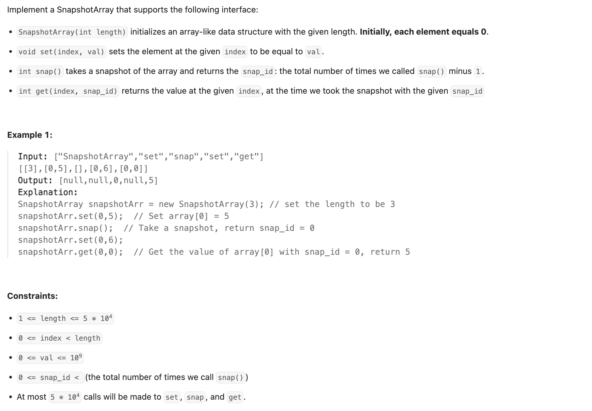
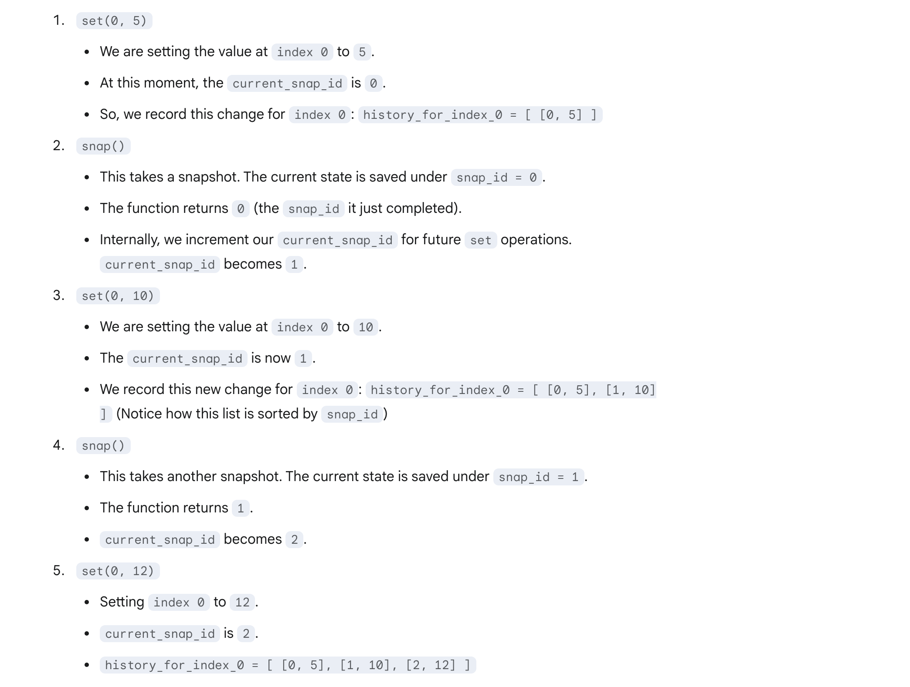
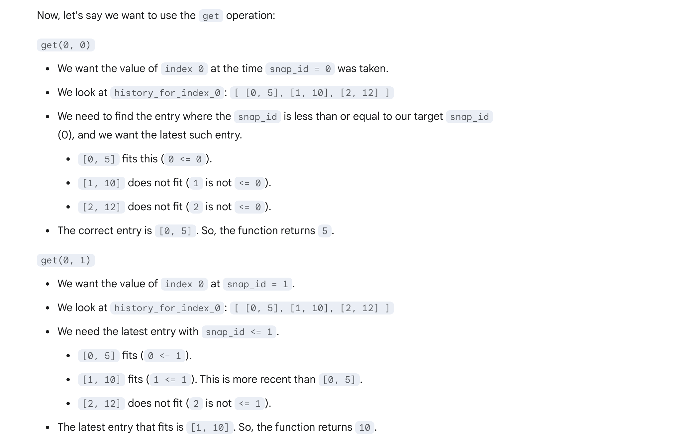
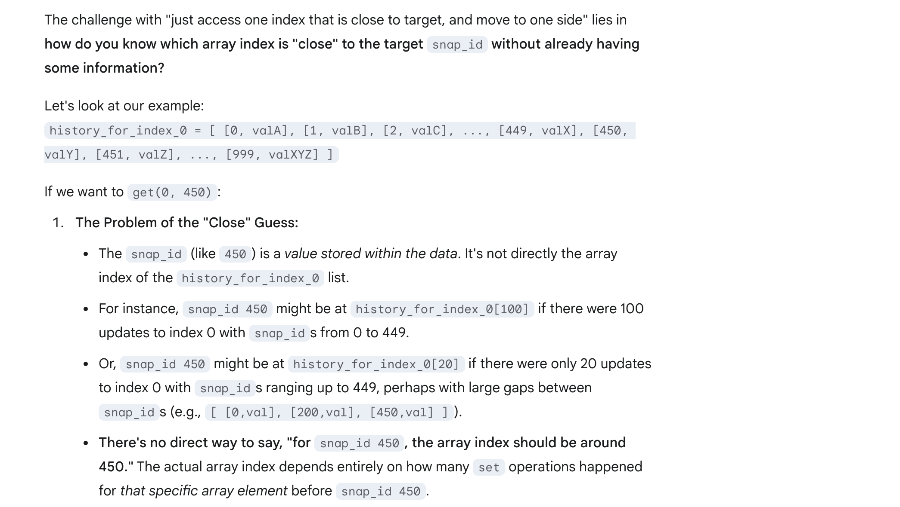
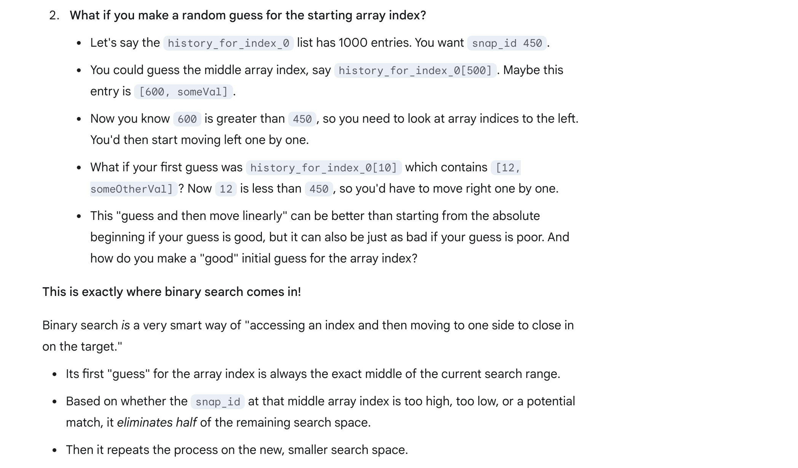

## 1146. Snapshot Array

---

- Let's look at this example to see how it working:



---

- why not try to be smarter than just starting at the very beginning if we have a target in mind?


---

- 接下来是option to read:


---

```java
class SnapshotArray {
    private int snap_cnt;
    private List<int[]>[] data;

    public SnapshotArray(int length) {
        snap_cnt = 0;
        data = new List[length];
        for (int i = 0; i < length; i++) {
            data[i] = new ArrayList<>();
        }
    }

    public void set(int index, int val) {
        data[index].add(new int[]{snap_cnt, val});
    }

    public int snap() {
        return snap_cnt++;
    }

    public int get(int index, int snap_id) {
        int pos = binarySearch(data[index], snap_id);
        return pos == -1 ? 0 : data[index].get(pos)[1];
    }

    private int binarySearch(List<int[]> list, int snap_id) {
        int left = 0, right = list.size() - 1;
        int res = -1;
        while (left <= right) {
            int mid = (left + right) >>> 1;
            int[] pair = list.get(mid);
            if (pair[0] == snap_id) {
                res = mid;
                left = mid + 1;
            } else if (pair[0] < snap_id) {
                res = mid;
                left = mid + 1;
            } else {
                right = mid - 1;
            }
        }
        return res;
    }
}
```
---

```py
class SnapshotArray:
    
    def __init__(self, length: int):
        self.snap_cnt = 0
        self.data = [[] for _ in range(length)]

    def set(self, index: int, val: int) -> None:
        self.data[index].append((self.snap_cnt, val))
        
    def snap(self) -> int:
        self.snap_cnt += 1
        return self.snap_cnt - 1

    def get(self, index: int, snap_id: int) -> int:
        pos = self.binarySearch(self.data[index], snap_id)
        return 0 if pos == -1 else self.data[index][pos][1]
    
    def binarySearch(self, lst: list, snap_id: int) -> int:
        left, right = 0, len(lst) - 1
        res = -1
        while left <= right:
            mid = (left + right) >> 1
            if lst[mid][0] <= snap_id:
                res = mid
                left = mid + 1
            else:
                right = mid - 1
        return res
```