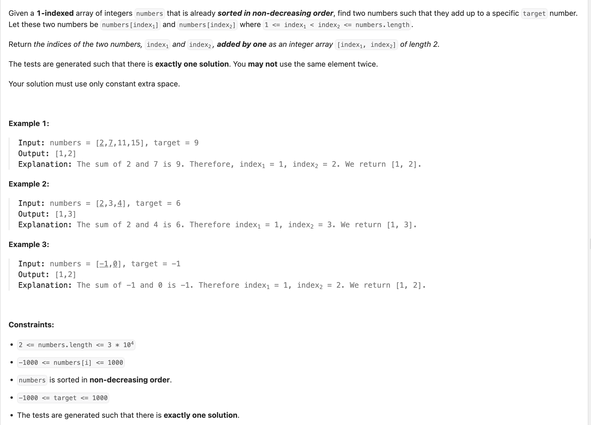

## 167. Two Sum II - Input Array Is Sorted


---

```py
class Solution:
    def twoSum(self, numbers: List[int], target: int) -> List[int]:
        min_diff = float('inf')
        left, right = 0, len(numbers) - 1
        res = []
        while left < right:
            twoSum = numbers[left] + numbers[right]
            if abs(twoSum - target) < min_diff:
                min_diff = abs(twoSum - target)
                res = [left, right]
            
            if twoSum == target:
                return [left + 1, right + 1]
            elif twoSum < target:
                left += 1
            else:
                right -= 1        
        
        return [res[0] + 1, res[1] + 1]
```