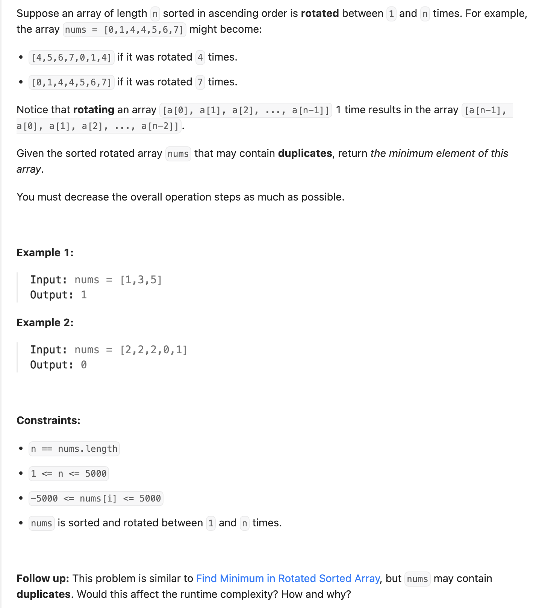
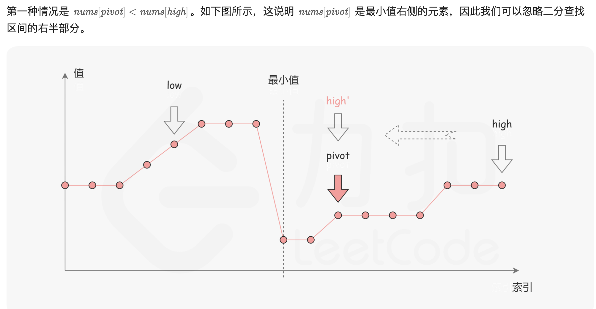
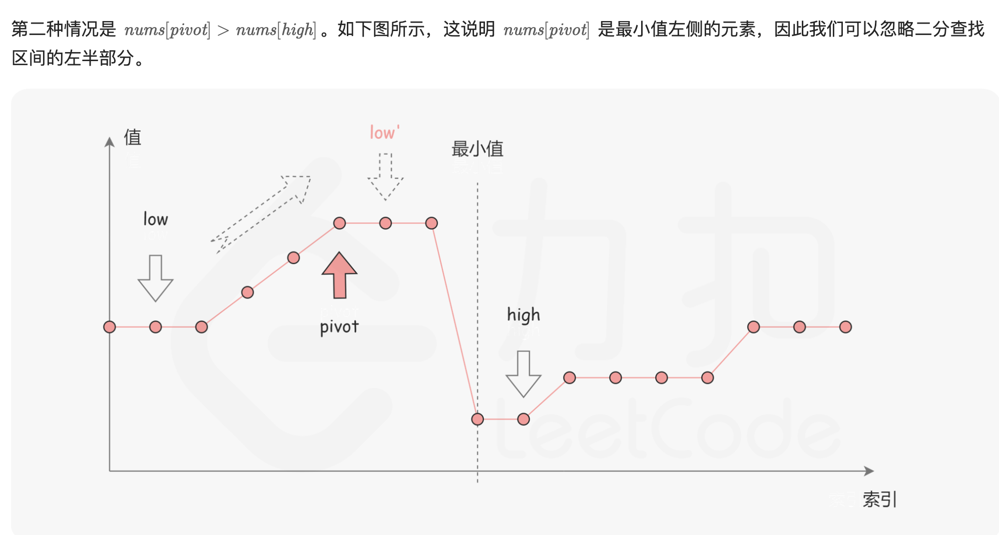
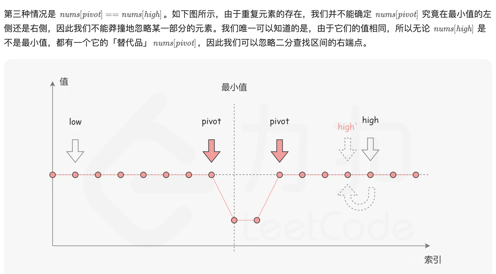

## 154. Find Minimum in Rotated Sorted Array II

---




```java
class FindMinimumInRotatedSortedArray_II {
    public int findMin(int[] nums) {
        int left = 0, right = nums.length - 1;
        while (left < right) {
            int mid = left + ((right - left) >> 1);
            if (nums[mid] < nums[right]) {
                right = mid;
            } else if (nums[mid] > nums[right]) {
                left = mid + 1;
            } else {
                right--;
            }
        }
        return nums[left];
    }
}
```