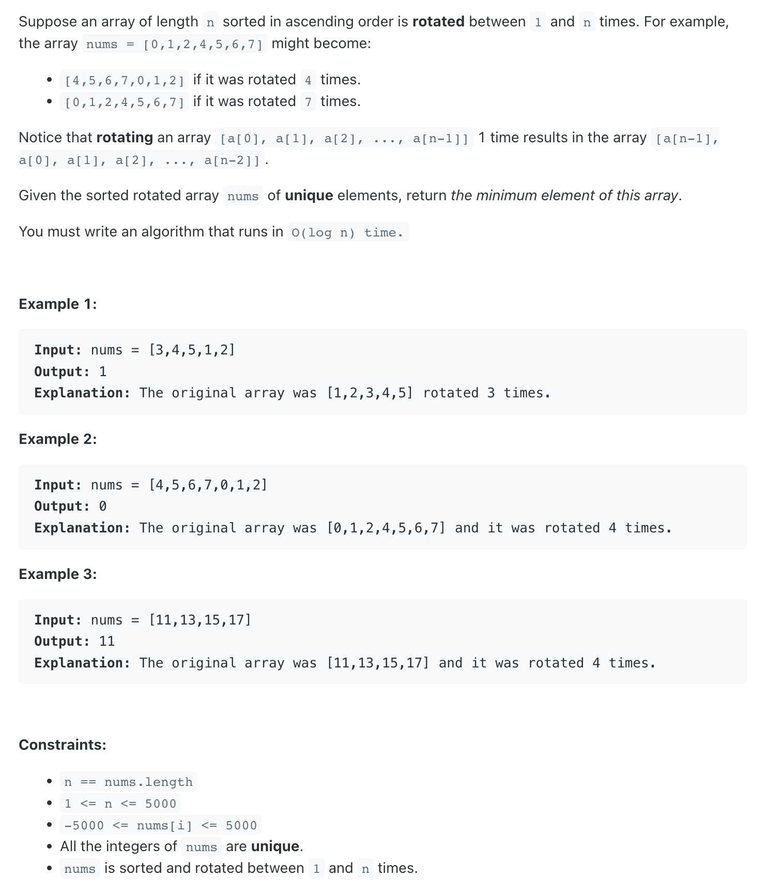

## 153. Find Minimum in Rotated Sorted Array


- [refer to LC 33 find Peak]()
---
```java
class findMinimumInRotatedSortedArray {
    public int findMin(int[] nums) {
        if (nums.length == 1) return 0;

        if (nums[0] < nums[nums.length - 1]) {
            return nums[0];
        }

        int left = 0, right = nums.length - 1;
        while (left <= right) {
            int mid = left + (right - left) / 2;
            if (nums[mid] > nums[mid + 1]) {
                return nums[mid + 1];
            } else if (nums[left] <= nums[mid]) {
                left = mid + 1;
            } else if (nums[mid] < nums[right]){
                right = mid - 1;
            }
        }
        return 0;
    }
}
```
---

### Find Peak

```java
class findMinimumInRotatedSortedArray_findPeak {
    public int findMin(int[] nums) {
        int peakIdx = findPeakIndex(nums);
        return nums[peakIdx];
    }

    private int findPeakIndex(int[] nums) {
        if (nums.length == 1) return 0;

        if (nums[0] < nums[nums.length - 1]) {
            // 如果是一个纯单调递增的数组，那么return 最第一个index
            return 0;
        }
        int left = 0, right = nums.length - 1;
        while (left <= right) {
            int mid = left + (right - left) / 2;
            if (nums[mid] > nums[mid + 1]) {
                return mid + 1;
            } else if (nums[left] <= nums[mid]) {
                left = mid + 1;
            } else {
                right = mid - 1;
            }
        }
        return 0;
    }
}
```