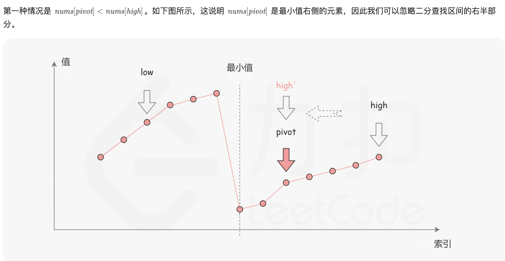
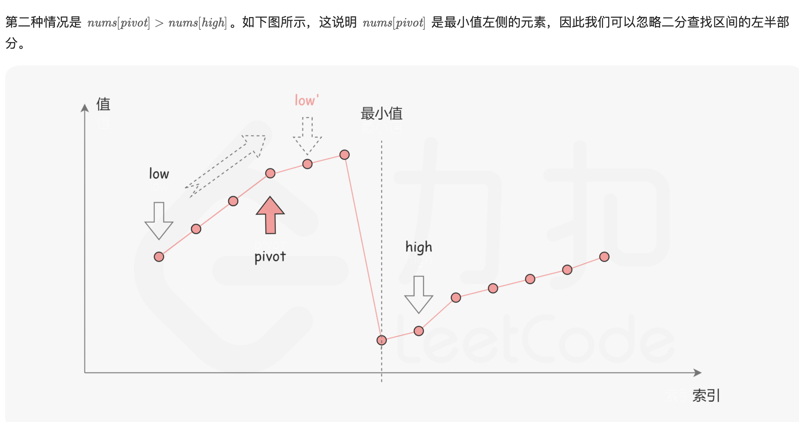

## 153. Find Minimum in Rotated Sorted Array


- [官方题解](https://leetcode.cn/problems/find-minimum-in-rotated-sorted-array/solutions/698479/xun-zhao-xuan-zhuan-pai-xu-shu-zu-zhong-5irwp/#:~:text=3%2B-,%E6%96%B9%E6%B3%95%E4%B8%80%EF%BC%9A%E4%BA%8C%E5%88%86%E6%9F%A5%E6%89%BE,%E6%97%8B%E8%BD%AC%E4%B9%8B%E5%90%8E%EF%BC%8C%E5%8F%AF%E4%BB%A5%E5%BE%97%E5%88%B0%E4%B8%8B%E9%9D%A2%E5%8F%AF%E8%A7%86%E5%8C%96%E7%9A%84%E6%8A%98%E7%BA%BF%E5%9B%BE%EF%BC%9A,-%E5%85%B6%E4%B8%AD%E6%A8%AA%E8%BD%B4)






---
### Template 2

```java
class findMinimumInRotatedSortedArray_t2 {
    public int findMin(int[] nums) {
        int left = 0, right = nums.length - 1;
        while (left < right) {
            int mid = left + ((right - left) >> 2);
            if (nums[mid] < nums[right]) {
                right = mid;
            } else {
                left = mid + 1;
            }
        }
        return nums[left];
    }
}
```


---
### Template 1

```java
class findMinimumInRotatedSortedArray {
    public int findMin(int[] nums) {
        if (nums.length == 1) return nums[0];

        if (nums[0] < nums[nums.length - 1]) {
            return nums[0];
        }

        int left = 0, right = nums.length - 1;
        while (left <= right) {
            int mid = left + (right - left) / 2;
            if (nums[mid] > nums[mid + 1]) {
                return nums[mid + 1];
            } else if (nums[left] <= nums[mid]) {
                left = mid + 1;
            } else if (nums[mid] < nums[right]){
                right = mid - 1;
            }
        }
        return -1;
    }
}
```
---

### Find Peak

```java
class findMinimumInRotatedSortedArray_findPeak {
    public int findMin(int[] nums) {
        int peakIdx = findPeakIndex(nums);
        return nums[peakIdx];
    }

    private int findPeakIndex(int[] nums) {
        if (nums.length == 1) return 0;

        if (nums[0] < nums[nums.length - 1]) {
            // 如果是一个纯单调递增的数组，那么return 最第一个index
            return 0;
        }
        int left = 0, right = nums.length - 1;
        while (left <= right) {
            int mid = left + (right - left) / 2;
            if (nums[mid] > nums[mid + 1]) {
                return mid + 1;
            } else if (nums[left] <= nums[mid]) {
                left = mid + 1;
            } else {
                right = mid - 1;
            }
        }
        return 0;
    }
}
```