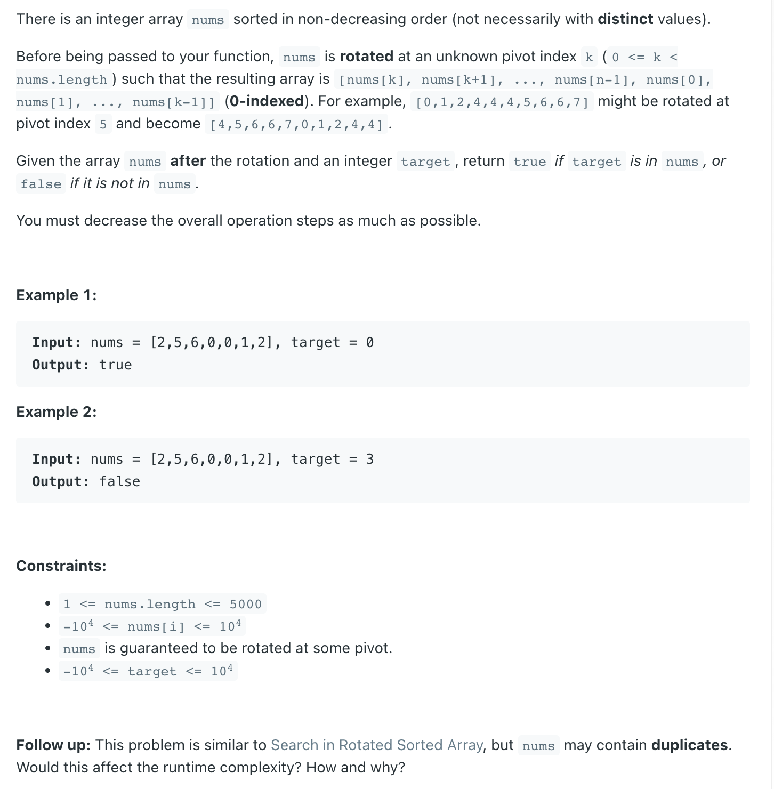
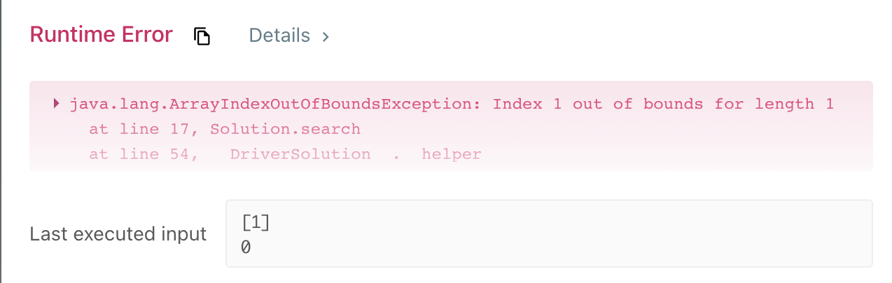
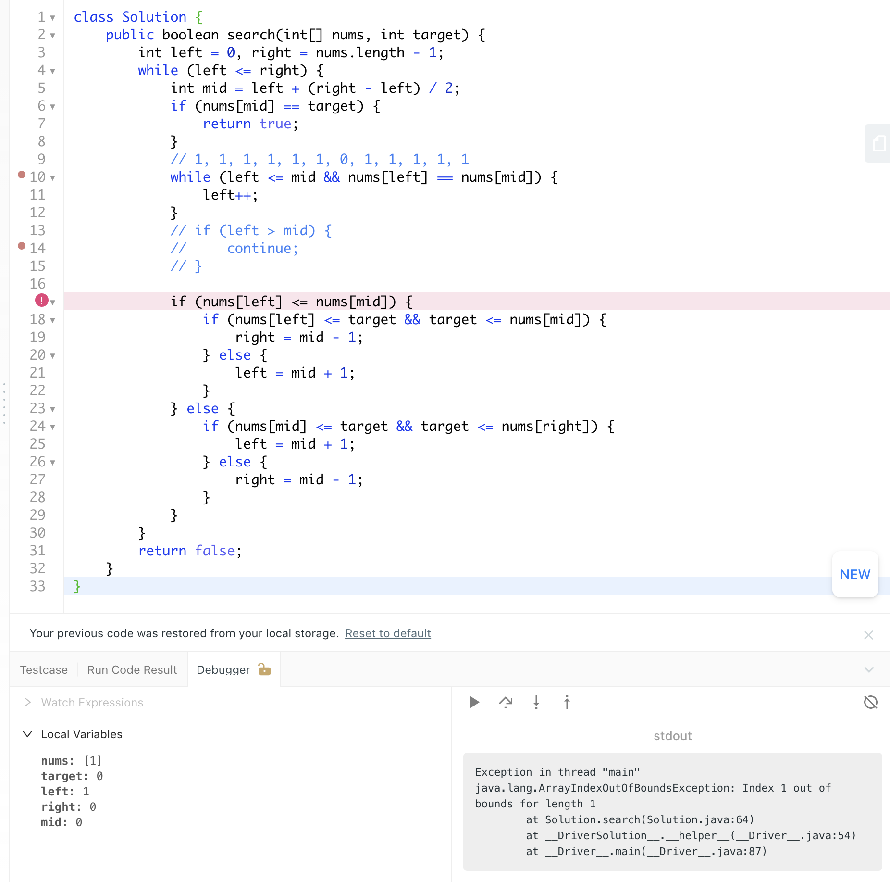

## 81. Search in Rotated Sorted Array II


- [refer to LC 33 | lc discussion](https://leetcode.cn/problems/search-in-rotated-sorted-array-ii/solutions/22056/zai-javazhong-ji-bai-liao-100de-yong-hu-by-reedfan/#:~:text=Java-,%E8%A7%A3%E9%A2%98%E6%80%9D%E8%B7%AF%EF%BC%9A,%E9%9C%80%E8%A6%81%E4%BD%BF%E7%94%A8%E4%BA%8C%E5%88%86%E6%9F%A5%E6%89%BE%EF%BC%8C%E6%80%8E%E4%B9%88%E5%88%86%E6%98%AF%E5%85%B3%E9%94%AE%EF%BC%8C%E4%B8%BE%E4%B8%AA%E4%BE%8B%E5%AD%90%EF%BC%9A,-%E7%AC%AC%E4%B8%80%E7%B1%BB)


- 本题是需要使用二分查找，怎么分是关键，举个例子：
  - 第一类 `1 0 1 1 1` 和 `1 1 1 0 1` 这种。此种情况下` nums[start] == nums[mid]`，分不清到底是前面有序还是后面有序，
    此时 `start++` 即可。相当于去掉一个重复的干扰项。
  - 第二类 `2 3 4 5 6 7 1` 这种，也就是 `nums[start] < nums[mid]`。此例子中就是 `2 < 5`； 这种情况下，前半部分有序。因此如果 
    `nums[start] <= target < nums[mid]`，则在前半部分找，否则去后半部分找。
  - 第三类 `6 7 1 2 3 4 5` 这种，也就是 `nums[start] > nums[mid]`。此例子中就是 `6 > 2`； 这种情况下，后半部分有序。因此如果 
    `nums[mid] < target <= nums[end]`。则在后半部分找，否则去前半部分找。


```java
class searchInRotatedSortedArray_II {
    public boolean search(int[] nums, int target) {
        int left = 0, right = nums.length - 1;
        while (left <= right) {
            int mid = left + (right - left) / 2;
            if (nums[mid] == target) {
                return true;
            }
            //  1 0 1 1 1   or
            //  1 1 1 0 1
            while (nums[left] == nums[mid]) {
                left++;
                continue;
            }

            if (nums[left] <= nums[mid]) {
                if (nums[left] <= target && target <= nums[mid]) {
                    right = mid - 1;
                } else {
                    left = mid + 1;
                }
            } else {
                if (nums[mid] <= target && target <= nums[right]) {
                    left = mid + 1;
                } else {
                    right = mid - 1;
                }
            }
        }
        return false;
    }
}
```


---

### Method 2


```java
class searchInRotatedSortedArray_II {
    public boolean search(int[] nums, int target) {
        int left = 0, right = nums.length - 1;
        while (left <= right) {
            int mid = left + (right - left) / 2;
            if (nums[mid] == target) {
                return true;
            }
            // 1, 1, 1, 1, 1, 1, 0, 1, 1, 1, 1, 1
            while (left <= mid && nums[left] == nums[mid]) {
                left++;
            }
            if (left > mid) {
                continue;
            }

            if (nums[left] <= nums[mid]) {
                if (nums[left] <= target && target <= nums[mid]) {
                    right = mid - 1;
                } else {
                    left = mid + 1;
                }
            } else {
                if (nums[mid] <= target && target <= nums[right]) {
                    left = mid + 1;
                } else {
                    right = mid - 1;
                }
            }
        }
        return false;
    }
}
```


- 注意： 可以两个判定都为**闭区间 closed interval**

- 需要小心极端条件： `1, 1, 1, 1, 1, 1, 0, 1, 1, 1`
  - 假设 `target = 0`


```java
        // 1, 1, 1, 1, 1, 1, 0, 1, 1, 1, 1, 1
        while (left <= mid && nums[left] == nums[mid]) {
            left++;
        }
        if (left > mid) {
            continue;
        }
```

- 还需要小心case: 





- 此时， `left = 1`, 跳出 `while (left <= right)` 的loop, 直接 `index out of bounds`


---
- [find peak 英文教程](https://leetcode.com/problems/search-in-rotated-sorted-array-ii/discuss/1654316/C%2B%2B-oror-Binary-Search-Approach-oror-O(log-N)-oror-Divided-and-Conquered)

