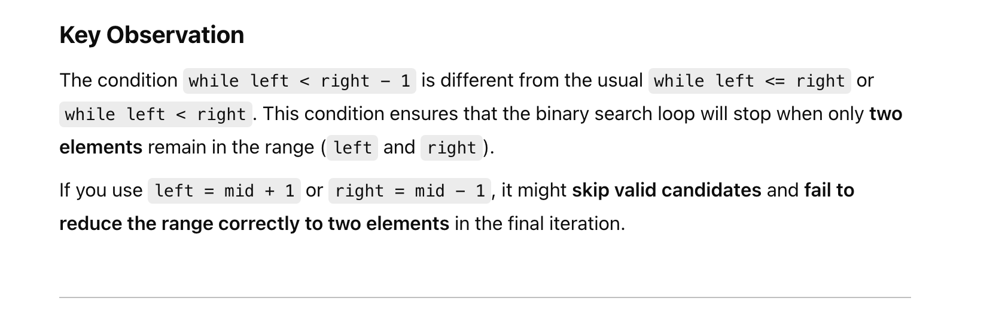
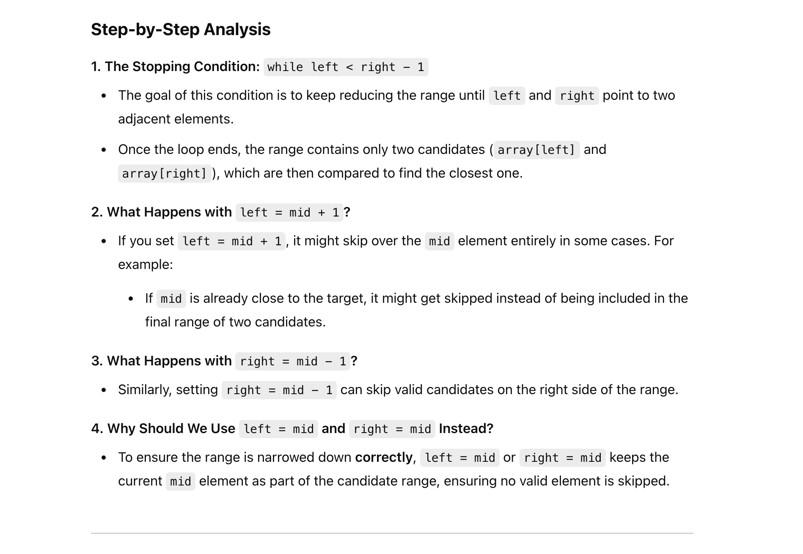

## Closest In Sorted Array

---

```java
class _Closest_In_SortedArray {
    public int closest(int[] array, int target) {
        if (array == null || array.length == 0) return -1;

        int left = 0, right = array.length - 1;
        while (left < right - 1) {
            int mid = (left + right) >>> 1;
            if (array[mid] == target) {
                return mid;
            } else if (array[mid] < target) {
                left = mid;
            } else {
                right = mid;
            }
        }

        if (Math.abs(array[left] - target) <= Math.abs(array[right] - target)) {
            return left;
        } else {
            return right;
        }
    }
}
```
---

#### Template 2

```py
class Solution(object):
  def closest(self, array, target):
    """
    input: int[] array, int target
    return: int
    """
    # write your solution here
    if array is None or len(array) == 0:
      return -1
    left, right = 0, len(array) - 1
    while left < right - 1:
      mid = (left + right) >> 1
      if array[mid] == target:
        return mid
      elif array[mid] < target:
        left = mid
      else:
        right = mid

    if abs(array[left] - target) <= abs(array[right] - target):
      return left
    else:
      return right
```

---

### Note: `left = mid`,  `right = mid`

- 首先这么做 是因为 **array[mid] 很可能也是一个 cloestest element to target**

---

- Let's analyze why using `left = mid + 1` and `right = mid - 1 `in the new code structure is problematic and how it affects the binary search logic.





