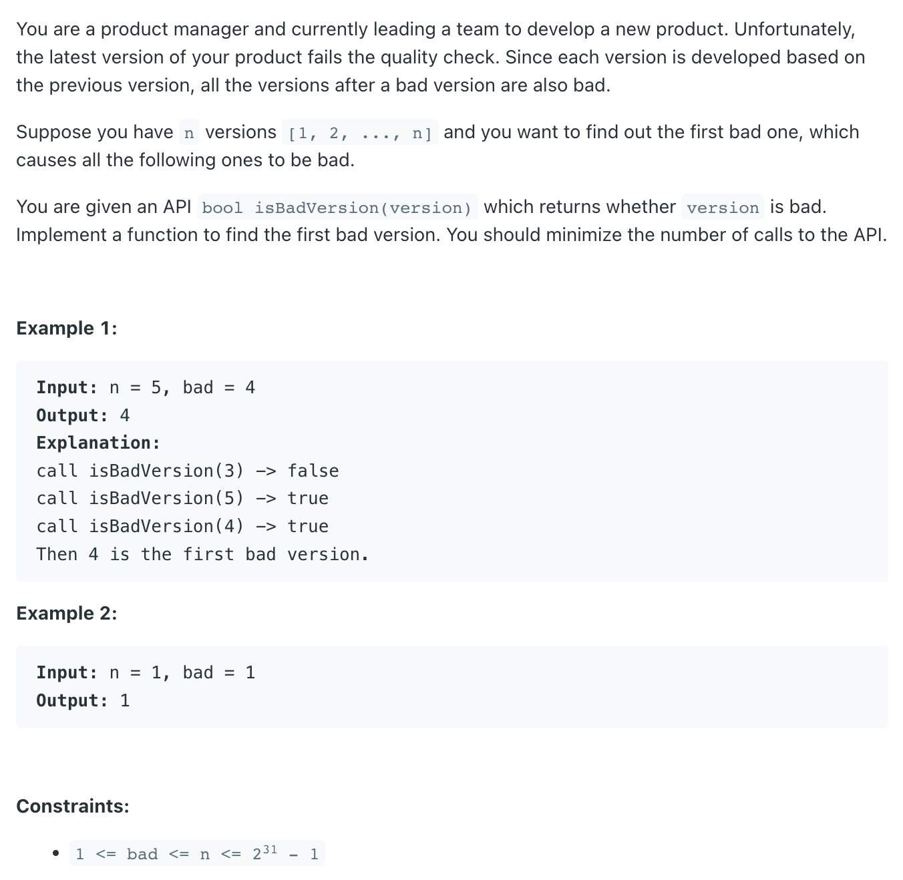

## 278. First Bad Version


- [Binary Search Template I](https://leetcode.com/explore/learn/card/binary-search/125/template-i/938/)

---

```java
/* The isBadVersion API is defined in the parent class VersionControl.
      boolean isBadVersion(int version); */

public class Solution extends VersionControl {
    public int firstBadVersion(int n) {
        int left = 1, right = n;
        while (left <= right) {
            int mid = left + (right - left) / 2;
            if (isBadVersion(mid)) {
                right = mid - 1;
            } else {
                left = mid + 1;
            }
        }
        return left;
    }
}
```


---
```java
/* The isBadVersion API is defined in the parent class VersionControl.
      boolean isBadVersion(int version); */

public class Solution extends VersionControl {
    public int firstBadVersion(int n) {
        int left = 0, right = n - 1;
        while (left <= right) {
            int mid = left + (right - left) / 2;
            if (isBadVersion(mid)) {
                right = mid - 1;
            } else {
                left = mid + 1;
            }
        }
        return left;
    }
}
```

