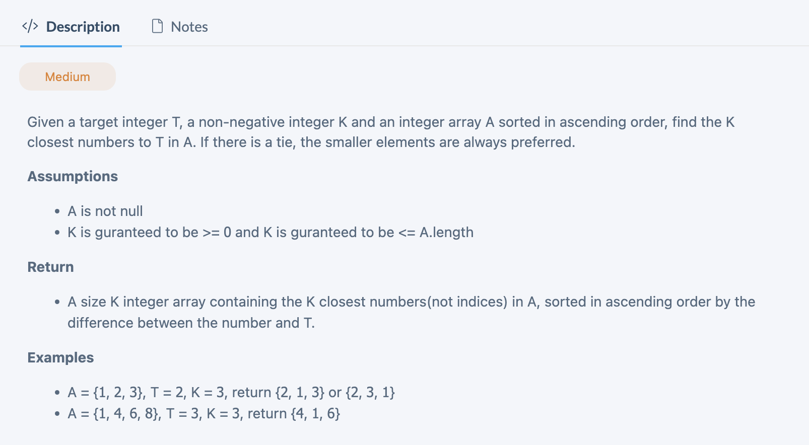

## K Closest In Sorted Array

---

```py
class Solution(object):
    def kClosest(self, array, target, k):
        """
        input: int[] array, int target, int k
        return: int[]
        """
        # write your solution here
        res = []
        if len(array) == 0 or k == 0:
            return res
        close = self.cloest(array, target)
        res.append(array[close])
        left = close - 1
        right = close + 1
        while len(res) < k:
            if left < 0:
                res.append(array[right])
                right += 1
            elif right >= len(array):
                res.append(array[left])
                left -= 1
            elif abs(array[left] - target) <= abs(array[right] - target):
                res.append(array[left])
                left -= 1
            else:
                res.append(array[right])
                right += 1
        return res

    def cloest(self, array, target):
        left, right = 0, len(array) - 1
        while left < right - 1:
            mid = (left + right) >> 1
            if array[mid] == target:
                return mid
            elif array[mid] < target:
                left = mid
            else:
                right = mid
        if abs(array[left] - target) <= abs(array[right] - target):
            return left
        else:
            return right
```