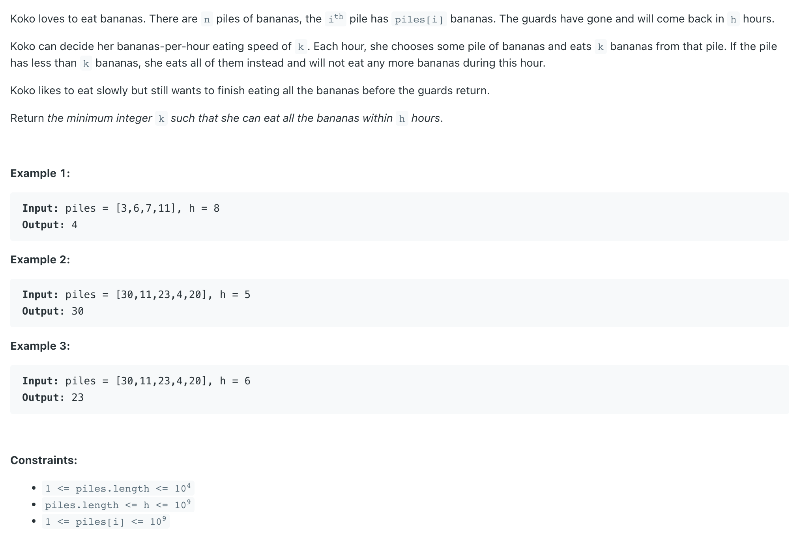
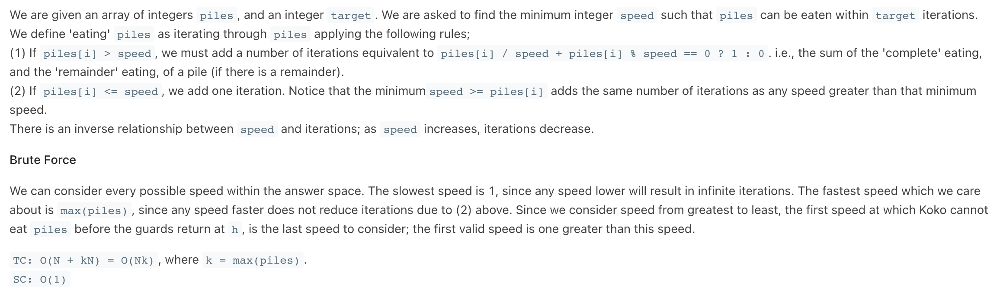

## 875. Koko Eating Bananas

---
### Binary Search

- [A very-very well detailed explanation](https://leetcode.com/problems/koko-eating-bananas/discuss/1703687/JavaC%2B%2B-A-very-very-well-detailed-explanation#:~:text=A%20very%2Dvery%20well%20detailed%20explanation)

- This java solution didn't pass all the test. Need to change the `hours` to `long` type in canEatAll method in order to pass some 
  edge cases


```java
class KokoEatingBananas {
    public int minEatingSpeed(int[] piles, int h) {
        int left = 1;
        int right = getMathPile(piles);
        int res = right;
        while (left <= right) {
            int mid = left + ((right - left) >> 1);
            long hours = 0;
            for (int pile : piles) {
                hours += pile / mid;
                if (pile % mid != 0) {
                    hours++;
                }
            }
            if (hours <= h) {
                res = Math.min(res, mid);
                right = mid - 1;
            } else {
                left = mid + 1;
            }
        }
        return res;
    }

    private int getMathPile(int[] piles) {
        int maxPile = Integer.MIN_VALUE;
        for (int pile : piles) {
            maxPile = Math.max(maxPile, pile);
        }
        return maxPile;
    }
}
```
---

- **why is this not working**?

```java
    if (canEatAll(piles, mid, h)) {
        hight = mid - 1;
    }   
```

- even if `canEatAll()` returns true, u r directly doing `high = mid -1` , when `mid` **itself could be a probable answer**

---
### Brute Force



```java
class KokoEatingBananas_bruteForce {
    public int minEatingSpeed(int[] piles, int h) {
        int speed = 1;

        while (true) {
            int hours = 0;
            for (int pile : piles) {
                hours += pile / speed;

                if (pile % speed != 0) {
                    hours++;
                }
            }
            if (hours <= h) {
                break;
            }
            speed++;
        }
        return speed;
    }
}
```