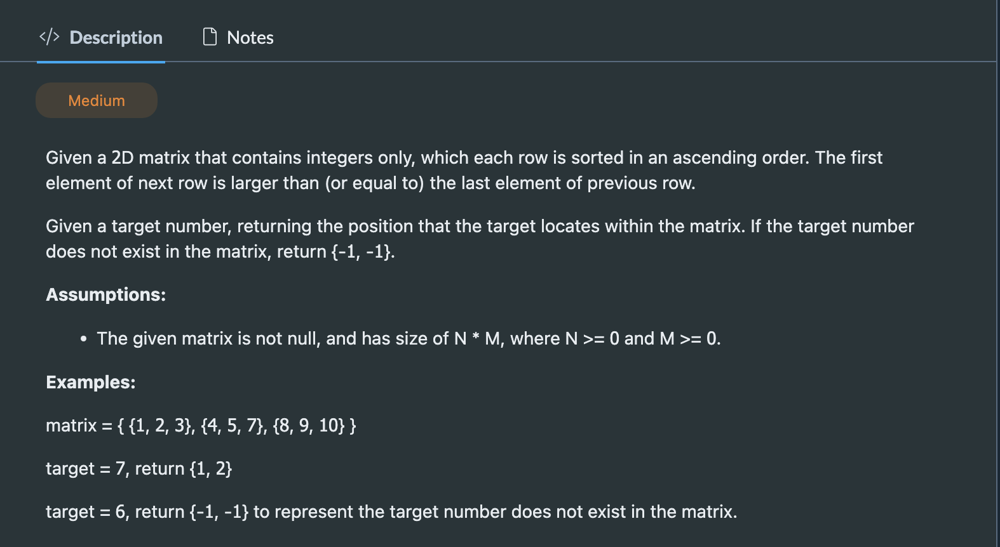

## Search In Sorted Matrix I

---


```py
class Solution(object):
    def search(self, matrix, target):
        """
        input: int[][] matrix, int target
        return: int[]
        """
        # write your solution here
        if len(matrix) == 0 or len(matrix[0]) == 0:
            return [-1, -1]
        left = 0
        right = len(matrix) * len(matrix[0]) - 1
        while left <= right:
            mid = (left + right) >> 1
            row = mid // len(matrix[0])
            col = mid % len(matrix[0])
            if matrix[row][col] == target:
                return [row, col]
            elif matrix[row][col] < target:
                left = mid + 1
            else:
                right = mid - 1
        return [-1, -1]
```