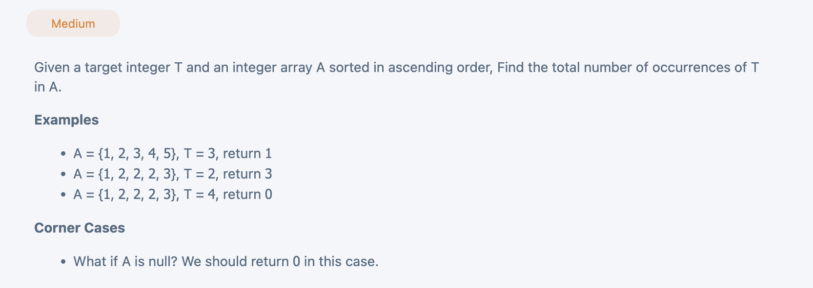

## Total Occurrence

---

```py
class Solution(object):
    def totalOccurrence(self, array, target):
        """
        input: int[] array, int target
        return: int
        """
        # write your solution here
        if array is None or len(array) == 0:
            return 0
        index = self.binarySearch(array, target, 0, len(array) - 1)
        if index == -1:
            return 0
        left = index - 1
        right = index + 1
        total = 1
        while left >= 0 and array[left] == target:
            total += 1
            left -= 1
        while right < len(array) and array[right] == target:
            total += 1
            right += 1
        return total

    def binarySearch(self, array, target, left, right):
        while left <= right:
            mid = (left + right) >> 1
            if array[mid] == target:
                return mid
            elif array[mid] < target:
                left = mid + 1
            else:
                right = mid - 1
        return -1
```
---

### Method 2

- step 1: find first occurrence
- step 2: find last occurrence
- calculate the total length:   **last - first + 1**

```py
class Solution(object):
    def totalOccurrence(self, array, target):
        """
        input: int[] array, int target
        return: int
        """
        # write your solution here
        if not array or len(array) == 0:
            return 0
        first = self.firstOccurrence(array, target)
        last = self.lastOccurrence(array, target)
        return 0 if first == -1 else last - first + 1

    def firstOccurrence(self, array, target):
        left, right = 0, len(array) - 1
        idx = -1
        while left < right - 1:
            mid = (left + right) >> 1
            if array[mid] == target:
                right = mid
            elif array[mid] < target:
                left = mid + 1
            else:
                right = mid - 1
        
        if array[left] == target:
            return left
        if array[right] == target:
            return right
        return -1

    def lastOccurrence(self, array, target):
        left, right = 0, len(array) - 1
        idx = -1
        while left < right - 1:
            mid = (left + right) >> 1
            if array[mid] == target:
                left = mid
            elif array[mid] < target:
                left = mid + 1
            else:
                right = mid - 1

        if array[right] == target:
            return right
        if array[left] == target:
            return left
        return -1
```