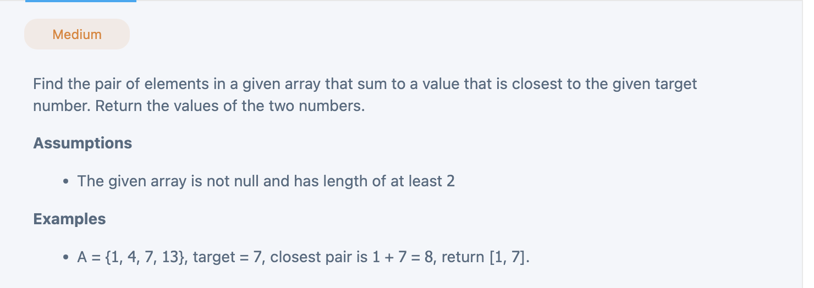

## Google | Onsite | Two Sum - Closest to Target
- [Two Sum - Closest to Target](https://leetcode.com/discuss/post/241808/google-onsite-two-sum-closest-to-target-qmjzs/)


---

```py
class Solution(object):
  def closest(self, array, target):
    """
    input: int[] array, int target
    return: Integer[]
    """
    # write your solution here
    array.sort()
    left, right = 0, len(array) - 1
    min_diff = float('inf')
    while left < right:
      twoSum = array[left] + array[right]
      if abs(twoSum - target) < min_diff:
        min_diff = abs(twoSum - target)
        res = [array[left], array[right]]

      if twoSum == target:
        return [array[left], array[right]]
      elif twoSum < target:
        left += 1
      else:
        right -= 1
    return res
```