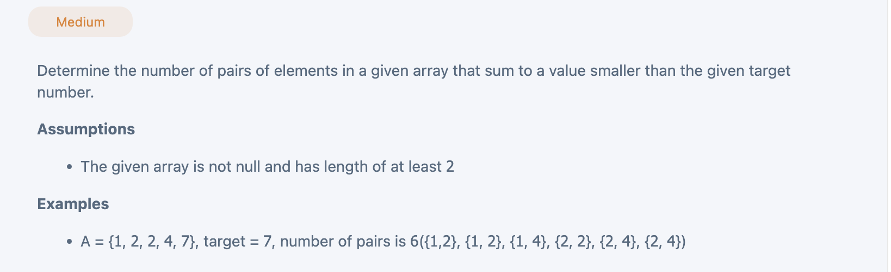

## 2 Sum Smaller


```py
class Solution(object):
    def smallerPairs(self, array, target):
        """
        input: int[] array, int target
        return: int
        """
        # write your solution here
        array.sort()
        left, right = 0, len(array) - 1
        count = 0
        while left < right:
            twoSum = array[left] + array[right]
            if twoSum < target:
                count += right - left
                left += 1
            else:
                right -= 1

        return count

```