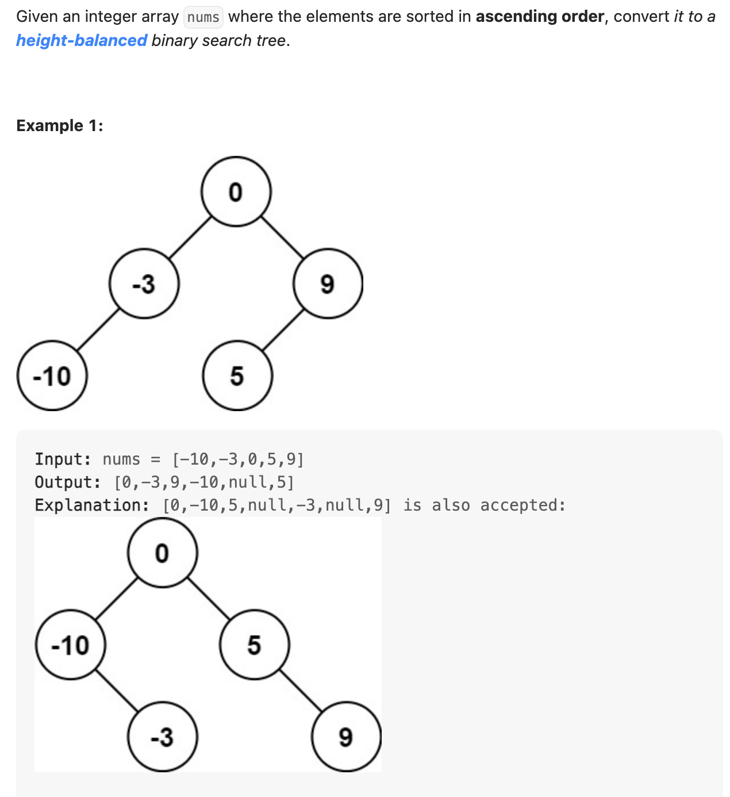
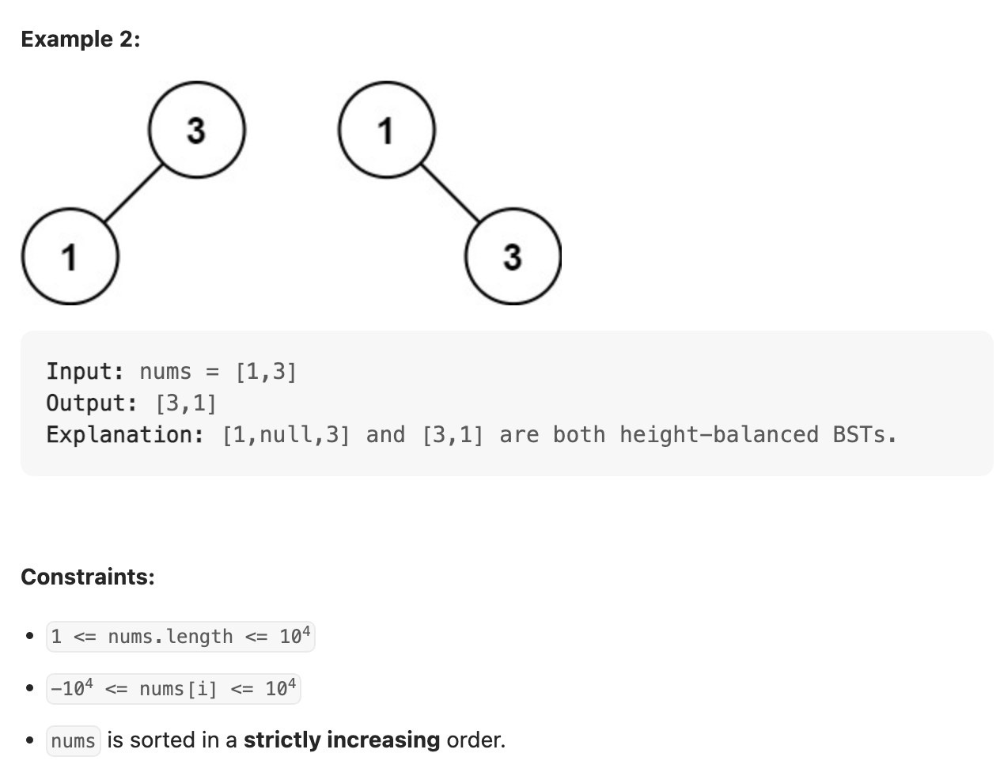

## 108. Convert Sorted Array to Binary Search Tree



```java
class _108_ConvertSortedArrayToBinarySearchTree {
    
    public TreeNode sortedArrayToBST(int[] nums) {
        if (nums == null || nums.length == 0) return null;

        return construct(nums, 0, nums.length - 1);
    }

    private TreeNode construct(int[] nums, int left, int right) {
        if (left > right) {
            return null;
        }
        int mid = left + (right - left) / 2;
        TreeNode root = new TreeNode(nums[mid]);
        root.left = construct(nums, left, mid - 1);
        root.right = construct(nums, mid + 1, right);
        return root;
    }


    static class TreeNode {
        int val;
        TreeNode left;
        TreeNode right;

        TreeNode() {
        }

        TreeNode(int val) {
            this.val = val;
        }

        TreeNode(int val, TreeNode left, TreeNode right) {
            this.val = val;
            this.left = left;
            this.right = right;
        }
    }
}
```