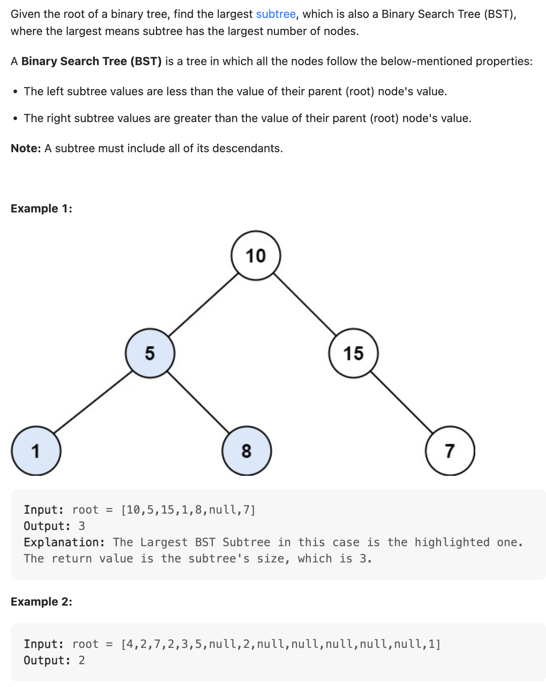
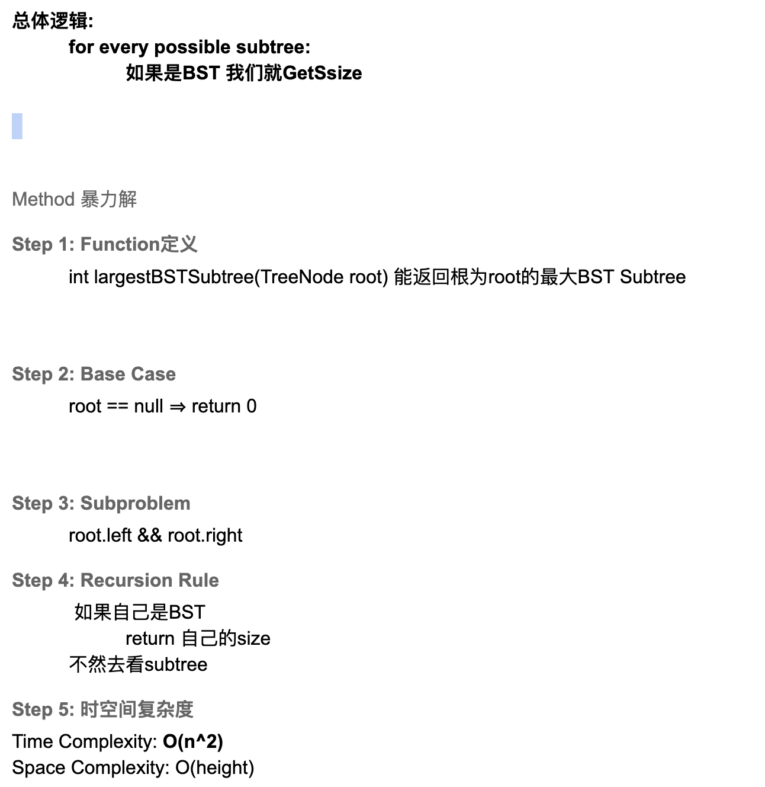
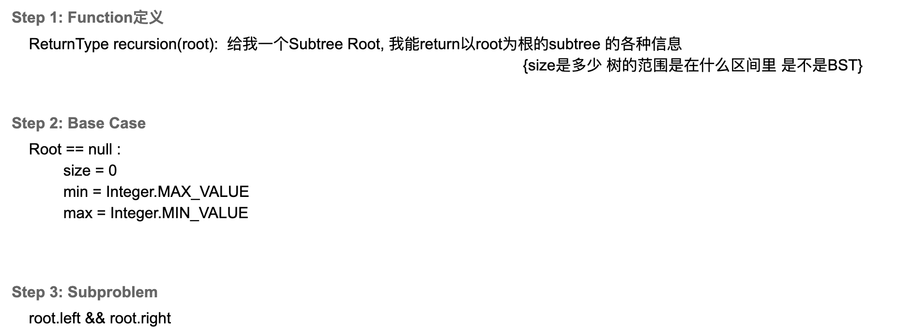
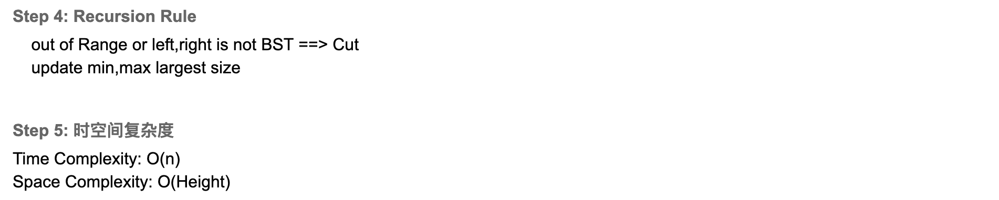

## 333. Largest BST Subtree


### Brute Force


```java
    public int largestBSTSubtree(TreeNode root) {
        if (root == null) {
            return 0;
        }
        if (isBST(root)) {
            return getSize(root);
        }
        int leftBSTSubtree = largestBSTSubtree(root.left);
        int rightBSTSubtree = largestBSTSubtree(root.right);
        return Math.max(leftBSTSubtree, rightBSTSubtree);
    }

    private boolean isBST(TreeNode root) {
        return isBST(root, Integer.MIN_VALUE, Integer.MAX_VALUE);
    }

    private boolean isBST(TreeNode root, int min, int max) {
        if (root == null) {
            return true;
        }
        if (root.val <= min || root.val >= max) {
            return false;
        }
        return isBST(root.left, min, root.val) &&
                isBST(root.right, root.val, max);
    }

    private int getSize(TreeNode root) {
        if (root == null) {
            return 0;
        }
        int left = getSize(root.left);
        int right = getSize(root.right);
        return left + right + 1;
    } 
```

---
- 由于以上的暴力解， T = O(N^2), 因为还需要每一次计算size

### 可以优化，Multi Return Value




- `leftSubtree maximum < root.val < rightSubtree minimum`

```java
public class largestBST_MultiReturnValue {
    private static final int INVALID = -1;

    static class ReturnType {
        int size;
        int min;
        int max;
//        boolean isBST; // isBST, 不需要因为可以通过 size = -1, 来代表不valid

        public ReturnType(int size, int min, int max) {
            this.size = size;
            this.min = min;
            this.max = max;
        }
    }

    public int largestBSTSubtree(TreeNode root) {
        if (root == null) {
            return 0;
        }
        int[] largestBSTSubtreeSize = new int[]{0};
        recursion(root, largestBSTSubtreeSize);
        return largestBSTSubtreeSize[0];
    }

    private ReturnType recursion(TreeNode root, int[] largestBSTSubtreeSize) {
        if (root == null) {
            return new ReturnType(0, Integer.MAX_VALUE, Integer.MIN_VALUE);
        }
        ReturnType left = recursion(root.left, largestBSTSubtreeSize);
        ReturnType right = recursion(root.right, largestBSTSubtreeSize);

        if (left.size == INVALID || right.size == INVALID ||
                root.val <= left.max || root.val >= right.min) {
            return new ReturnType(INVALID, INVALID, INVALID);
        }
        int curSize = left.size + right.size + 1;
        largestBSTSubtreeSize[0] = Math.max(largestBSTSubtreeSize[0], curSize);
        int curMin = Math.min(root.val, left.min);
        int curMax = Math.max(root.val, right.max);
        return new ReturnType(curSize, curMin, curMax);
    }
}
```