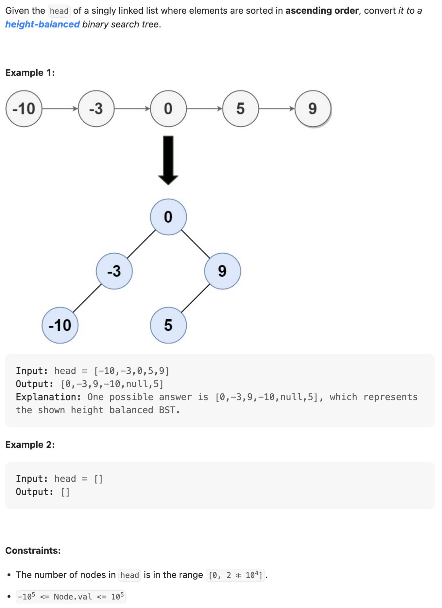

## 109. Convert Sorted List to Binary Search Tree


```java
class _109_ConvertSortedListToBinarySearchTree {

    public TreeNode sortedListToBST(ListNode head) {
        List<Integer> sortedList = new ArrayList<>();
        while (head != null) {
            sortedList.add(head.val);
            head = head.next;
        }
        return construct(sortedList, 0, sortedList.size() - 1);
    }

    private TreeNode construct(List<Integer> sortedList, int left, int right) {
        if (left > right) {
            return null;
        }
        int mid = left + (right - left) / 2;
        TreeNode root = new TreeNode(sortedList.get(mid));
        root.left = construct(sortedList, left, mid - 1);
        root.right = construct(sortedList, mid + 1, right);
        return root;
    }
    

    static class ListNode {
        int val;
        ListNode next;

        ListNode() {
        }

        ListNode(int val) {
            this.val = val;
        }

        ListNode(int val, ListNode next) {
            this.val = val;
            this.next = next;
        }
    }

    static class TreeNode {
        int val;
        TreeNode left;
        TreeNode right;

        TreeNode() {
        }

        TreeNode(int val) {
            this.val = val;
        }

        TreeNode(int val, TreeNode left, TreeNode right) {
            this.val = val;
            this.left = left;
            this.right = right;
        }
    }
}
```
---

```py
class ListNode:
    def __init__(self, val=0, next=None):
        self.val = val
        self.next = next

# Definition for a binary tree node.
class TreeNode:
    def __init__(self, val=0, left=None, right=None):
        self.val = val
        self.left = left
        self.right = right

class Solution:
    def sortedListToBST(self, head: Optional[ListNode]) -> Optional[TreeNode]:
        arr = []
        while head:
            arr.append(head.val)
            head = head.next
        return self.createBST(arr)

    def createBST(self, arr):
        if not arr:
            return None
        return self.bst(arr, 0, len(arr) - 1)

    def bst(self, arr, start, end):
        if start > end:
            return None

        mid = (start + end) >> 1
        root = TreeNode(arr[mid])
        root.left = self.bst(arr, start, mid - 1)
        root.right = self.bst(arr, mid + 1, end)
        return root
```