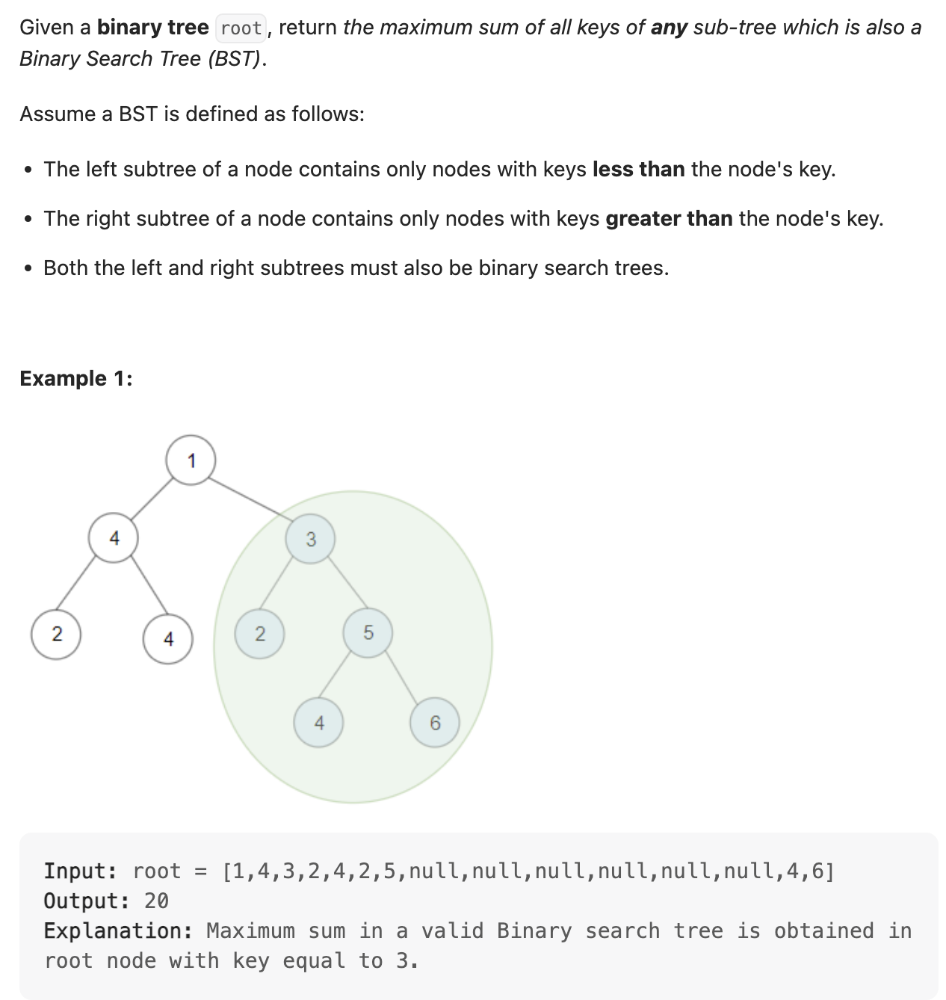
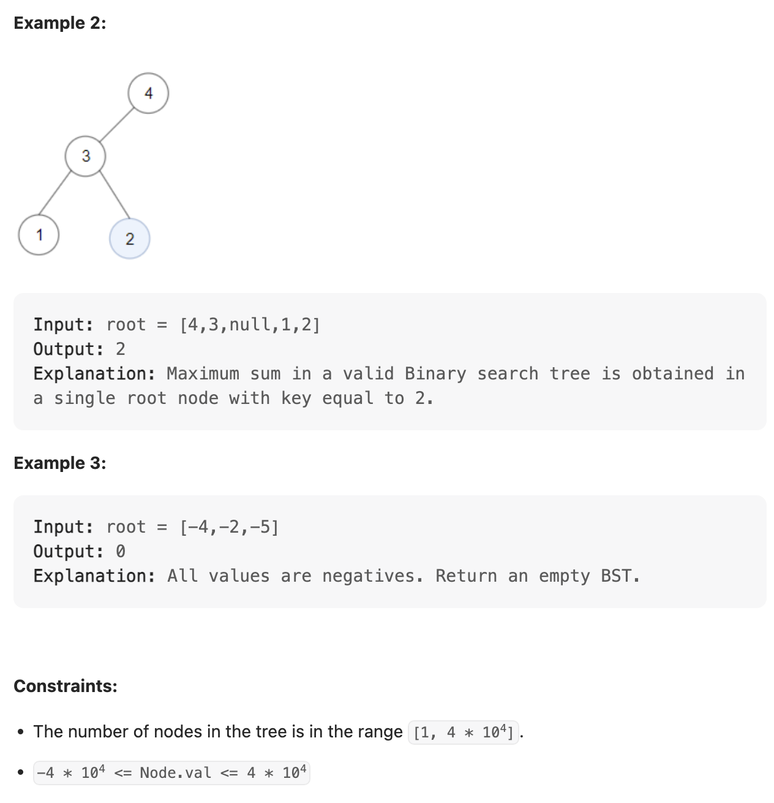
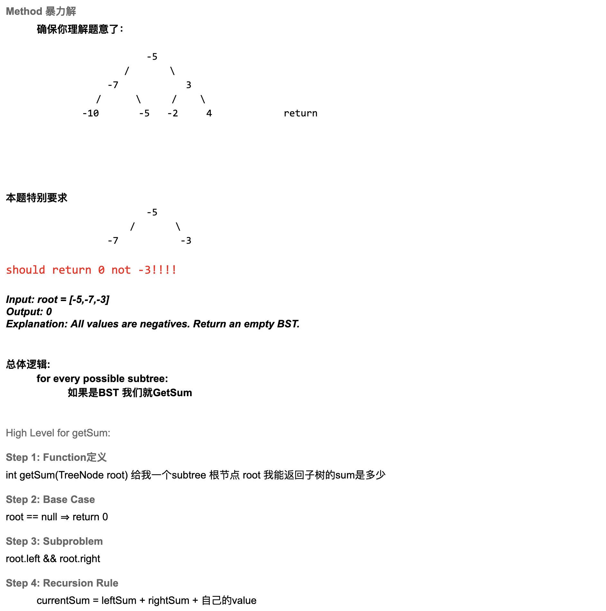
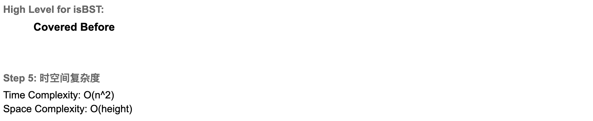
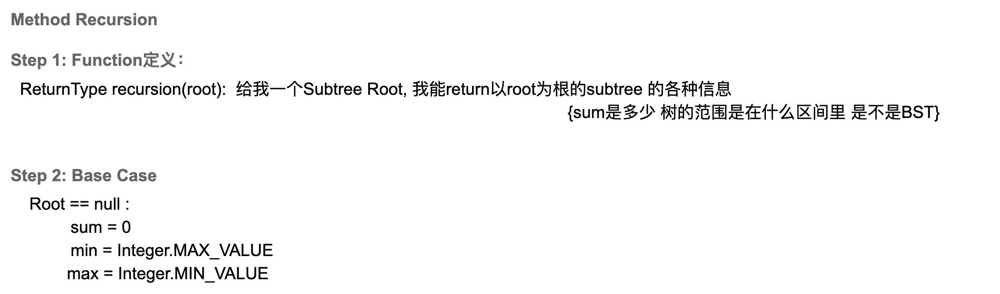
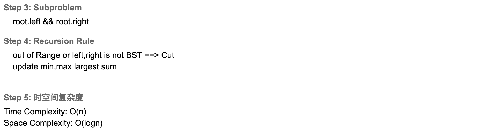

## 1373. Maximum Sum BST in Binary Tree



### Brute Force



```java
public class maxSumBST_BruteForce {
    public int maxSumBST(TreeNode root) {
        int[] maxSum = {0};
        recursion(root, maxSum);
        return Math.max(0, maxSum[0]);
    }

    private void recursion(TreeNode root, int[] maxSum) {
        if (root == null) {
            return;
        }
        if (isBST(root)) {
            int curSum = getSum(root);
            maxSum[0] = Math.max(maxSum[0], curSum);
        }
        recursion(root.left, maxSum);
        recursion(root.right, maxSum);
    }

    private boolean isBST(TreeNode root) {
        return isBST(root, Integer.MIN_VALUE, Integer.MAX_VALUE);
    }

    private boolean isBST(TreeNode root, int minValue, int maxValue) {
        if (root == null) {
            return true;
        }
        if (root.val <= minValue || root.val >= maxValue) {
            return false;
        }
        return isBST(root.left, minValue, root.val) &&
                isBST(root.right, root.val, maxValue);
    }

    private int getSum(TreeNode root) {
        if (root == null) {
            return 0;
        }
        int leftSum = getSum(root.left);
        int rightSum = getSum(root.right);
        return leftSum + rightSum + root.val;
    }
}
```
---

### Mutli Return Value



```java
class maxSumBST_MultiReturnValue {
    static class ReturnType {
        int sum;
        int min;
        int max;

        public ReturnType(int sum, int min, int max) {
            this.sum = sum;
            this.min = min;
            this.max = max;
        }
    }

    public int maxSumBST(TreeNode root) {
        if (root == null) {
            return 0;
        }
        int[] maxSum = {0};
        findMaxSum(root, maxSum);
        return maxSum[0];
    }

    private ReturnType findMaxSum(TreeNode root, int[] maxSum) {
        if (root == null) {
            return new ReturnType(0, Integer.MAX_VALUE, Integer.MIN_VALUE);
        }

        ReturnType left = findMaxSum(root.left, maxSum);
        ReturnType right = findMaxSum(root.right, maxSum);

        if (left != null && right != null) {
            if (root.val > left.max && root.val < right.min) {
                int curSum = root.val + left.sum + right.sum;
                maxSum[0] = Math.max(maxSum[0], curSum);
                int curMin = Math.min(root.val, left.min);
                int curMax = Math.max(root.val, right.max);
                return new ReturnType(curSum, curMin, curMax);
            }
        }
        return null;
    }
}
```