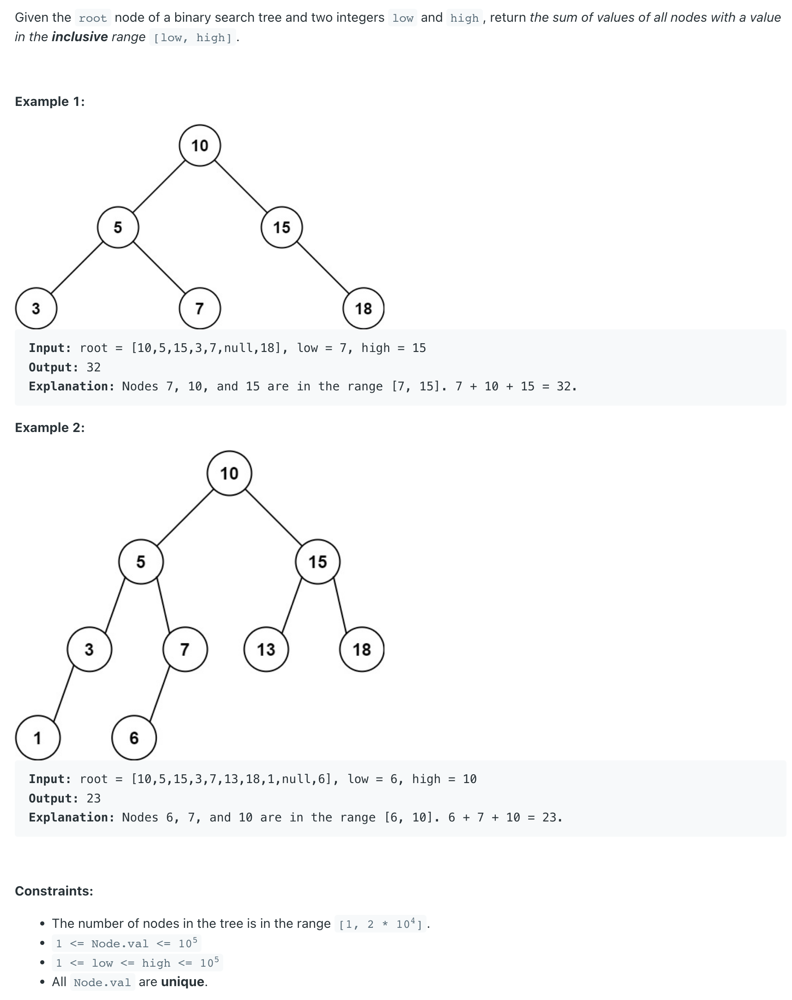

## 938. Range Sum of BST


```java
class _938_RangeSumOfBST {
    public int rangeSumBST(TreeNode root, int low, int high) {
        if (root == null) {
            return 0;
        }
        int[] sum = new int[]{0};
        recursion(root, low, high, sum);
        return sum[0];
    }

    private void recursion(TreeNode root, int low, int high, int[] sum) {
        if (root == null) {
            return;
        }
        recursion(root.left, low, high, sum);
        if (low <= root.val && root.val <= high) {
            sum[0] += root.val;
        }
        recursion(root.right, low, high, sum);
    }
}
```
---

### Optimization: Pruning

```java
public class RangeSumOfBST_Optimization {
    public int rangeSumBST(TreeNode root, int low, int high) {
        if (root == null) {
            return 0;
        }
        int[] sum = new int[]{0};
        recursion(root, low, high, sum);
        return sum[0];
    }

    private void recursion(TreeNode root, int low, int high, int[] sum) {
        if (root == null) {
            return;
        }

        if (root.val > low) {
            recursion(root.left, low, high, sum);
        }

        if (root.val >= low && root.val <= high) {
            sum[0] += root.val;
        }

        if (root.val < high) {
            recursion(root.right, low, high, sum);
        }
    }
}
```