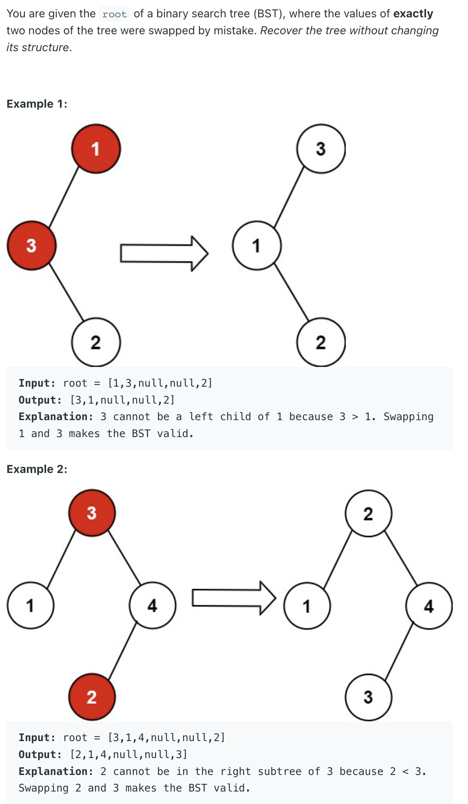
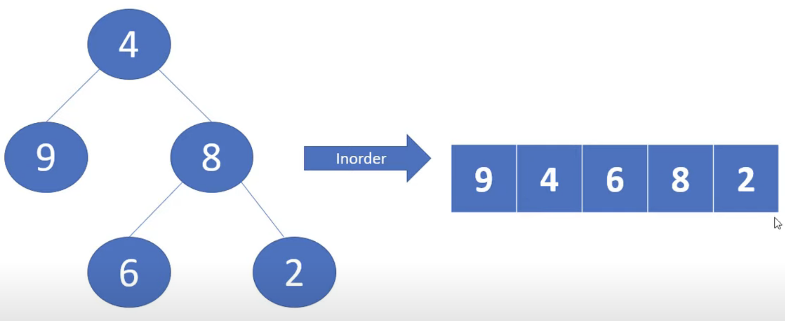
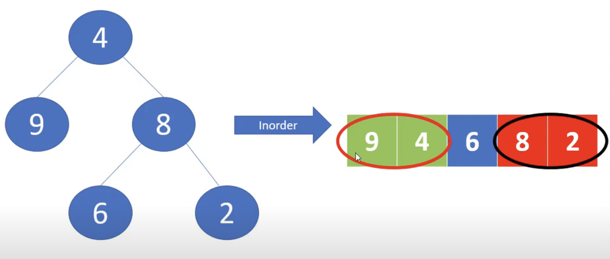
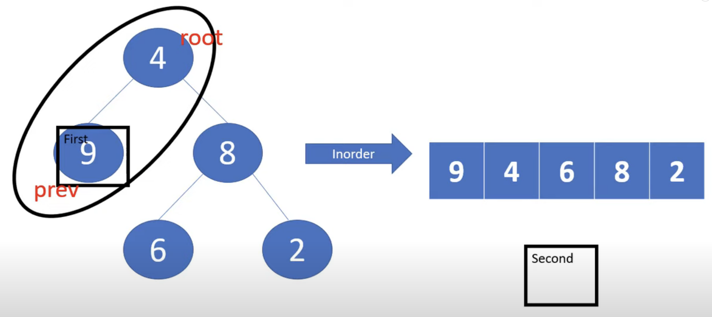
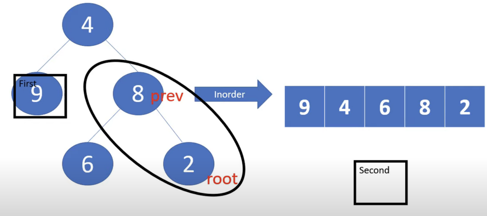
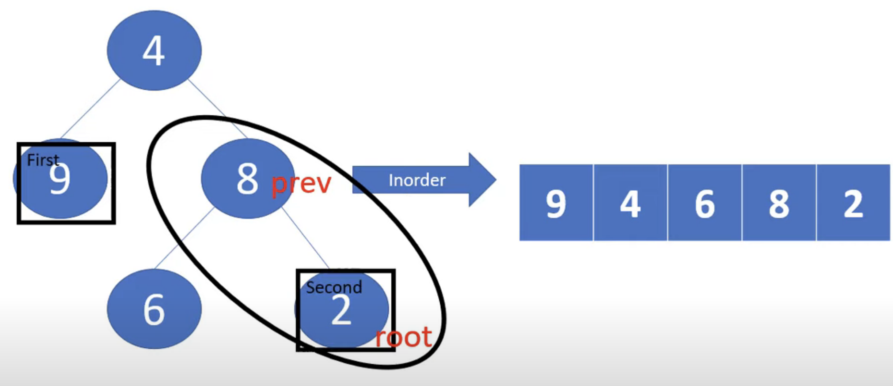

## 99. Recover Binary Search Tree

---


- `9......2` is incorrect






- for this `prev` is **greater than** `root`


- instead of `previous` the `root` will **become** our `second`
- 这里可以清楚看到， `9 > 4`, `8 > 2`, 所以我们记录下 **fist** 和 **second** 的位置， 然后`swap`

---

```java
class _99_RecoverBinarySearchTree {
    TreeNode firstNode = null;
    TreeNode secondNode = null;
    TreeNode prev = new TreeNode(Integer.MIN_VALUE);
    public void recoverTree(TreeNode root) {
        if (root == null) {
            return;
        }
        inOrderRecursion(root);
        int temp = firstNode.val;
        firstNode.val = secondNode.val;
        secondNode.val = temp;
    }

    private void inOrderRecursion(TreeNode root) {
        if (root == null) {
            return;
        }

        inOrderRecursion(root.left);

        if (firstNode == null && prev.val > root.val) {
            firstNode = prev;
        }
        if (firstNode != null && prev.val > root.val) {
            secondNode = root;
        }
        prev = root;

        inOrderRecursion(root.right);
    }


    static class TreeNode {
        int val;
        TreeNode left;
        TreeNode right;

        TreeNode() {
        }

        TreeNode(int val) {
            this.val = val;
        }

        TreeNode(int val, TreeNode left, TreeNode right) {
            this.val = val;
            this.left = left;
            this.right = right;
        }
    }
}
```