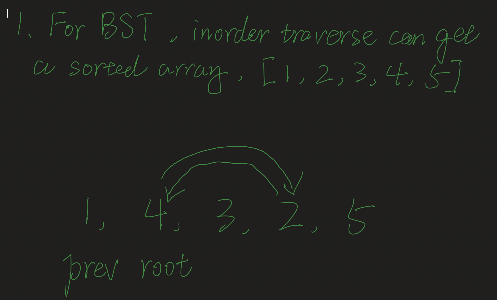
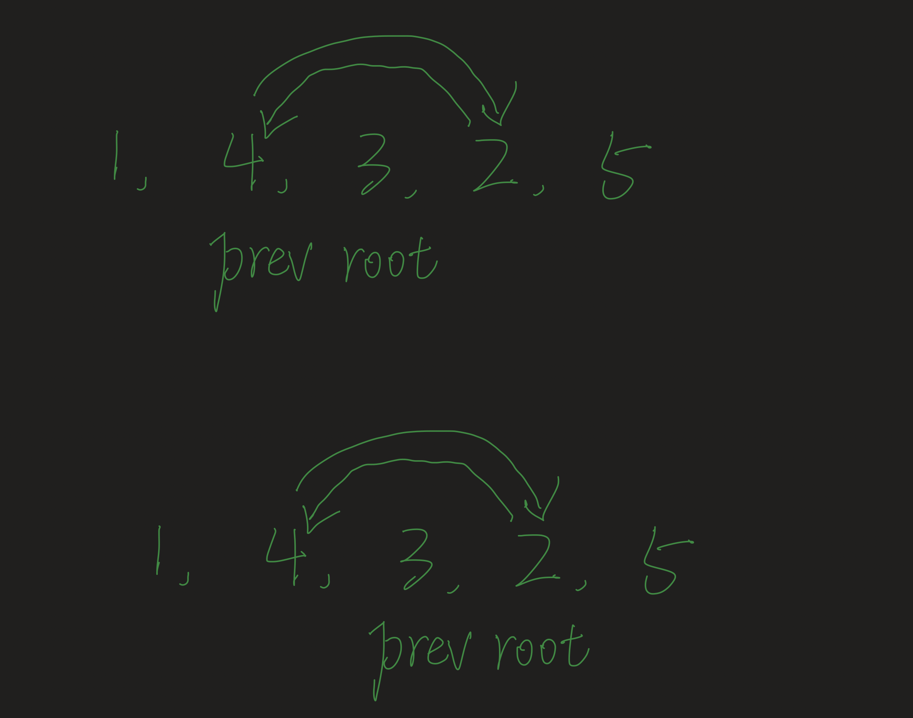

## 99. Recover Binary Search Tree

---




- create two nodes: **first** and **second**
- **first** store `prev node`
- **second** store `current root`

---

```java
class _99_RecoverBinarySearchTree {
    TreeNode first = null; // 第一个错误值
    TreeNode second = null; // 第二个错误值
    TreeNode prev = null; // 之前的节点
    public void recoverTree(TreeNode root) {
        if (root == null) {
            return;
        }

        // 找到first和second
        inOrderRecursion(root);
        int temp = first.val;
        first.val = second.val;
        second.val = temp;
    }

    private void inOrderRecursion(TreeNode root) {
        if (root == null) {
            return;
        }

        inOrderRecursion(root.left);

        // 出现了错误的值，中序遍历之前的值比之后的值大
        if (prev == null && prev.val > root.val) {
            // 有两个数顺序不对
            // 第一个错误是prev
            // 第二个错误是root
            // [1,(3),(2),4,5]
            // [1,(4),3,(2),5]
            if (first == null) {
                first = prev;
            }
            second = root;
        }

        prev = root;
        inOrderRecursion(root.right);
    }
}
```