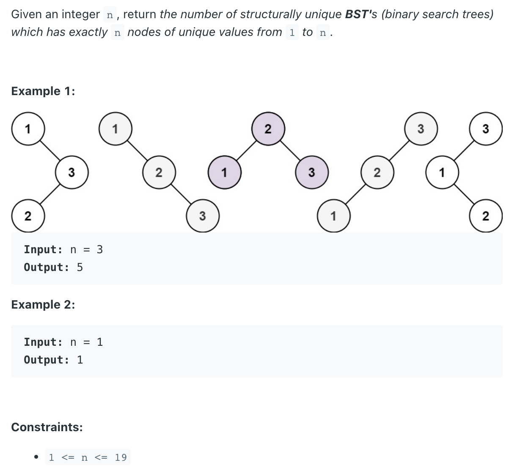
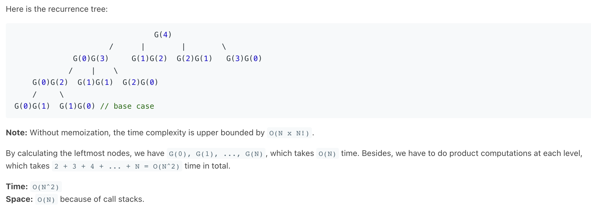
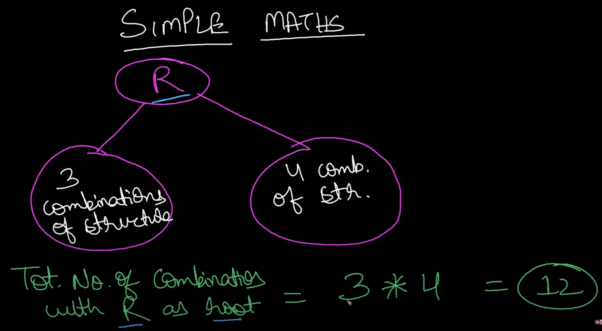
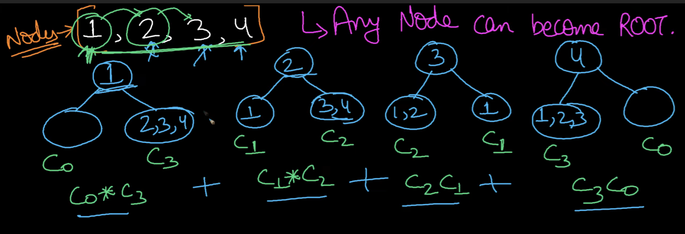
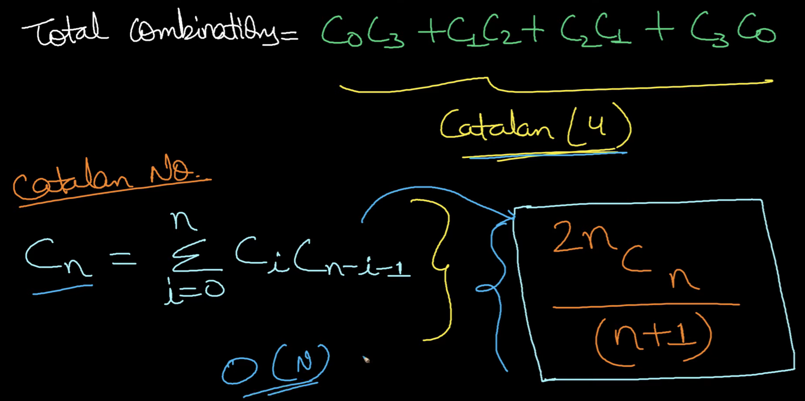

## 96. Unique Binary Search Trees


- [Summary of All Solutions in Java with Explanations](https://leetcode.com/problems/unique-binary-search-trees/discuss/409987/Summary-of-All-Solutions-in-Java-with-Explanations)
---
### Recursion 
Analysis
`DP (Recursion)`

- Given a sequence `1, 2, ..., n,` we enumerate each number i in the sequence and take it as the root to form binary trees.

- We define two functions:
  - `G(n)` : the number of unique BST for a sequence of length n (number of nodes).
  - `F(i, n)` : the number of unique BST, where the number `i (1 <= i <= n)` is the root.

- Notice that when we select `i` as a root i.e. `F(i, n)`, we have `i - 1` nodes which can be used to form a left 
  subtree; similarly we have `n - i` nodes to form a right subtree.
  - `F(i,n) = G(i - 1) x G(n - i)`

- Thus, `F(i, n)` can be calculated by the product of the number of unique BST with `i - 1` nodes and the number of 
  unique BST with `n - i` nodes. **Uniqueness is guaranteed by the sizes of the left subtree and the right subtree**.

- Particularly, consider two base cases when `i = 1` and `i = 2`:
  - `i = 1: F(1, n) = G(0) x G(n - 1)`. The empty left subtree is still a subtree, so `G(0) = 1`.
  - `i = 2: F(2, n) = G(1) x G(n - 2)`. With one node we can only construct one unique left subtree, so `G(1) = 1`.
---
- Here is the recurrence tree:

```ruby
                               G(4)
                     /      |        |        \
             G(0)G(3)     G(1)G(2)  G(2)G(1)   G(3)G(0)        // 4
            /    |    \
    G(0)G(2)  G(1)G(1)  G(2)G(0)                               // 4 x 3
    /     \
G(0)G(1)  G(1)G(0) // base case                                // 4 x 3 x 2
```


- Time: `C(N) = N x N!`
- Space: `O(N)`

---
### Recursion with HashMap - Deduplicate

- Examining the previous `recurrence` carefully, we find that there are **repeated calculations**.

```java
G(3) = G(0) x G(2)  // i = 1
     = G(1) x G(1)  // i = 2
     = G(2) x G(0)  // i = 3

G(4) = G(0) x G(3)  // i = 1
     = G(1) x G(2)  // i = 2
     = G(2) x G(1)  // i = 3
     = G(3) x G(0)  // i = 4
```

- Therefore, we can use a `hash map` or an `integer array` to store calculated `G(n)`. Here is the hash map version.

```java
class UniqueBinarySearchTrees_Recursion_HashMap {
    Map<Integer, Integer> map = new HashMap<>();
    public int numTrees(int n) {
        if (n == 0 || n == 1) {
            return 1;
        }
        int sum = 0;
        for (int i = 1; i <= n; i++) {
            if (!map.containsKey(i - 1)) {
                int leftSubtree = numTrees(i - 1);
                map.put(i - 1, leftSubtree);
            }
            if (!map.containsKey(n - i)) {
                int rightSubtree = numTrees(n - i);
                map.put(n - i, rightSubtree);
            }
            sum += map.get(i - 1) * map.get(n - i);
        }
        return sum;
    }
}
```


---
### DP


- `R : root`
- `3 combinations of structure` * `4 comb of str` = `12`



---

### Brute Force

```java
class UniqueBinarySearchTrees_BruteForce {
    public int numTrees(int n) {
        if (n == 0) return 0;

        List<TreeNode> res = recursion(1, n);
        return res.size();
    }

    private List<TreeNode> recursion(int start, int end) {
        List<TreeNode> res = new ArrayList<>();
        if (start > end) {
            res.add(null);
            return res;
        }
        for (int i = start; i <= end; i++) {
            List<TreeNode> leftSubtree = recursion(start, i - 1);
            List<TreeNode> rightSubtree = recursion(i + 1, end);
            for (TreeNode leftNode : leftSubtree) {
                for (TreeNode rightNode : rightSubtree) {
                    TreeNode root = new TreeNode(i);
                    root.left = leftNode;
                    root.right = rightNode;
                    res.add(root);
                }
            }
        }
        return res;
    }
}
```
 