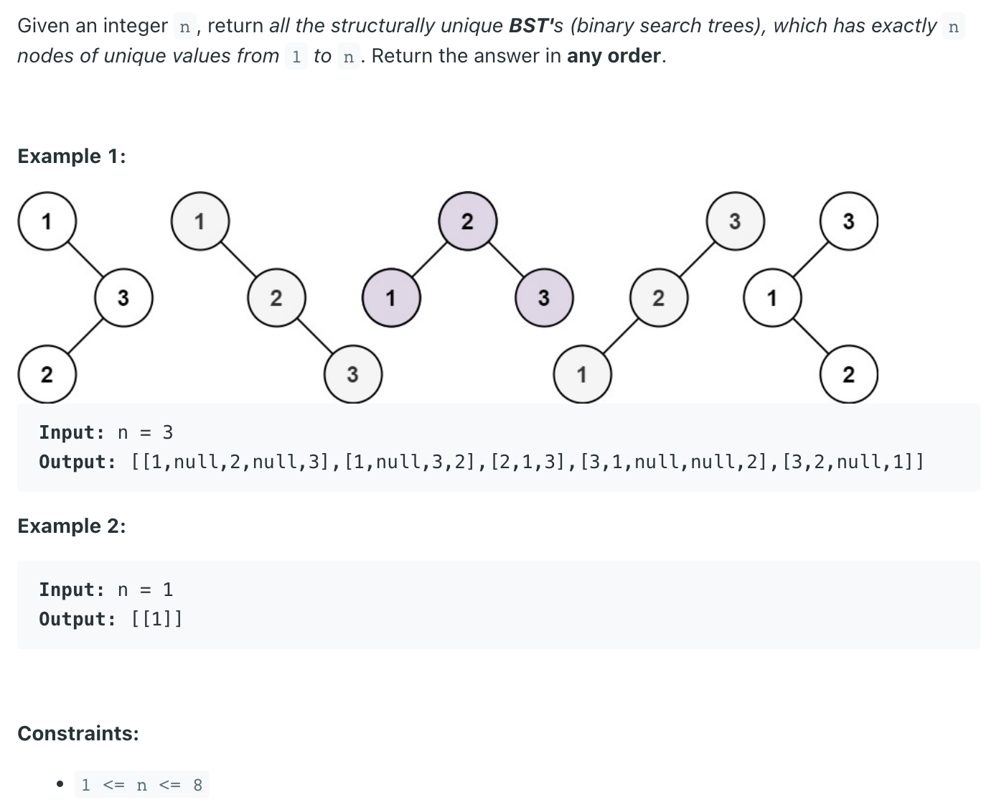
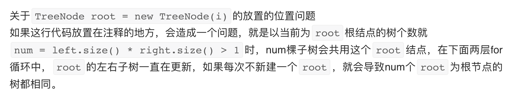

## 95. Unique Binary Search Trees II


```java
class _95_UniqueBinarySearchTrees_II {
    public List<TreeNode> generateTrees(int n) {
        if (n == 0) {
            return new ArrayList<>();
        }
        return recursion(1, n);
    }

    private List<TreeNode> recursion(int start, int end) {
        List<TreeNode> allTrees = new ArrayList<>();
        //此时没有数字，将 null 加入结果中
        if (start > end) {
            allTrees.add(null);
            return allTrees;
        }
        //只有一个数字，当前数字作为一棵树加入结果中
        if (start == end) {
            allTrees.add(new TreeNode(start));
            return allTrees;
        } // 这段也可以不写

        // 枚举可行根节点
        for (int i = start; i <= end; i++) {
            // 想想为什么这行不能放在这里，而放在下面？
            // TreeNode root = new TreeNode(i);

            // 获得所有可行的左子树集合
            List<TreeNode> leftSubtree = recursion(start, i - 1);

            // 获得所有可行的右子树集合
            List<TreeNode> rightSubtree = recursion(i + 1, end);

            // 从左子树集合中选出一棵左子树，从右子树集合中选出一棵右子树，拼接到根节点上
            for (TreeNode leftNode : leftSubtree) {
                for (TreeNode rightNode : rightSubtree) {
                    TreeNode curRoot = new TreeNode(i);
                    curRoot.left = leftNode;
                    curRoot.right = rightNode;
                    allTrees.add(curRoot);
                }
            }
        }
        return allTrees;
    }

    static class TreeNode {
        int val;
        TreeNode left;
        TreeNode right;

        TreeNode() {
        }

        TreeNode(int val) {
            this.val = val;
        }

        TreeNode(int val, TreeNode left, TreeNode right) {
            this.val = val;
            this.left = left;
            this.right = right;
        }
    }
}
```

