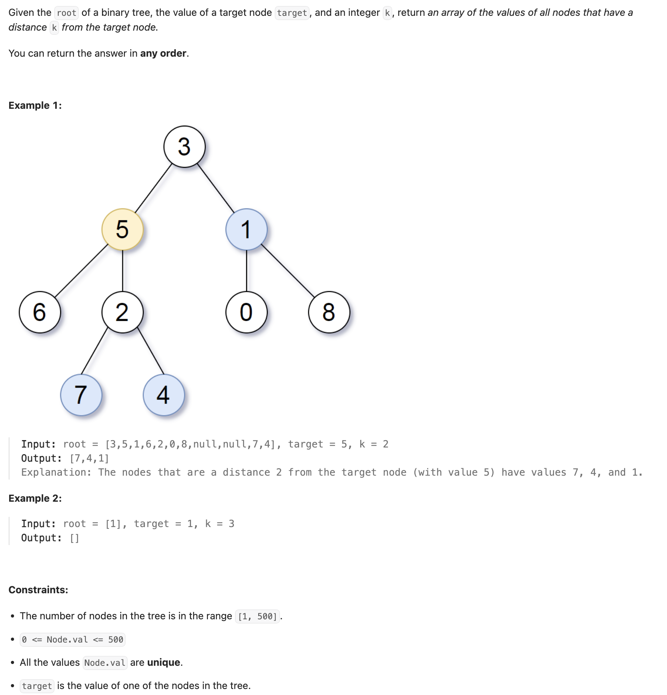
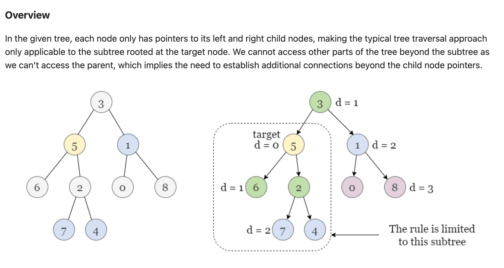
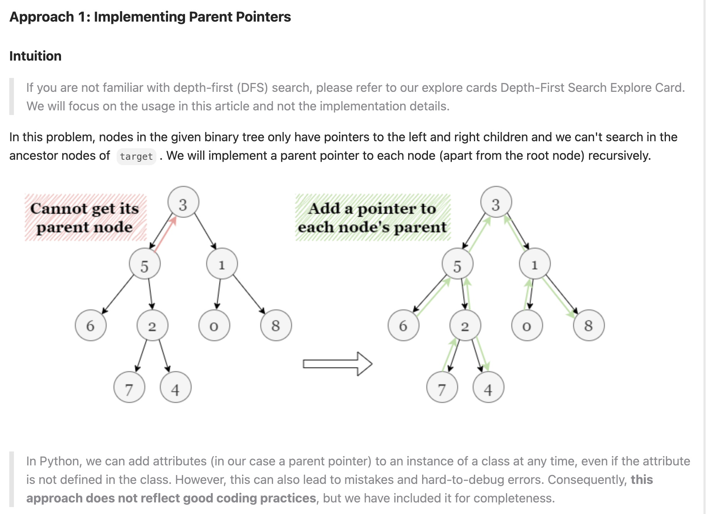
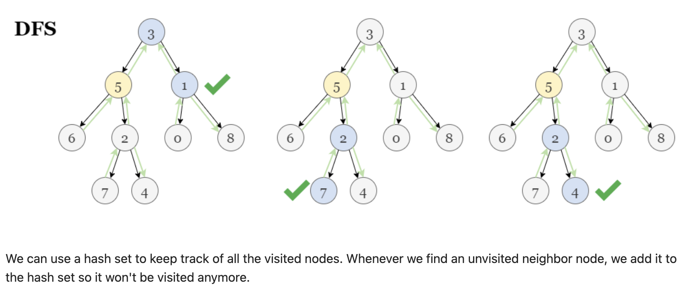

## 863. All Nodes Distance K in Binary Tree

---






---
```py
class Solution:
    def distanceK(self, root: TreeNode, target: TreeNode, k: int) -> List[int]:
        self.add_parent(root, None)
        ans = []
        visited = set()
        self.dfs(target, visited, ans, k)
        return ans

    def add_parent(self, cur, parent):
        if cur is None:
            return
        if cur:
            cur.parent = parent
            self.add_parent(cur.left, cur)
            self.add_parent(cur.right, cur)

    def dfs(self, cur, visited, ans, distance):
        if not cur:
            return
        if cur in visited:
            return
        visited.add(cur)
        if distance == 0:
            ans.append(cur.val)
            return
        self.dfs(cur.parent, visited, ans, distance - 1)
        self.dfs(cur.left, visited, ans, distance - 1)
        self.dfs(cur.right, visited, ans, distance - 1)
```
---

#### using HashMap

```java
class _863_All_NodesDistance_K_in_BinaryTree {
    Map<TreeNode, TreeNode> pMap;

    public List<Integer> distanceK(TreeNode root, TreeNode target, int k) {
        pMap = new HashMap<TreeNode, TreeNode>();
        addParent(root, null);

        List<Integer> res = new ArrayList<Integer>();
        Set<TreeNode> visited = new HashSet<TreeNode>();
        dfs(target, res, visited, k);
        return res;
    }

    private void addParent(TreeNode cur, TreeNode parent) {
        if (cur == null) {
            return;
        }
        this.pMap.put(cur, parent);
        addParent(cur.left, cur);
        addParent(cur.right, cur);
    }

    private void dfs(TreeNode cur, List<Integer> res, Set<TreeNode> visited, int distance) {
        if (cur == null) {
            return;
        }
        if (visited.contains(cur)) {
            return;
        }
        visited.add(cur);
        if (distance == 0) {
            res.add(cur.val);
        }
        dfs(this.pMap.get(cur), res, visited, distance - 1);
        dfs(cur.left, res, visited, distance - 1);
        dfs(cur.right, res, visited, distance - 1);
    }
}
```
---

```py
class Solution:
    def distanceK(self, root: TreeNode, target: TreeNode, k: int) -> List[int]:
        self.map = {}
        ans = []
        visited = set()
        self.add_parent(root, None)
        self.dfs(target, ans, visited, k)
        return ans
    
    def add_parent(self, cur, parent):
        if cur is None:
            return
        self.map[cur] = parent
        self.add_parent(cur.left, cur)
        self.add_parent(cur.right, cur)
    
    def dfs(self, cur, ans, visited, distance):
        if cur is None:
            return
        if cur in visited:
            return
        visited.add(cur)
        if distance == 0:
            ans.append(cur.val)
        
        self.dfs(self.map[cur], ans, visited, distance - 1)
        self.dfs(cur.left, ans, visited, distance - 1)
        self.dfs(cur.right, ans, visited, distance - 1)
```
