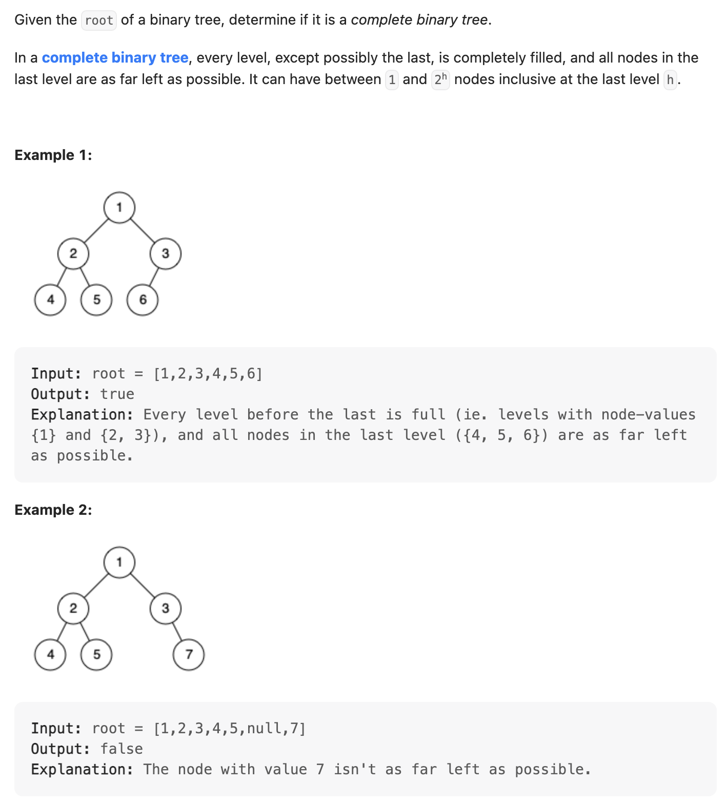
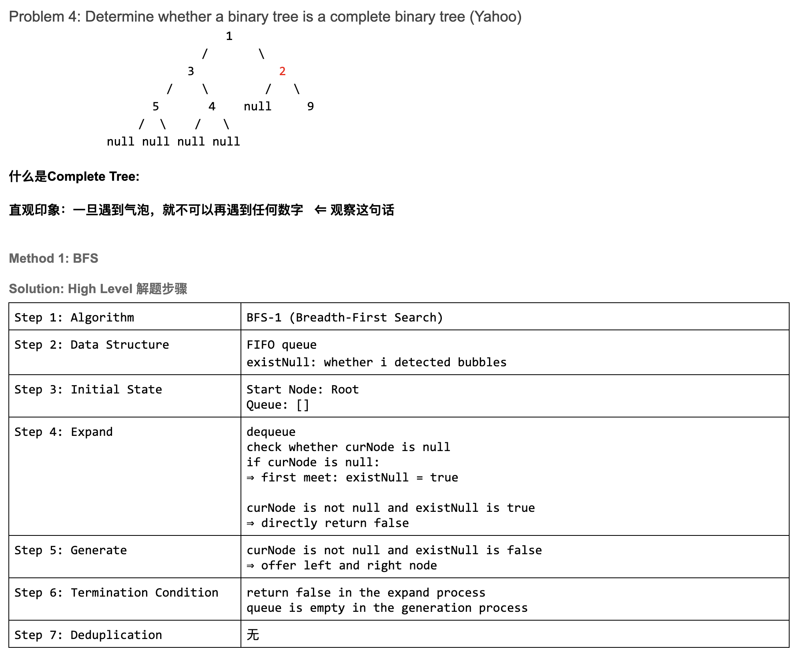
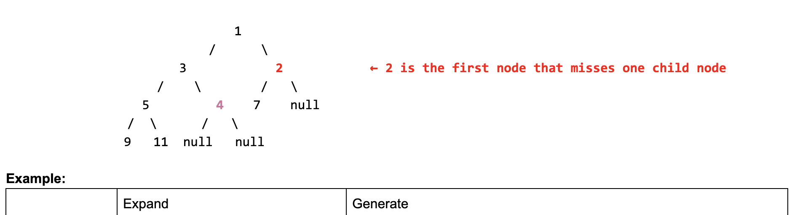
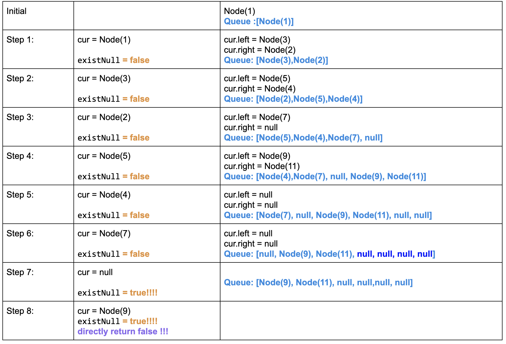
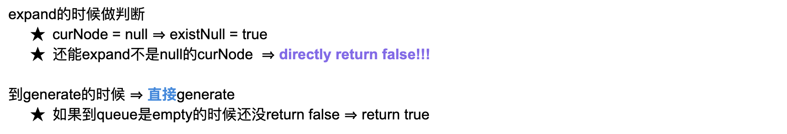
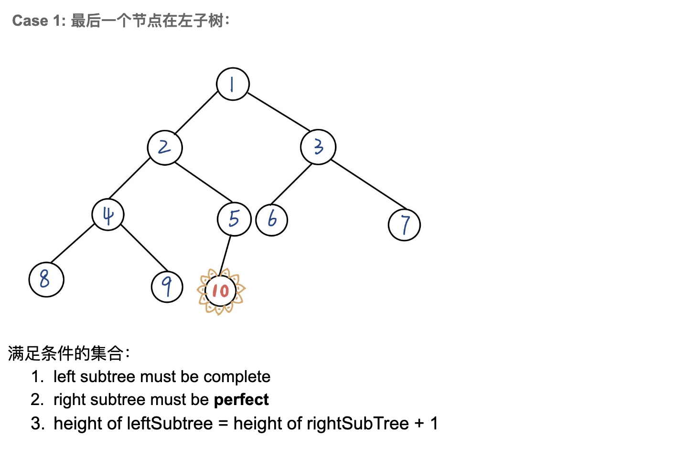
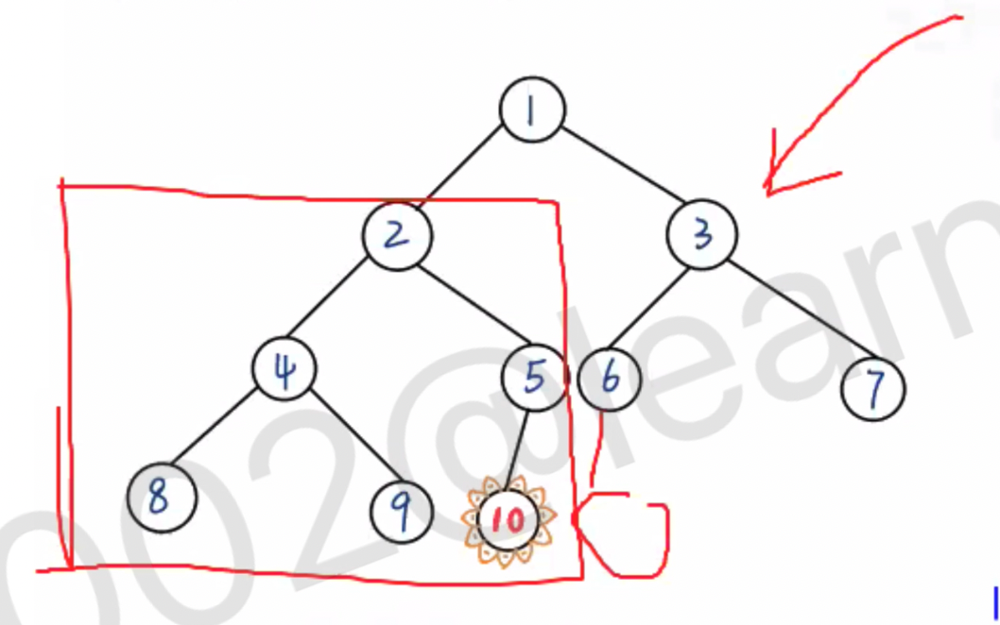
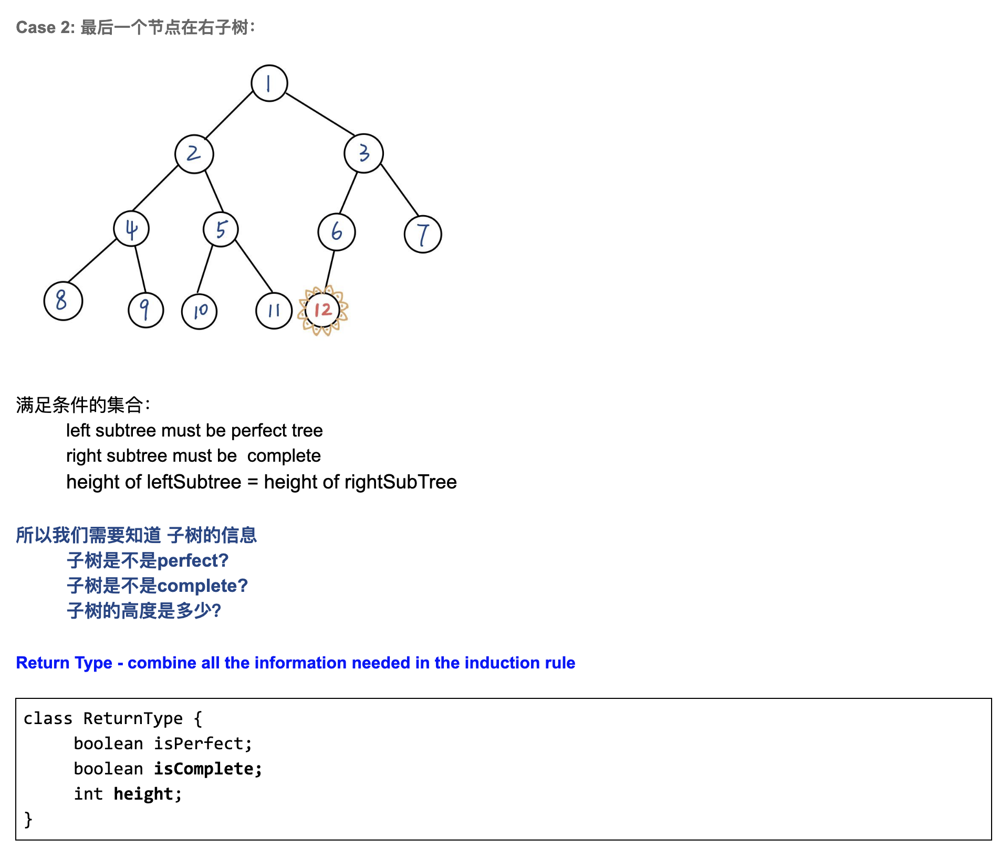
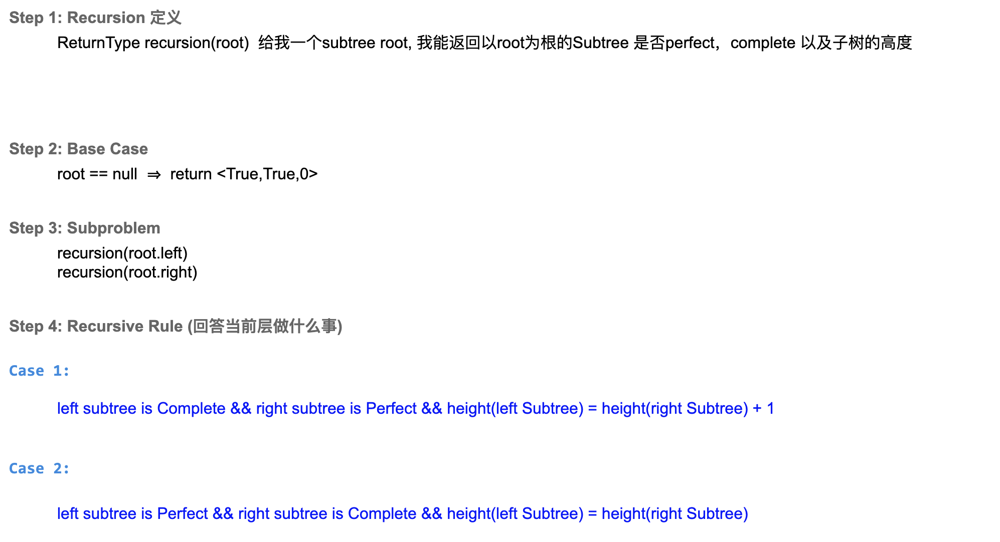
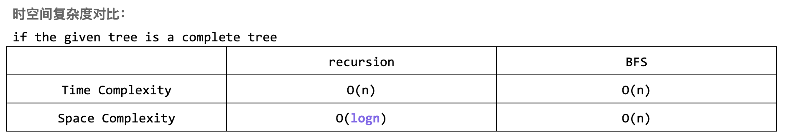

## 958. Check Completeness of a Binary Tree

- In a complete binary tree, every level, **except possibly the last**, is completely filled, 
  and **all nodes in the last level are as far left as possible**.






- Time: O(N)
- Space: O(N)

### BFS

```java
class CheckCompleted {
    // This method will check if there is a child node which is null, optimal space
    public boolean isCompleteTree(TreeNode root) {
        if (root == null) {
            return true;
        }
        Queue<TreeNode> queue = new ArrayDeque<>();
        // If the flag is set true, there should not be any child nodes afterwards.
        boolean flag = false;
        queue.offer(root);
        while (!queue.isEmpty()) {
            TreeNode cur = queue.poll();

            // if any of the child is not present, set the flag to true.
            if (cur.left == null) {
                flag = true;
            } else if (flag) {
                // if flag is set, but we still see cur has a left child,
                // the binary tree is not a completed one.
                return false;
            } else {
                // if flag is not set and let child is present.
                queue.offer(cur.left);
            }

            // same logic applied to right child.
            if (cur.right == null) {
                flag = true;
            } else if (flag) {
                return false;
            } else {
                queue.offer(cur.right);
            }
        }
        return true;
    }
}
```
---

### Recursion


- 注意： right subtree must be **perfect**


- right subtree, `Node 6` 下面不允许有`left child node`, 否则有气泡。 所以必须 perfect
- 而且**左边的高度 还必须是右边高度 + 1**
---




---
```java
class CheckCompleted_Recursion {
    static class ReturnType {
        boolean isPerfect;
        boolean isCompete;
        int height;

        public ReturnType(boolean isPerfect, boolean isCompete, int height) {
            this.isPerfect = isPerfect;
            this.isCompete = isCompete;
            this.height = height;
        }
    }
    public boolean isCompleteTree(TreeNode root) {
        if (root == null) {
            return true;
        }

        ReturnType result = recursion(root);
        return result.isCompete;
    }

    private ReturnType recursion(TreeNode root) {
        // base case
        if (root == null) {
            return new ReturnType(true, true, 0);
        }

        // Sub problem
        ReturnType left = recursion(root.left);
        if (!left.isCompete) {
            return new ReturnType(false, false, -1);
        }
        ReturnType right = recursion(root.right);
        if (!right.isCompete) {
            return new ReturnType(false, false, -1);
        }

        // recursive rule
        boolean currentIsPerfect = left.isPerfect && right.isPerfect && left.height == right.height;
        int currentHeight = Math.max(left.height, right.height) + 1;
        boolean currentIsComplete = 
                (left.isCompete && right.isPerfect && (left.height == right.height + 1)) ||
                        (left.isPerfect && right.isCompete && (left.height == right.height));
        
        return new ReturnType(currentIsPerfect, currentIsComplete, currentHeight);
    }
}
```