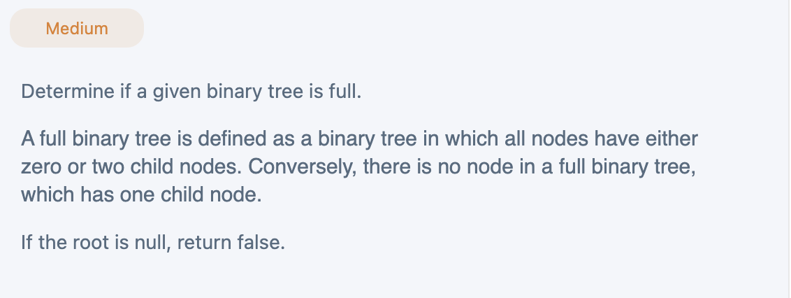
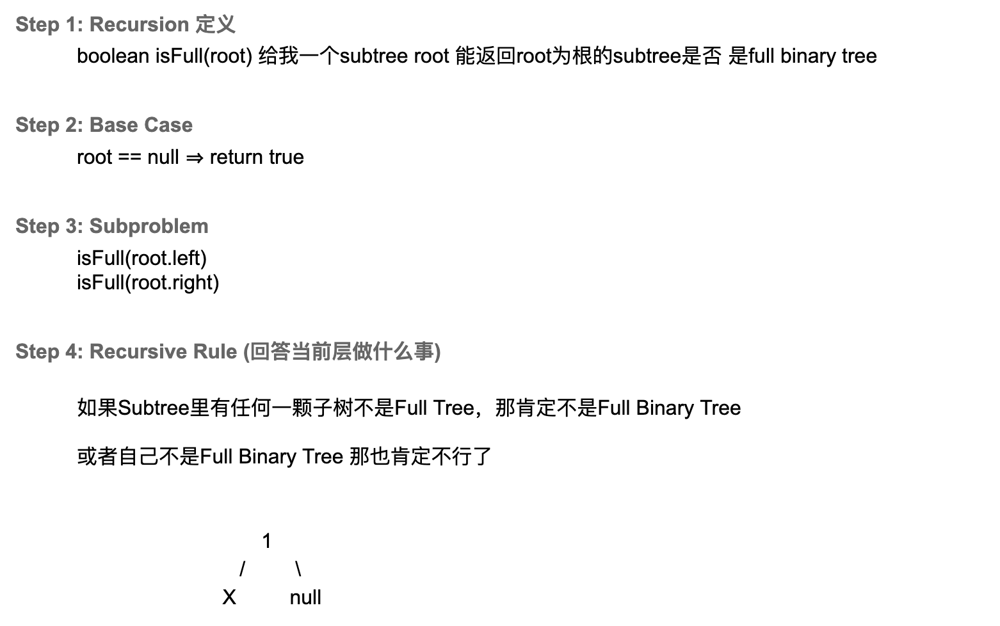

## Determine If Binary Tree Is Full Tree


- 基本概念：
  - A full Binary tree(proper binary tree) is a special type of binary tree in which 
    every parent node/internal node has either **two** or **no** children

### BFS

- Time: `O(n)`
- Space: `O(n)`

```java
public class Solution {
    public boolean isFull(TreeNode root) {
        if (root == null) return true;

        Queue<TreeNode> queue = new LinkedList<>();
        queue.offer(root);
        while (!queue.isEmpty()) {
            TreeNode cur = queue.poll();
            if (cur.left == null && cur.right == null) {
                continue;
            }
            else if (cur.left == null || cur.right == null) {
                return false;
            }
            else {
                queue.offer(cur.left);
                queue.offer(cur.right);
            }
        }
        return true;
    }
}
```

---

### Recursion (DFS)



- Time: `O(n)`
- Space: `O(Height)`

```java
public class CheckFull_Recursion {
    public boolean isFullBinaryTree(TreeNode root) {
        if (root == null) {
            return true;
        }
        if (root.left == null && root.right == null) {
            return true;
        }
        // check if left subtree and right subtree
        boolean leftIsFull = isFullBinaryTree(root.left);
        boolean rightIsFull = isFullBinaryTree(root.right);
        if (!leftIsFull || !rightIsFull) {
            return false;
        }

        // 当前层 check self node
        if (root.left != null || root.right != null) {
            return false;
        }
        return true;
    }
}
```