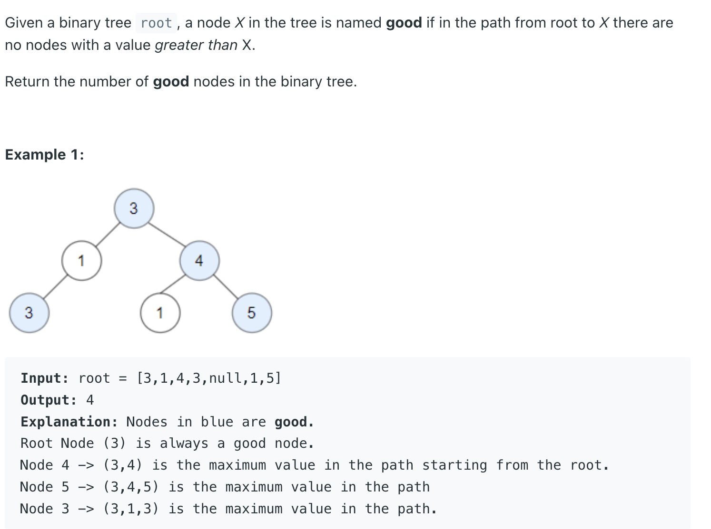
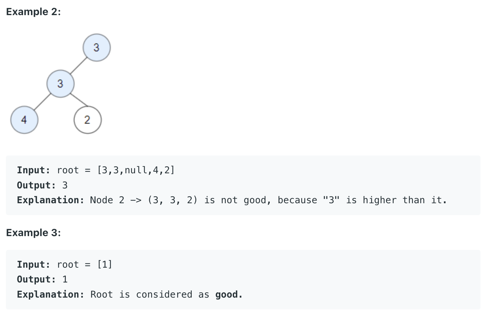

## 1448. Count Good Nodes in Binary Tree


---

```java
class Solution {
    public int goodNodes(TreeNode root) {
        int[] res = new int[1];
        return getGoods(root, root.val, res);
    }
    
    private int getGoods(TreeNode node, int maxValue, int[] res) {
        if (node == null) {
            return 0;
        }
        
        res[0] = node.val >= maxValue ? 1 : 0;
        maxValue = Math.max(maxValue, node.val);
        res[0] += getGoods(node.left, maxValue, res);
        res[0] += getGoods(node.right, maxValue, res);
        return res[0];
    }
}
```