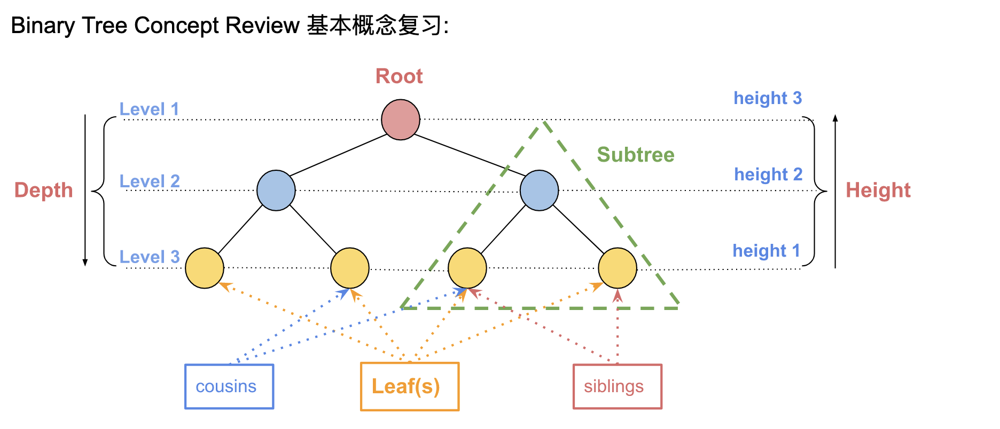
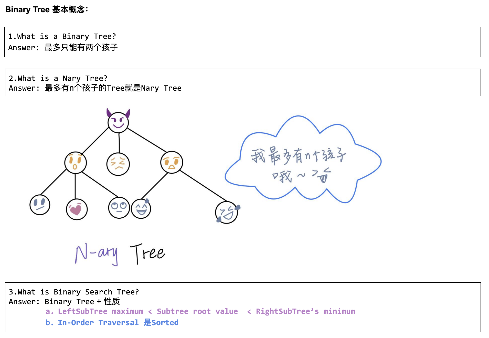
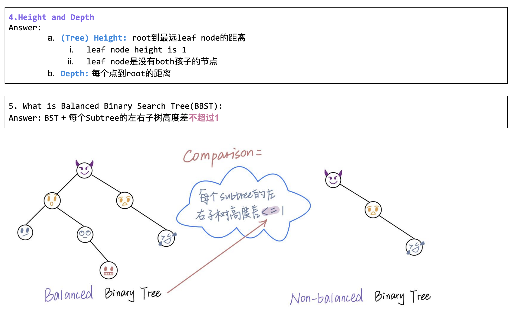
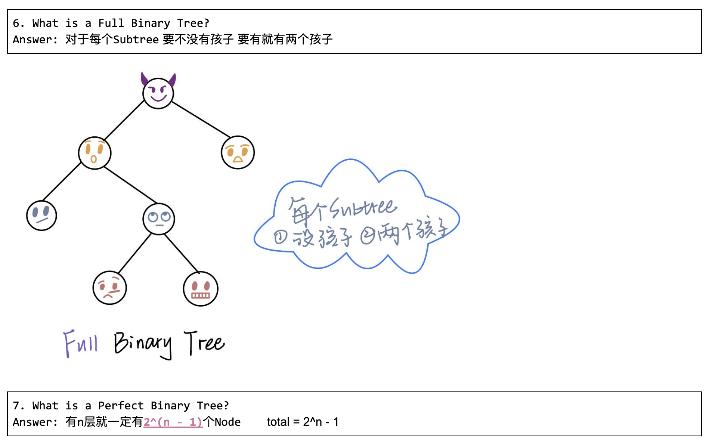
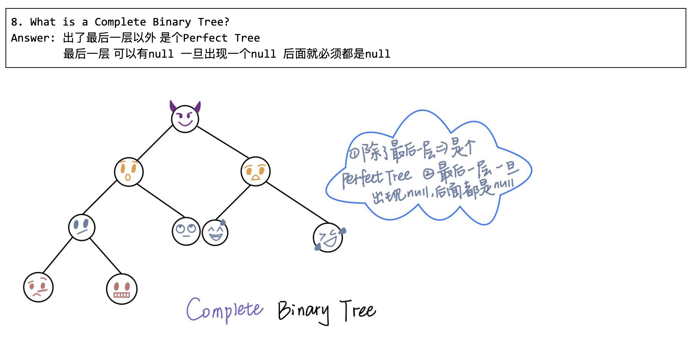
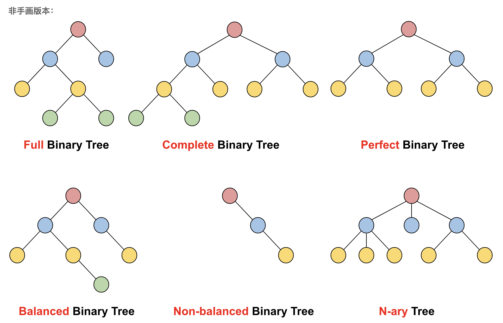

## Binary Tree



- [110. Balanced Binary Tree](https://novemberfall.github.io/LeetCode-NoteBook/#/ch5/checkBalanced)


- [Determine If Binary Tree Is Full Tree](https://novemberfall.github.io/LeetCode-NoteBook/#/binaryTree/fullbinary)


- []()


---

---
### PreOrder


```ruby
        1
      /   \
     2      5
    / \    /  \
   3   4  6    7


PreOrder: 1, 2, 3, 4, 5, 6, 7   

我们可以把左右subtree, 都当作递归来看


         2            5
1 =>    / \    =>    / \
       3   4        6   7
 
可以从上图看出，左子树进行preOrder,  右子树也进行preOrder

1 => 2 => 3 => 4 => 5 => 6 => 7
```

## One more example: PostOrder

```ruby

        1
      /   \
     2      5
    / \    /  \
   3   4  6    7


PostOrder: 3, 4, 2, 6, 7, 5, 1

我们可以把左右subtree, 都当作递归来看


     2            5
    / \    =>    / \     =>   1
   3   4        6   7
 
可以从上图看出，左子树进行postOrder,  右子树也进行postOrder

3 => 4 => 2 => 6 => 7 => 5 => 1
```