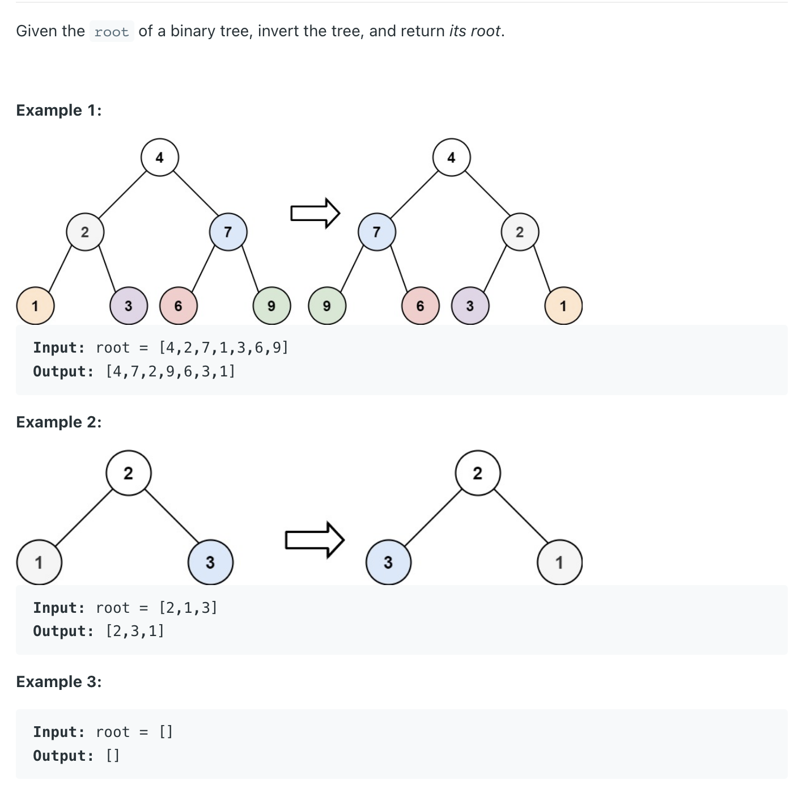
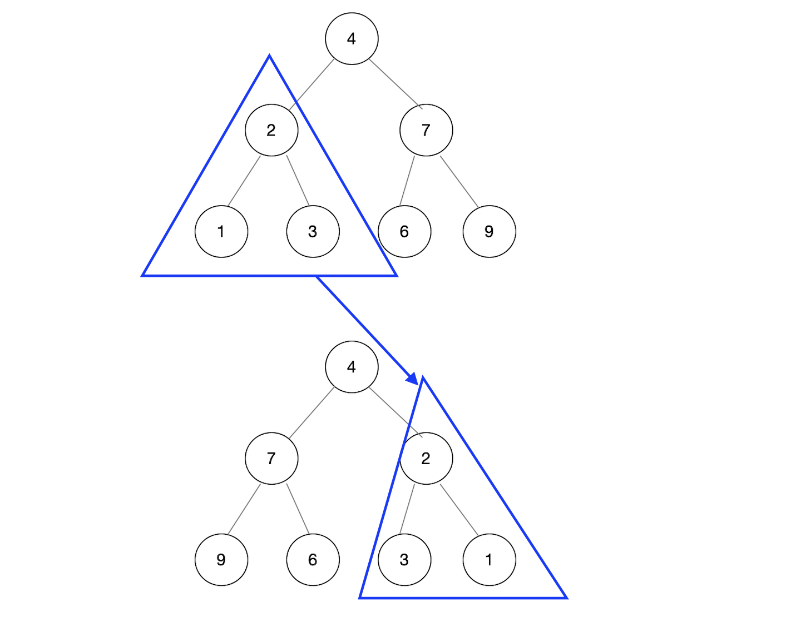

## 226. Invert Binary Tree




---


```java
/**
 * Definition for a binary tree node.
 * public class TreeNode {
 *     int val;
 *     TreeNode left;
 *     TreeNode right;
 *     TreeNode() {}
 *     TreeNode(int val) { this.val = val; }
 *     TreeNode(int val, TreeNode left, TreeNode right) {
 *         this.val = val;
 *         this.left = left;
 *         this.right = right;
 *     }
 * }
 */
class Solution {
    public TreeNode invertTree(TreeNode root) {
        if (root == null) return root;

        // swap the thildren       
        TreeNode tmp = root.left;
        root.left = root.right;
        root.right = tmp;
        
        invertTree(root.left);
        invertTree(root.right);
        return root;
    }
}
```
---

```py
class Solution:
    def invertTree(self, root: Optional[TreeNode]) -> Optional[TreeNode]:
        if root is None:
            return None
        tmp_left = root.left
        root.left = root.right
        root.right = tmp_left

        self.invertTree(root.left)
        self.invertTree(root.right)
        return root
```

- **T = O(N)**
- **S = O(log N)**