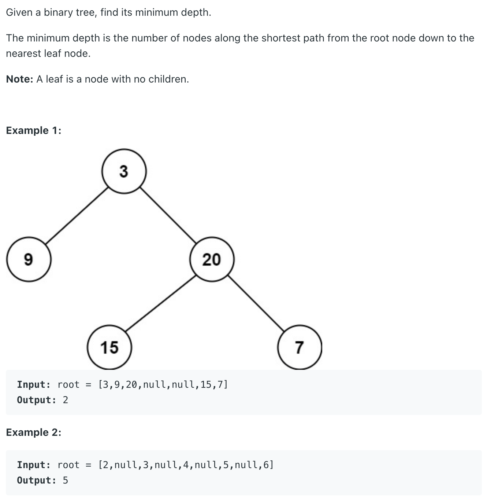
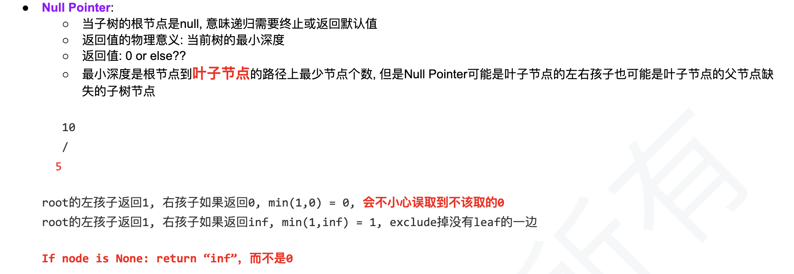

## 111. Minimum Depth of Binary Tree


- for this quesion's meaning, the **minimum depth** is **2**, path is **3 -> 9**



---
```java
/**
 * Definition for a binary tree node.
 * public class TreeNode {
 *     int val;
 *     TreeNode left;
 *     TreeNode right;
 *     TreeNode() {}
 *     TreeNode(int val) { this.val = val; }
 *     TreeNode(int val, TreeNode left, TreeNode right) {
 *         this.val = val;
 *         this.left = left;
 *         this.right = right;
 *     }
 * }
 */
class Solution {
    public int minDepth(TreeNode root) {
        if (root == null) {
            return 0;
        }    
        
        int leftMinNums = minDepth(root.left);
        int rightMinNums = minDepth(root.right);
        
        if (root.left == null || root.right == null) {
            return Math.max(leftMinNums, rightMinNums) + 1;
        }
        
        return Math.min(leftMinNums, rightMinNums) + 1;
    }
}
```
---

```py
# Definition for a binary tree node.
# class TreeNode:
#     def __init__(self, val=0, left=None, right=None):
#         self.val = val
#         self.left = left
#         self.right = right
class Solution:
    def minDepth(self, root: Optional[TreeNode]) -> int:
        if root is None:
            return 0
        
        return self.dfs(root)
    
    def dfs(self, root):
        if root is None:
            return float('inf')
        
        if root.left is None and root.right is None:
            return 1
        left = self.dfs(root.left)
        right = self.dfs(root.right)
        return min(left, right) + 1

```