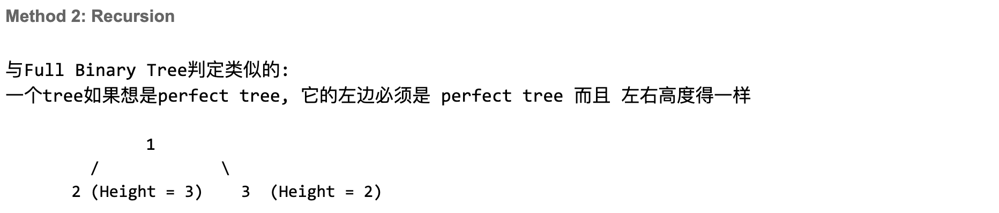
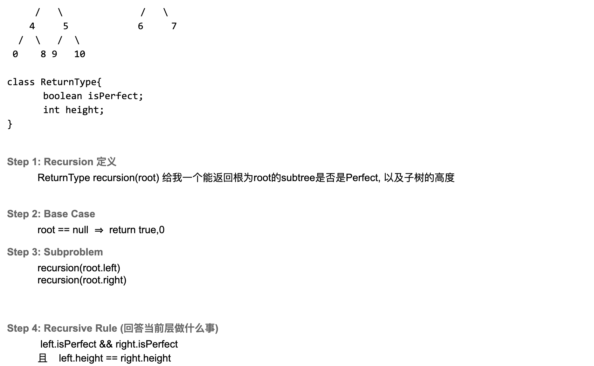

## Determine If Binary Tree Is Perfect Tree

---

### BFS

```java
public class CheckPerfect_BFS {
    public boolean isPerfectBinaryTree(TreeNode root) {
        if (root == null) {
            return true;
        }
        Queue<TreeNode> queue = new ArrayDeque<>();
        queue.offer(root);
        int level = 0;
        int previousLeveSize = 0;

        while (!queue.isEmpty()) {
            int numberOfNodeInCurrentLevel = queue.size();
            if (level > 0 && numberOfNodeInCurrentLevel != 2 * previousLeveSize) {
                return false;
            }
            for (int i = 0; i < numberOfNodeInCurrentLevel; i++) {
                TreeNode cur = queue.poll();
                if (cur.left != null) {
                    queue.offer(cur.left);
                }
                if (cur.right != null) {
                    queue.offer(cur.right);
                }
            }
            previousLeveSize = numberOfNodeInCurrentLevel;
        }
        return true;
    }
}
```
---

### Recursion





```java
class CheckPerfect_Recursion {
    static class ReturnType {
        boolean isPerfect;
        int height;

        public ReturnType(boolean isPerfect, int height) {
            this.isPerfect = isPerfect;
            this.height = height;
        }
    }
    public boolean isPerfectBinaryTree(TreeNode root) {
        if (root == null) {
            return true;
        }
        ReturnType result = recursion(root);
        return result.isPerfect;
    }

    private ReturnType recursion(TreeNode root) {
        if (root == null) {
            return new ReturnType(true, 0);
        }
        if (root.left == null && root.right == null) {
            return new ReturnType(true, 1);
        }
        ReturnType left = recursion(root.left);
        ReturnType right = recursion(root.right);

        if (left.isPerfect && right.isPerfect && left.height == right.height) {
            return new ReturnType(true, left.height + 1);
        } else {
            return new ReturnType(false, -1);
        } 
    }
}
```
