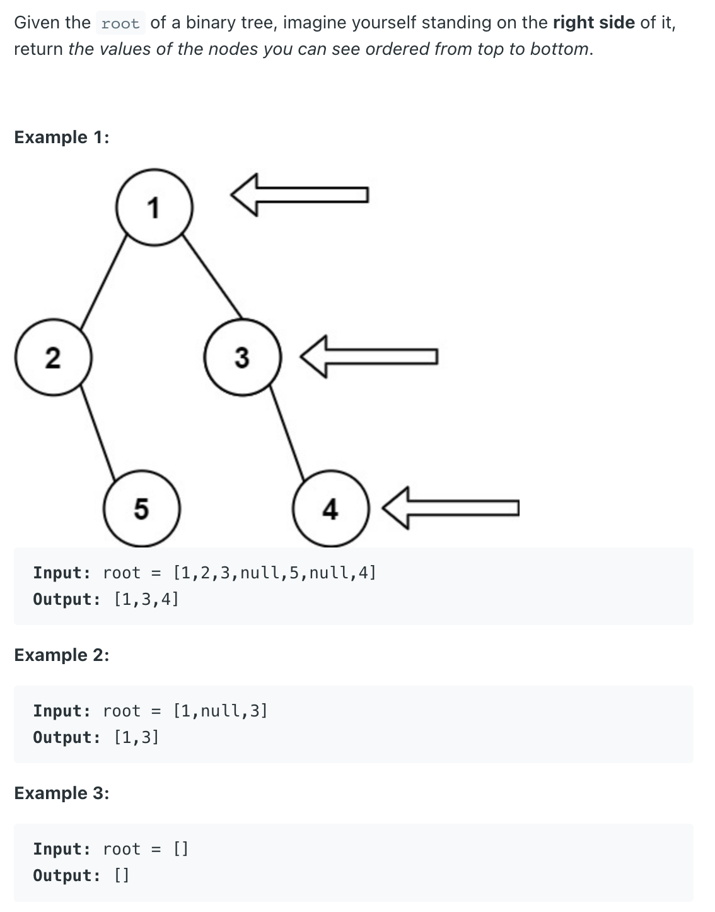

## 199. Binary Tree Right Side View

---

### 错误写法

- 我第一次写递归，直接 `right traverse`, 但是如果 binary tree 长这样：
  - 我就只能打印出 `1`

```ruby
                1
              /
             2
              \
               3 
```

- 代码如下：

```java
class Solution {
    public List<Integer> rightSideView(TreeNode root) {
        List<Integer> res = new ArrayList<>();
        if (root == null) return res;
        
        dfs(root, res);
        return res;
    }
    
    private void dfs(TreeNode root,  List<Integer> res) {
        if (root == null) {
            return;
        }   
        res.add(root.val);
        dfs(root.right, res);
    }
}
```
---

- 所以我们可以记录一下当前 **Nums of current level** 
- 当我们记录下`层数`, 那么如果**right subtree is null**, 往左边traverse, 
  只有当我们遍历的时候我们才记录当前层数

- (1) the traverse of the tree is NOT standard pre-order traverse. It checks the RIGHT node first and then the LEFT
- (2) the line to check currDepth == result.size() makes sure **the first element of that level** will be added to 
  the result list
- (3) if reverse the visit order, that is first LEFT and then RIGHT, it will return the left view of the tree.

```java
class BinaryTreeRightSideView_recursion {
    public List<Integer> rightSideView(TreeNode root) {
        List<Integer> res = new ArrayList<>();
        if (root == null) {
            return res;
        }
        recursion(root, res, 0);
        return res;
    }

    private void recursion(TreeNode root, List<Integer> res, int curLevel) {
        if (root == null) {
            return;
        }
        if (res.size() == curLevel) {
            res.add(root.val);
        }
        recursion(root.right, res, curLevel + 1);
        recursion(root.left, res, curLevel + 1);
    }

    public static void main(String[] args) {
        TreeNode root = new TreeNode(1);
        root.left = new TreeNode(2);
        root.left.right = new TreeNode(3);
        root.left.right.left = new TreeNode(4);
        BinaryTreeRightSideView_recursion btrsvr = new BinaryTreeRightSideView_recursion();
        List<Integer> res = btrsvr.rightSideView(root);
        System.out.println(res); // [1, 2, 3, 4]
    }
}
```

---
### BFS

- 尽管Time Complexity 并不是很好看，但便于理解
- 利用queue, `FIFO`, 每次call `ArrayList.add(current.val)`， 并且在队列的第一个元素

```java
/**
 * Definition for a binary tree node.
 * public class TreeNode {
 *     int val;
 *     TreeNode left;
 *     TreeNode right;
 *     TreeNode() {}
 *     TreeNode(int val) { this.val = val; }
 *     TreeNode(int val, TreeNode left, TreeNode right) {
 *         this.val = val;
 *         this.left = left;
 *         this.right = right;
 *     }
 * }
 */
class Solution {
    public List<Integer> rightSideView(TreeNode root) {
        if(root == null){
            return new ArrayList<>();
        }
        List<Integer> list = new ArrayList<>();
        Queue<TreeNode> queue = new LinkedList();
        queue.offer(root);
        
        while(!queue.isEmpty()){
            int size = queue.size();
            for(int i=0; i<size; i++){
                TreeNode cur = queue.poll();
                if(i == 0){
                    list.add(cur.val);
                }
                if(cur.right != null){
                    queue.offer(cur.right);
                }
                
                if(cur.left != null){
                    queue.offer(cur.left);
                }
            }
        }
        return list;
    }
}
```