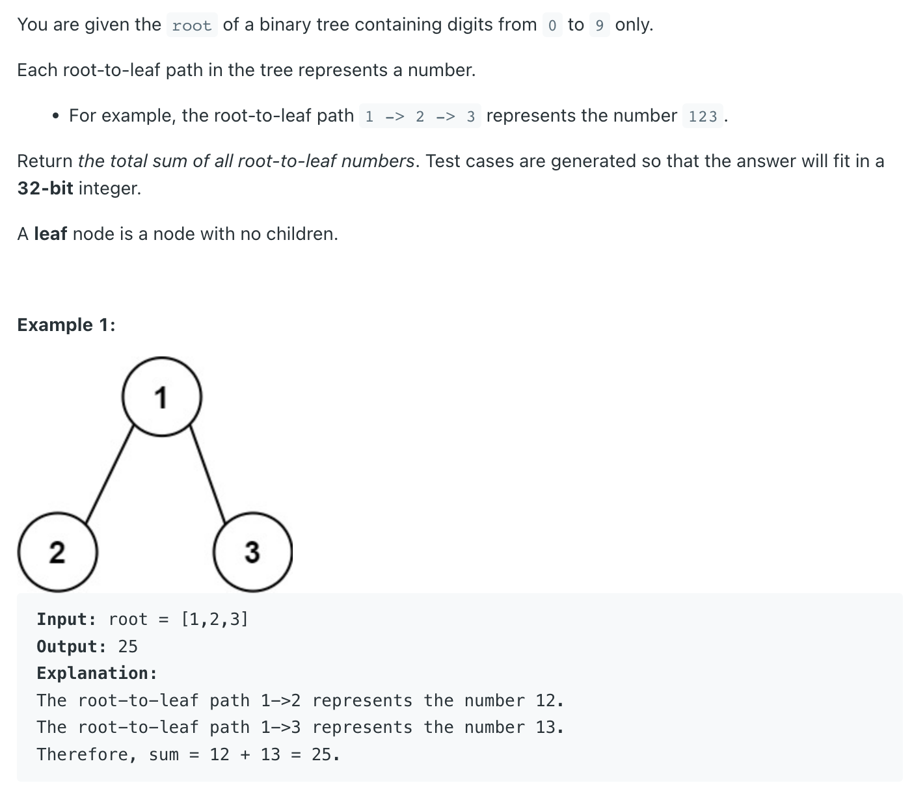
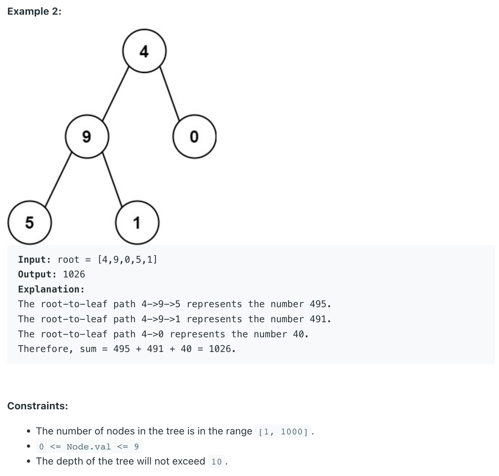

## 129. Sum Root to Leaf Numbers



### PreOrder Traversal

```java
class _129_SumRootToLeafNumbers {
    public int sumNumbers(TreeNode root) {
        int[] max = new int[]{0};
        recursion(root, max, 0);
        return max[0];
    }

    private void recursion(TreeNode root, int[] max, int sum) {
        if (root == null) {
            return;
        }

        sum = sum * 10 + root.val;
        if (root.left == null && root.right == null) {
            max[0] += sum;
            return;
        }

        recursion(root.left, max, sum);
        recursion(root.right, max, sum);
    }

    public static void main(String[] args) {
        TreeNode root = new TreeNode(1);
        root.left = new TreeNode(2);
        root.right = new TreeNode(3);
        _129_SumRootToLeafNumbers sumRootToLeafNumbers = new _129_SumRootToLeafNumbers();
        int res = sumRootToLeafNumbers.sumNumbers(root);
        System.out.println(res); // 25
    }
}
```