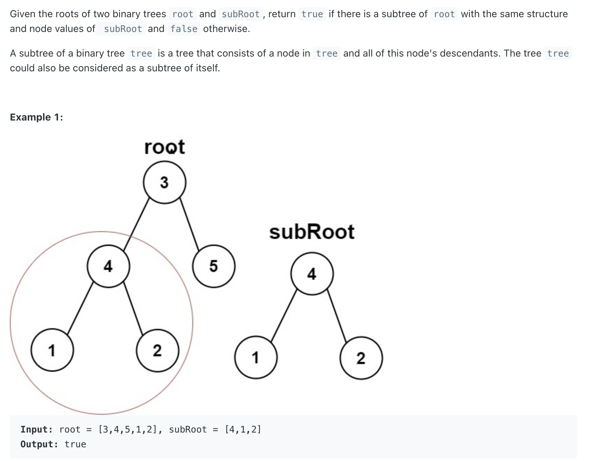
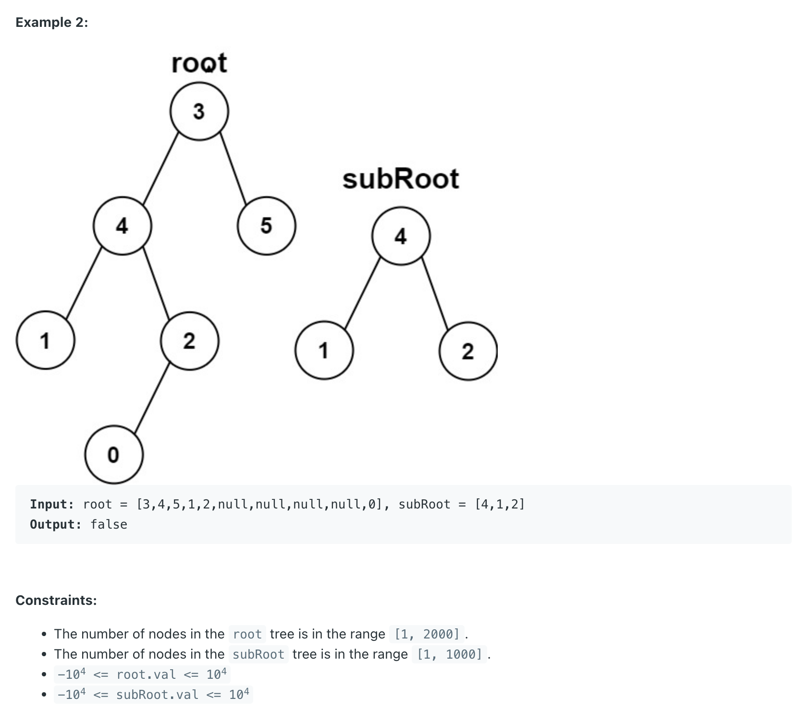

## 572. Subtree of Another Tree


---

```java
class _572_SubtreeOfAnotherTree {
    public boolean isSubtree(TreeNode root, TreeNode subRoot) {
        if (root == null) {
            return false;
        }

        if (isSame(root, subRoot)) {
            return true;
        }
        return isSubtree(root.left, subRoot) || isSubtree(root.right, subRoot);
    }

    private boolean isSame(TreeNode root, TreeNode subRoot) {
        if (root == null && subRoot == null) {
            return true;
        }
        if (root == null || subRoot == null) {
            return false;
        }
        if (root.val != subRoot.val) {
            return false;
        }
        return isSame(root.left, subRoot.left) && isSame(root.right, subRoot.right);
    }
}
```