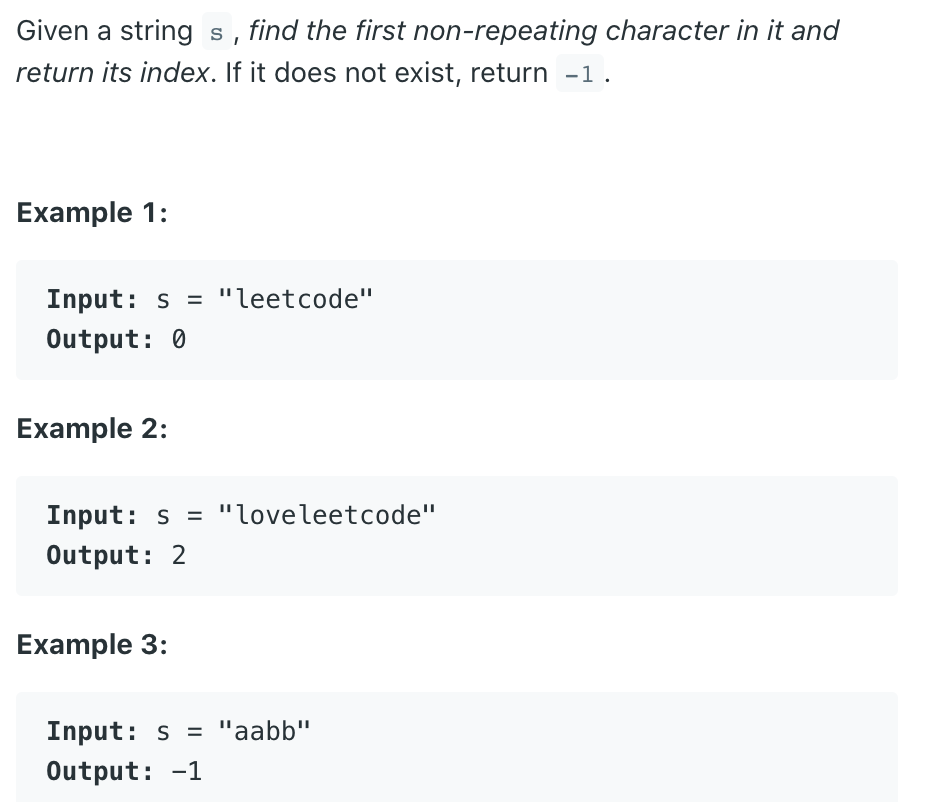

## 387. First Unique Character in a String



- 1. Make a hash_map which will map the character to there respective frequencies.
- 2. Traverse the given string using a pointer.
- 3. Increase the count of current character in the hash_map.
- 4. Now traverse the string again and check whether the current character hasfrequency=1.

- Time = O(N)
- Space = O(26)

---

```java
class Solution {
    public int firstUniqChar(String s) {
        int[] freq = new int[26];
        char[] arr = s.toCharArray();
        for (char c : arr) {
            freq[c - 'a']++;
        }
        for (int i = 0; i < arr.length; i++) {
            if (freq[arr[i] - 'a'] == 1) {
                return i;
            }
        }
        return -1;
    }
}
```

