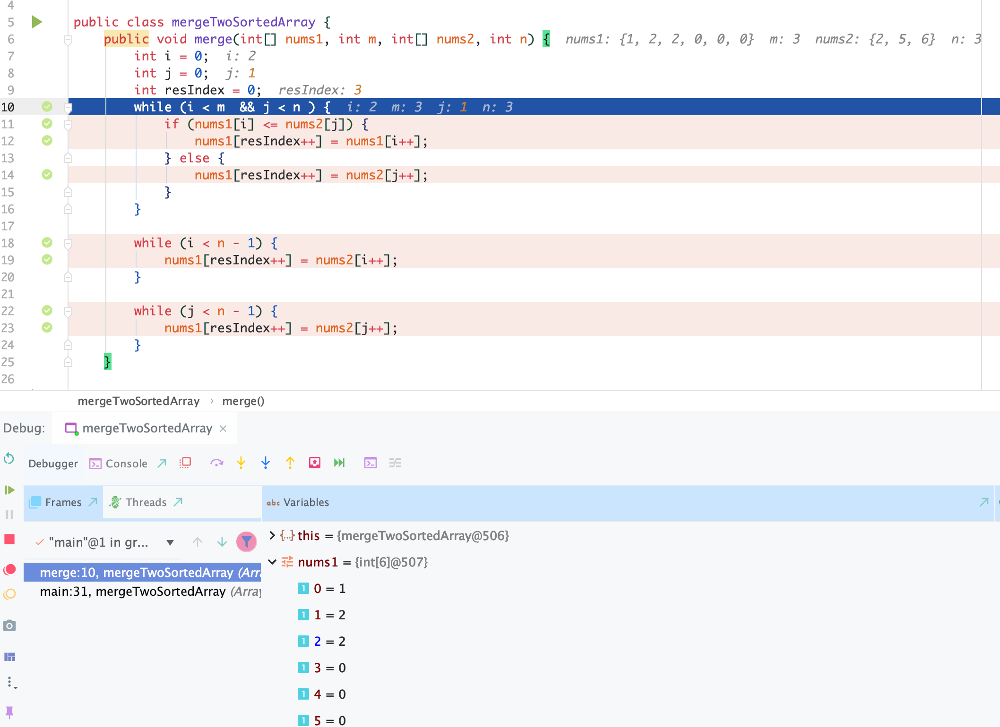

# 88. Merge Sorted Array  | Merge Two Sorted Array

```ruby
Given two sorted integer arrays nums1 and nums2, merge nums2 into nums1 
as one sorted array.

Note:

The number of elements initialized in nums1 and nums2 are m and n respectively.
You may assume that nums1 has enough space (size that is equal to m + n) 
to hold additional elements from nums2.
Example:

Input:
nums1 = [1,2,3,0,0,0], m = 3
nums2 = [2,5,6],       n = 3

Output: [1,2,2,3,5,6]
```


- 为什么要从倒叙merge ?
  - assume: [1,2,3,0,0,0] 3,  [2,5,6] 3


- 注意这图， 在 num1[i == 2], num1[i == 2] >= nums[j == 0], 所以 num1[i == 2] = num2[j == 0] 
- 因此, num1[i == 2] 等于 2, 这样 3 就永远从 num1[] 里消失了！
- 注意本题要求 in place!
 
```java
class Solution {
    public void merge(int[] nums1, int m, int[] nums2, int n) {        
        int i = m - 1;
        int j = n - 1;
        int resIndex = m + n - 1;
        while (i >= 0 && j >= 0){
            if (nums1[i] > nums2[j]) {
                nums1[resIndex--] = nums1[i--];
            } else {
                nums1[resIndex--] = nums2[j--];
            }
        }
        
        while (j >= 0){
            nums1[resIndex--] = nums2[j--];
        }
    }
}
```


## 变种题目：

```ruby
Merge given amount of numbers from two sorted arrays.

Note that given amount of numbers are not larger than the length of the respective arrays.

Input: [1, 2, 3], 3, [2, 4, 6], 1

Output: [1,2, 2, 3]
```


- 这里不要求in-place，所以可以用不同办法:
- 也可用正序！

```java
public class Solution {
  public int[] merge(int[] A, int m, int[] B, int n) {
    // Write your solution here
    int i = m - 1;
    int j = n - 1;
    int[] array = new int[m + n];
    int resIndex = m + n - 1;
    while (i >= 0 && j >= 0){
      if (A[i] > B[j]) {
        array[resIndex--] = A[i--];
      } else {
        array[resIndex--] = B[j--];
      }
    }
    while(i >= 0){
      array[resIndex--] = A[i--];
    }

    while (j >= 0){
      array[resIndex--] = B[j--];
    }
    return array;
  }
}

```