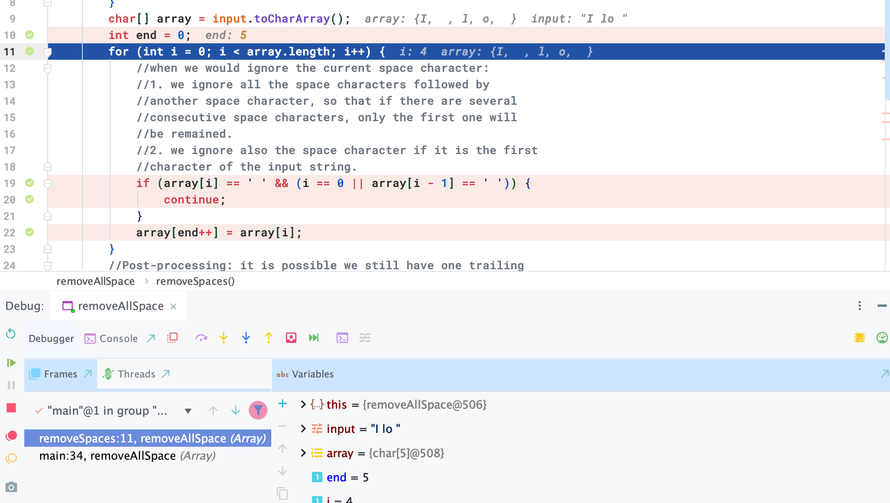

# Remove Spaces

```ruby
Given a string, remove all leading/trailing/duplicated empty spaces.

Assumptions:

The given string is not null.
Examples:

“  a” --> “a”
“   I     love MTV ” --> “I love MTV”
```

### 本题关键在于是否使用 String API

- key point:
  - 尽量避免调用 `subString(start, end), deleteCharAt(i), string1 + string2`, because they
    may use O(n) time and O(n) extra space, 所以最终time 可能是 O(n^2) 



- 最后注意在结束时候，由于第一次初始end 为 0, 在全部copy 完， end++ => `end == 5`
  所以在最后还要进行post-processing, `end--`

```java
public class Solution {
  public String removeSpaces(String input) {
    // Write your solution here
    if(input.isEmpty()){
      return input;
    }
    char[] array = input.toCharArray();
    int end = 0;
    for(int i = 0; i < array.length; i++){
      //when we would ignore the current space character:
      //1. we ignore all the space characters followed by 
      //another space character, so that if there are several
      //consecutive space characters, only the first one will
      //be remained.
      //2. we ignore also the space character if it is the first
      //character of the input string.
      if(array[i] == ' ' && (i == 0 || array[i - 1] == ' ')){
        continue;
      }
      array[end++] = array[i];
    }
    //Post-processing: it is possible we still have one trailing
    //space character at the end.
    if(end > 0 && array[end - 1] == ' '){
      end--;
    }
    return new String(array, 0, end);
  }
}
```