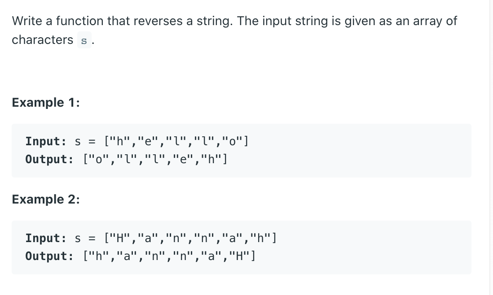

## 344. Reverse String



---


### Analysis

- Time = O(n)
- Space = O(1)

```java
class Solution {
    public void reverseString(char[] s) {
        if(s == null || s.length == 0){
            return;
        }
        
        int left = 0;
        int right = s.length - 1;
        while(left <= right){
            swap(s, left++, right--);
        }
    }
    
    private void swap(char[] res, int left, int right){
        char tmp = res[left];
        res[left] = res[right];
        res[right] = tmp;
    }
}
```

---

## solution 2: recursive

- Time = O(n)
- Space = O(n)

```java
class Solution {
    public void reverseString(char[] s) {
        int i = 0;
        int j = s.length - 1;
        
        recursive(s, i, j);
    }
    
    private void recursive(char[] s, int i, int j) {
        if (i >= j) {
            return;
        }
        
        char tmp = s[i];
        s[i] = s[j];
        s[j] = tmp;
        
        recursive(s, ++i, --j);
    }
}
```