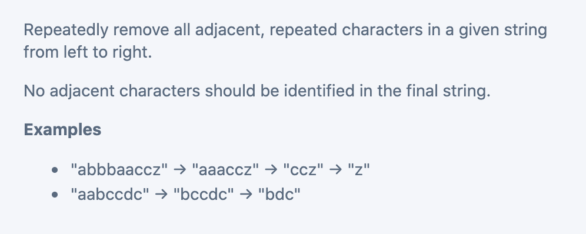

## Remove Adjacent Repeated Characters IV [Hard]



```ruby
s: slow, init index = 0
f: fast, init index = 1
two pointer method:

   a  b  b  b  a  c  a
   s
      f

   a  b  b  b  a  c  a
      s
         f

   a  b  b  b  a  c  a
   s
            f

   a  b  b  b  a  c  a
s
               f

   c
   a  b  b  b  a  c  a
   s
                  f

   c  a
   a  b  b  b  a  c  a
      s
                     f

Note: finally return ++s
```

- Time = O(n)
- Space = O(1)

---

```java
class Solution {
    public String removeDuplicates(String s) {
        char[] arr = s.toCharArray();
        int slow = 0;
        for (int fast = 1; fast < arr.length; fast++) {
            if (slow == -1 || arr[slow] != arr[fast]) {
                slow++;
                arr[slow] = arr[fast];
            } else {
                slow--;
                while (fast + 1 < arr.length && arr[fast] == arr[fast + 1]) {
                    fast++;
                }
            }
        }
        return new String(arr, 0, ++slow);
    }
}
```