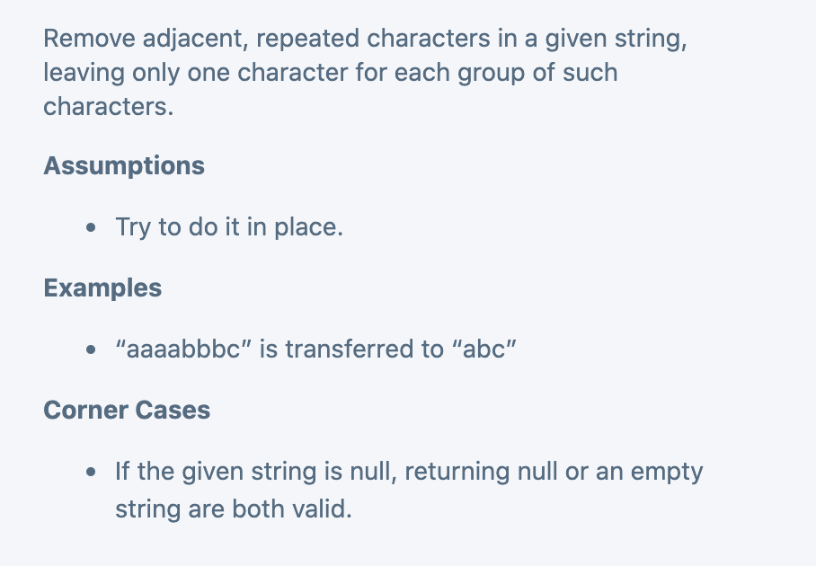

## Remove Adjacent Repeated Characters I



```java
public class Solution {
  public String deDup(String input) {
    // Write your solution here
    if(input == null || input.length() == 0){
      return input;
    }
    char[] array = input.toCharArray();
    int slow = 1;
    for(int fast = 1; fast < array.length; fast++){
      if(array[fast] == array[slow - 1]){
        continue;
      }
      array[slow++] = array[fast];
    }
    return new String(array, 0, slow);
  }
}
```