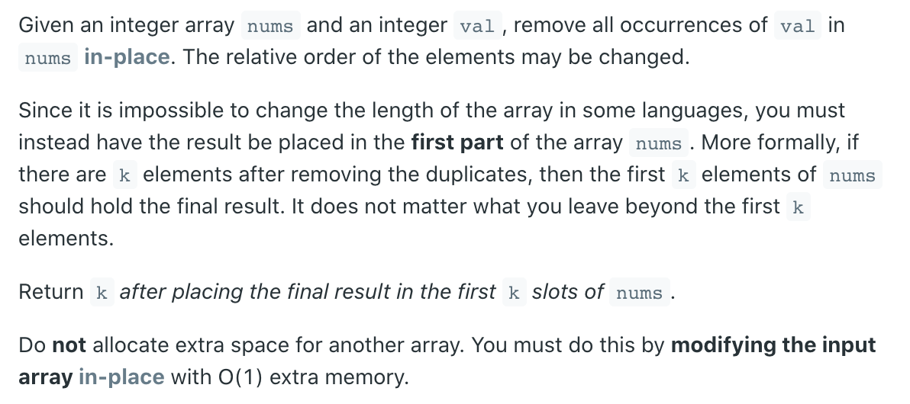
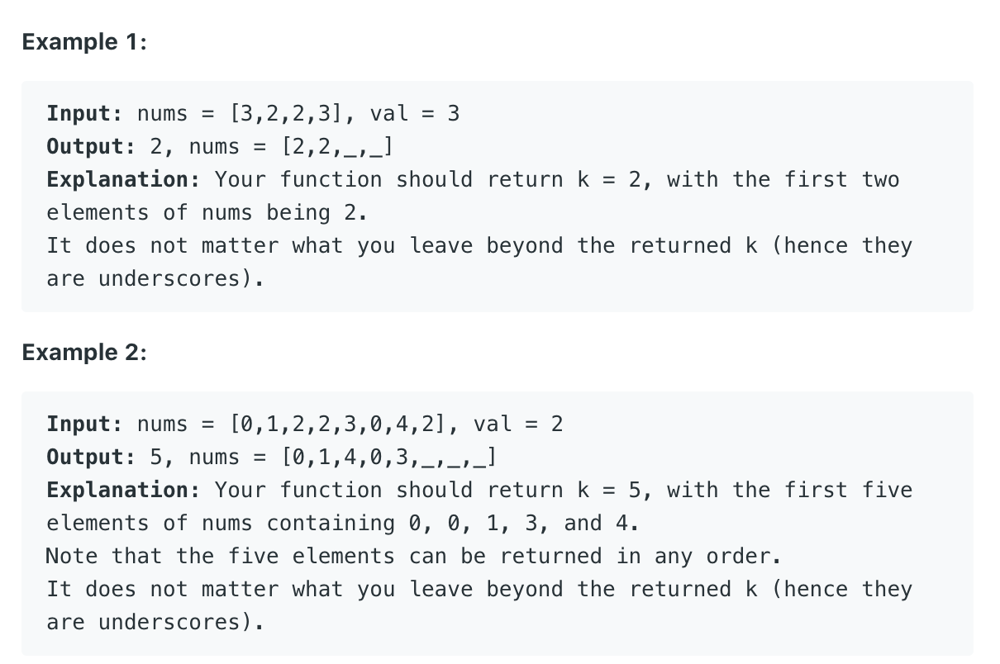

## 27. Remove Element





- Time = O(n)
- Space = 0(1)

```java
class Solution {
    public int removeElement(int[] nums, int val) {
        int slow = 0;
        for (int fast = 0; fast < nums.length; fast++) {
            if (nums[fast] != val) {
                nums[slow++] = nums[fast];
            }
        }
        return slow;
    }
}
```